# Lab 02: Conditional Access

## Exercise Overview

You have discovered that employees are accessing Microsoft 365 from unknown locations, despite your Conditional Access policies only allowing access from specific locations and devices. Your investigation has revealed that these employees are accessing Microsoft 365 while traveling home from their office on public transportation. This behavior is in violation of industry regulations, and you want to use Continuous Access Evaluation to prevent it. Additionally, you want to implement the authentication strength you prepared in the previous exercise to secure certain applications that handle customer data.

## Exercise Objectives

After completing this exercise, you'll be able to:

- Create a trusted network for enhanced security.
- Set up a new Conditional Access Policy with a limited scope.
- Test and validate the effectiveness of the configured policy.
- Implement a Conditional Access policy that restricts user login to the trusted network.
- Create and enforce a Conditional Access policy to apply your authentication strength policy to Salesforce.

### Estimated Duration: 45 Minutes

## Architecture Diagram


## Explanation of Components

The architecture for this lab involves the following key components:

- **Trusted Network**: Defines a secure network boundary to ensure only authorized traffic from trusted locations can access organizational resources.

- **Conditional Access Policy**: Configures policies with limited scope to enforce access controls based on specific conditions, such as user identity, location, or device state.

- **Policy Testing**: Validates the effectiveness and functionality of configured policies before broader implementation to ensure compliance and security.

- **Company-Wide Policy Rollout**: Expands the tested policies across the organization to standardize access control measures and enhance overall security.

- **Multi-Factor Authentication (MFA) for Salesforce**: Enforces MFA for Salesforce access to protect sensitive data and ensure secure authentication practices.

## Part 1: Design a solution

### Design approach

The initial step involves analyzing the requirements based on the described issue, understanding the objectives and defining the requirements.

Based on the provided use-case, the following requirements can be outlined:

- Restrict access from insecure/unknown locations
- Require strong authentication for apps containing sensitive information

In the second step examine Contoso Ltd.'s existing environment. Microsoft Entra ID offers solutions to manage and restrict user access with the use of Entra ID Conditional access policies. Investigate which controls exist and which policies are already in place. Use the Entra ID portal to review current configurations and policies and determine if adjustments are necessary or if new policies need to be implemented.

The third phase involves crafting the solution's concept. Upon investigation, it is evident that there is no trusted network yet configured and none of the current policies meet the defined requirements. Therefore, a new set of Conditional access policies is essential.

### Proposed solution

| Requirement                                                             | Solution                           | Action plan                                                                                                                                                                                          |
| ----------------------------------------------------------------------- | ---------------------------------- | ---------------------------------------------------------------------------------------------------------------------------------------------------------------------------------------------------- |
| Restrict access from insecure/unknown locations                         | Entra ID Conditional access policy | Define the current company's networks as trusted network and restrict access to devices inside this network                                                                                          |
| Require strong authentication for apps containing sensitive information | Entra ID Conditional access policy | Create a new conditional access policy scoped to sensitive applications requiring the just created hardened authentication strength that excludes insecure authentication methods like SMS and Voice |

## Part 2: Implement the solution

### Task 1 - Create trusted network

In this task, you will create a named location using your VM's external IP address to define a trusted network you can use in a conditional access policy in the following tasks. You will use this address because your machine is located within your company network.

1. Right-click the **Windows (1)** icon on the Start menu, then select **Windows PowerShell (Admin) (2)**.

   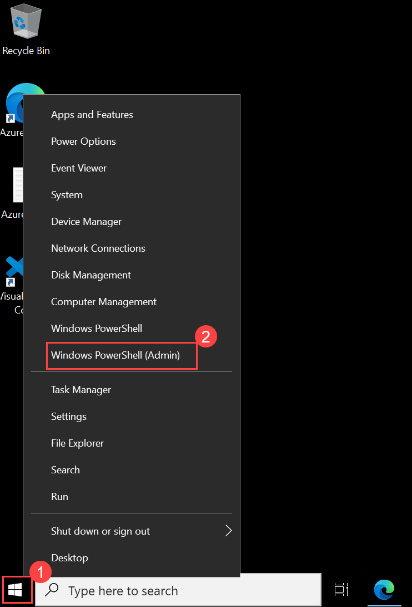

1. Enter the following cmdlet to check your current external IP address:

   ```powershell
   Invoke-RestMethod -Uri "http://ifconfig.me/ip"
   ```

   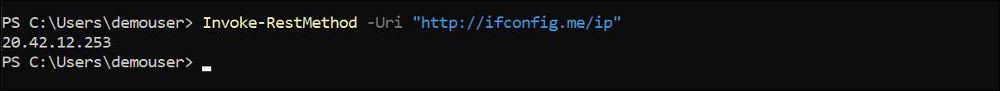

1. Note down the IP address powershell returned.

1. Open **Microsoft Edge**, select the address bar, navigate to **`https://entra.microsoft.com`** and sign in with below credentials if prompted
   - **Email/Username:** <inject key="AzureAdUserEmail"></inject>

   - **Password:** <inject key="AzureAdUserPassword"></inject>

1. On the Stay signed in? dialog box, select the **Don’t show this again** checkbox and then select **No**.

1. On the left navigation pane, navigate to **Entra ID (1)** > **Conditional Access (2)** > **Named locations (3)**.

   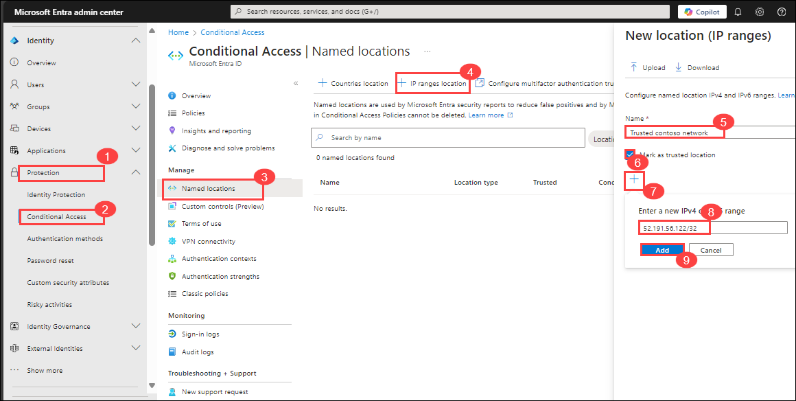

1. Select **+ IP ranges location (1)**.

1. Enter the name **`Trusted contoso network` (2)**.

1. Select **Mark as trusted location (3)**.

1. Select **+ (4)** to add the IP address you noted in **Step 4.**

1. The Input should look like `**.***.**.***/32` **(5)**(\*\*\* replace with ip address noted in the above step ).

1. Select **Add (6)**.

1. Select **Create (7)**.

   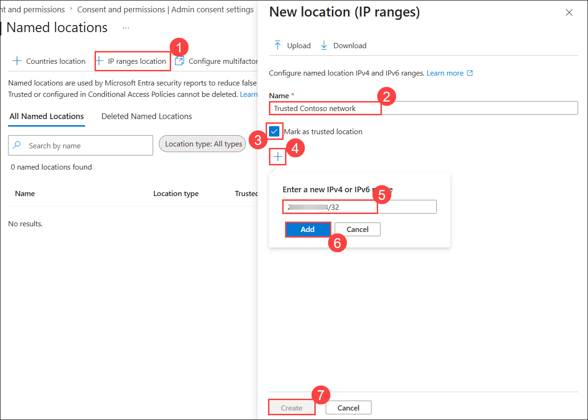

> **Success!** You have now defined your Company's external IP Address named and trusted location you can use to restrict access outside the company's network.

> **Congratulations** on completing the task! Now, it's time to validate it. Here are the steps:

- Hit the Validate button for the corresponding task. If you receive a success message, you can proceed to the next task.
- If not, carefully read the error message and retry the step, following the instructions in the lab guide.
- If you need any assistance, please contact us at cloudlabs-support@spektrasystems.com. We are available 24/7 to help

<validation step="6023a971-27ce-41da-8a97-ea621ca2e8de" />

### Task 2 - Create new Conditional Access Policy with limited scope

As you have successfully created a trusted network you will now use this to create the Conditional Access policy to restrict access outside the corporate network with a scope limited to your personal user to be able to test and prevent a company wide account lockout from Entra ID.

1. On the left navigation pane, expand **Entra ID** navigate to **Conditional Access (1) > Policies (2)**.

1. Select **+ New policy (3)**.

   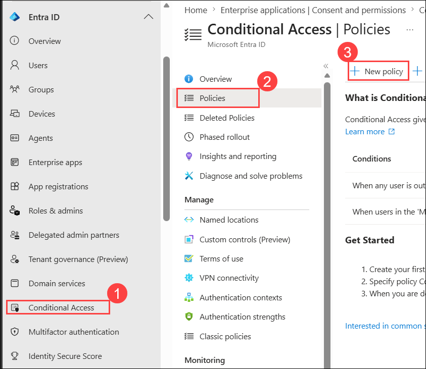

1. Enter the name **`Block access outside Trusted Network` (1)**.

   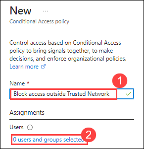

1. Under **Users or agents**, select **0 users or agents selected (2)**.
   1. Under **Include (1)** select **Select users and groups (2)** and tick **Users and groups (3)**.

      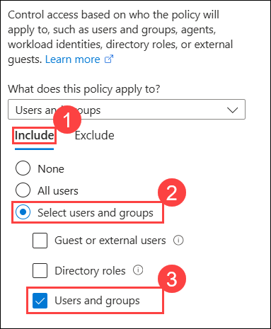

   2. Select **Allan Deyoung (1)** as the sole test user for the policy, then select **Select (2)** at the bottom of the page.

      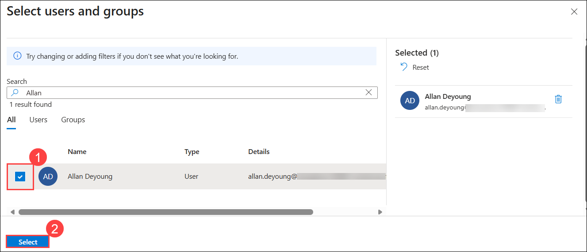

1. Under **Target resources**, select **No target resources selected**.
   1. Under **Include (1)** select **All resources (formerly 'All cloud apps') (2)**.

      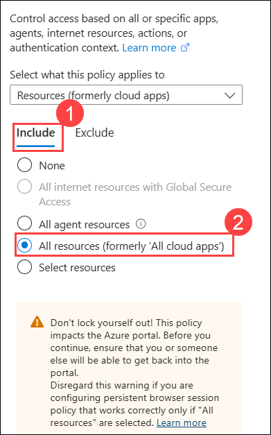

1. Under **Network**, select **Not configured (1)**.
   1. Select **Yes (2)** to configure the location condition.
   1. Under **Include (3)** select **Any network or location (4)**.

      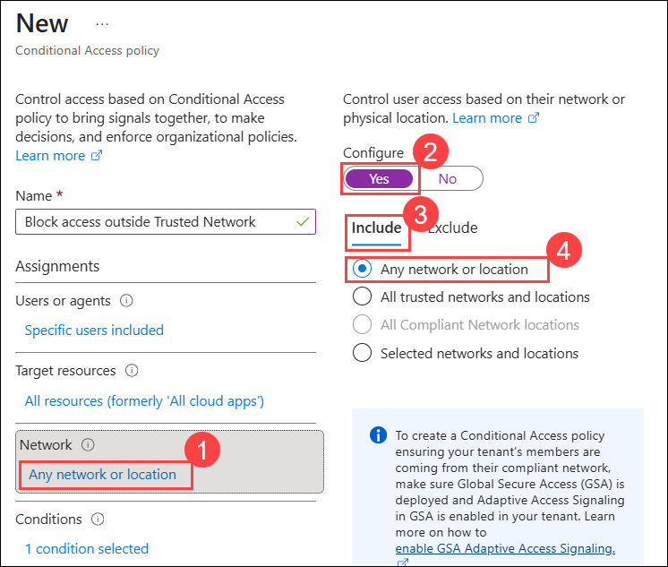

   1. Under **Exclude (5)** select **All trusted networks and locations (6)**.

      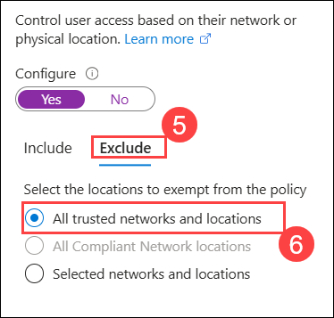

1. Under **Grant** select **0 controls selected (1)**.
   1. Switch it from **Grant access** to **Block access (2)**

   1. Choose **Select (3)** at the bottom of the page.

      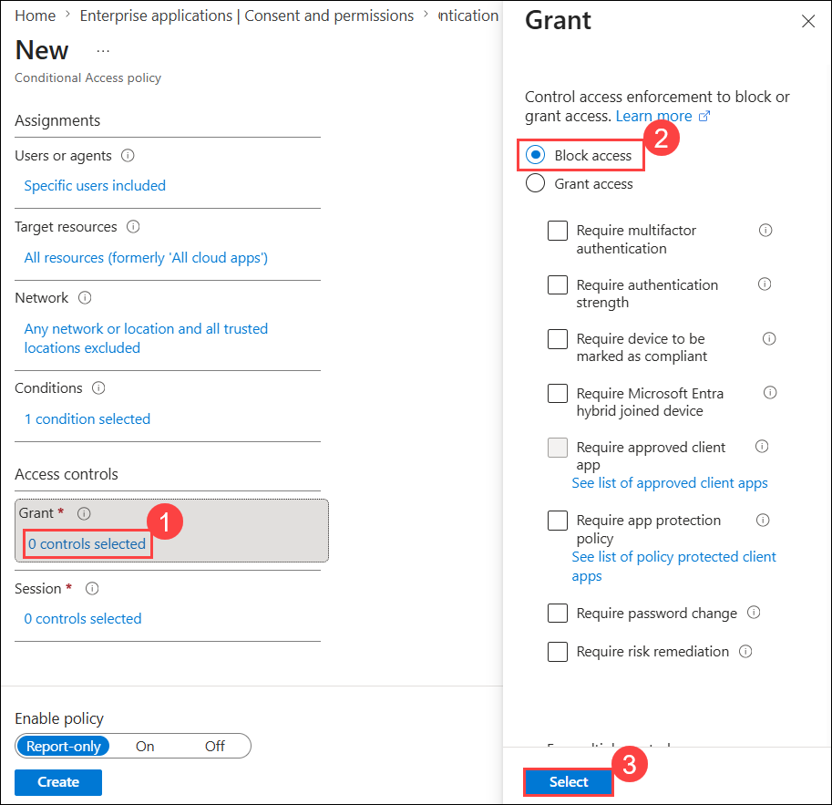

1. Under **Session** select **0 controls selected (1)**.
   1. Enable **Customize continuous access evaluation (2)**
   1. Select **Strictly enforce location policies (preview) (3)**
   1. Choose **Select (4)** at the bottom to confirm.

      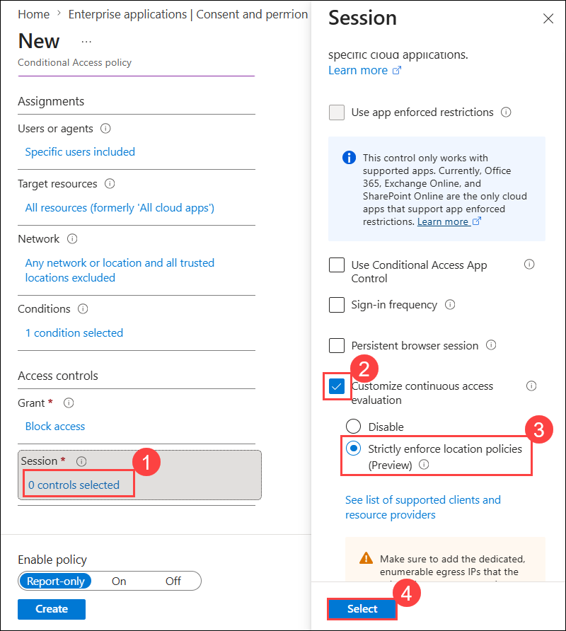

1. Where it says **Enable Policy**, select **On (1)**, then select **Create (2)**.

   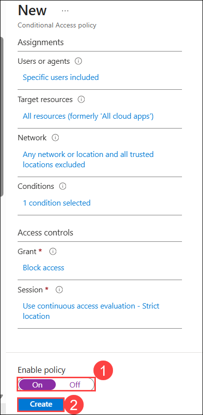

> **Success!** You have now created and enabled your CA policy to restrict access outside trusted networks only affecting your own test user account.

> **Congratulations** on completing the task! Now, it's time to validate it. Here are the steps:

- Hit the Validate button for the corresponding task. If you receive a success message, you can proceed to the next task.
- If not, carefully read the error message and retry the step, following the instructions in the lab guide.
- If you need any assistance, please contact us at cloudlabs-support@spektrasystems.com. We are available 24/7 to help

<validation step="ab7de097-f109-48c9-82ef-c69c8122bc37" />

### Task 3 - Test the configured Policy

Since you have created a Conditional Access policy limiting access to all cloud applications of your company you must make sure that access is still possible.

> **ALERT**: This task is significantly abbreviated for illustrative purposes!In a real world scenario you would do a longer testing period with a larger, more representative group to make sure that no unforeseeable incidents distort the result.

1.  Right-click the **Microsoft Edge** icon **(1)** on the taskbar, then select **New InPrivate window (2)** to open a new InPrivate browsing window.

    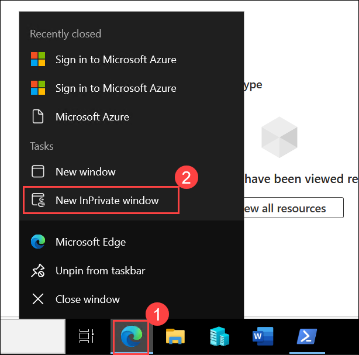

1.  Select the address bar, navigate to **`https://portal.microsoft.com`** and log into the M365 Portal as **Allan Deyoung** using below credentials
    - Email : <inject key="User 02 UPN" enableCopy="true"/>
    - Password : <inject key="User 02 Password" enableCopy="true"/>

1.  On the Stay signed in? dialog box, select the **Don’t show this again** checkbox and then select **No**.

    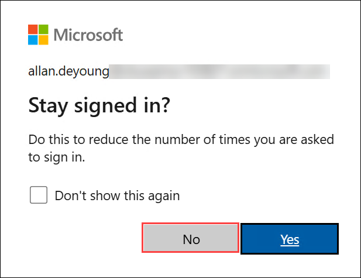

1.  Since the login was successful, you can close the **InPrivate** window.

1.  Switch back to your Edge browser window where you should still be logged into the Entra ID portal **https://entra.microsoft.com**.

1.  On the left navigation pane, expand Entra ID then navigate to **Conditional Access (1) > Sign-in logs (2)** (listed under Monitoring).

    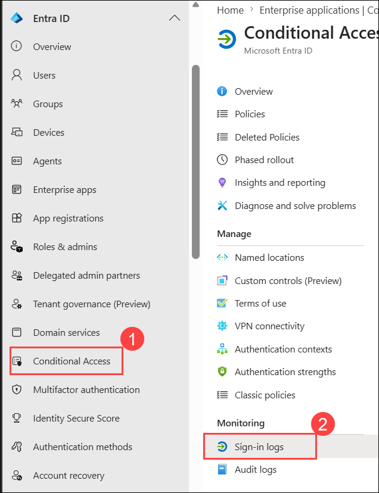

1.  Select the latest log entry of **Allan Deyoung** (it could take a couple of minutes for the Allan Deyoug entries to appear).

    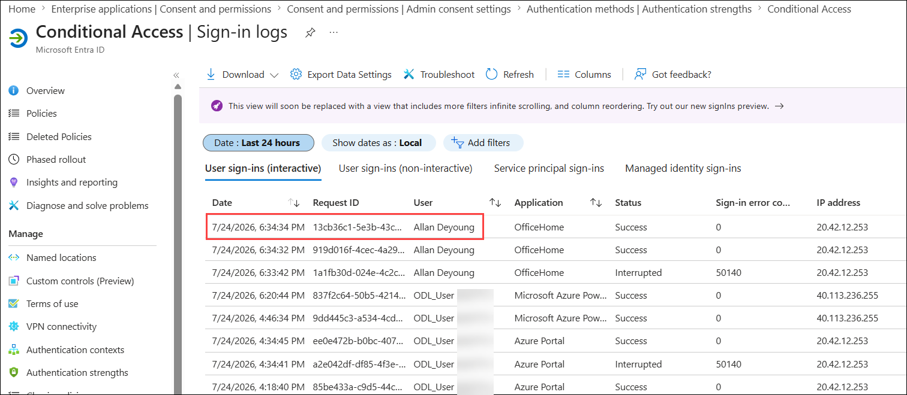

1.  You are currently in the Basic info tab. From the top of the page, select the **Conditional Access (1)** tab, select **Block access outside Trusted Network (2)**.

    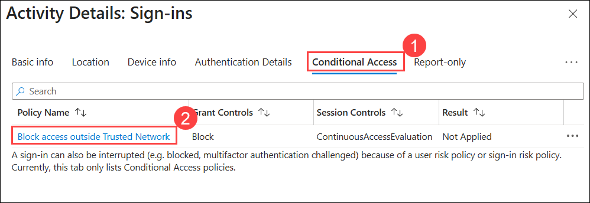
    1. Select the **User** assignment and you should see, that it **Matched** by **Direct assignment**.

    1. Select the **Resource** assignment and you should see, that it **Matched** by **All resources included**.

       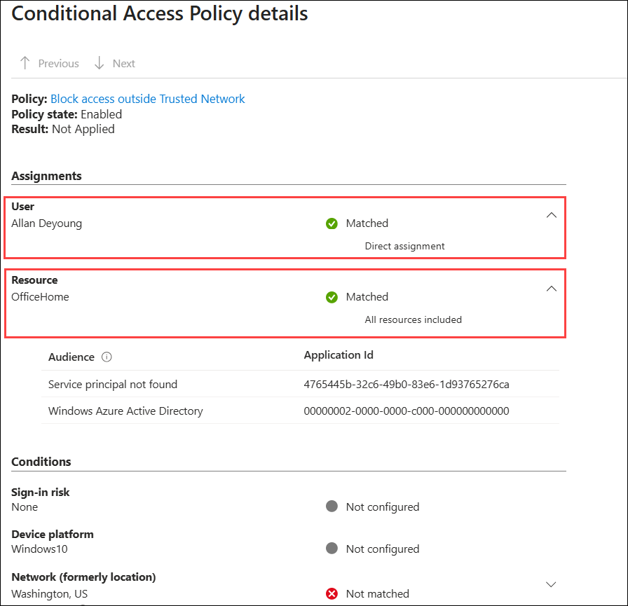

1.  You should also see, that the **Network (formerly location)** condition was **Not matched** since it is within the trusted network that is excluded.
    If you tried to log in from a network with a different external IP address, this condition would match and block the login attempt.

        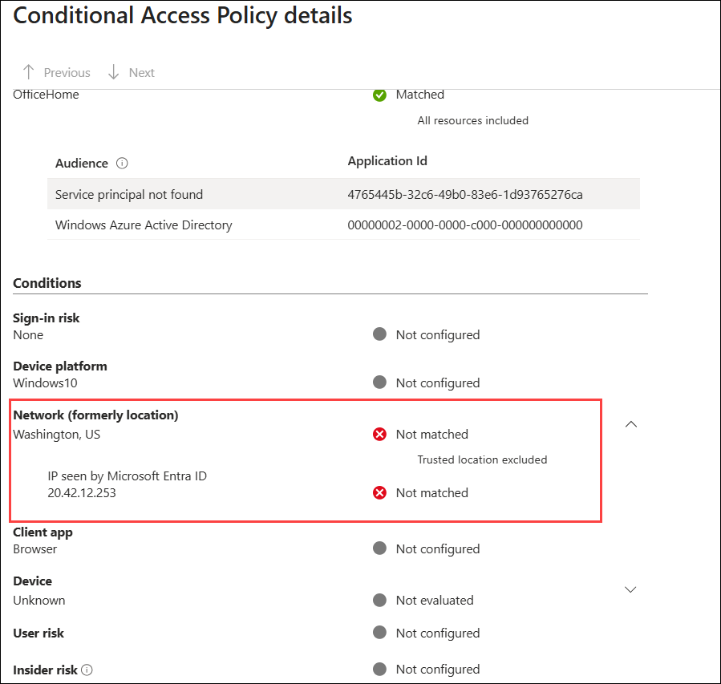

1.  Close the **Conditional Access Policy details** and the **Activity Details: Sign-ins**.

> **Success!** You have now successfully tested and ensured access to all cloud applications from within the company's network. You have also checked the Sign-in logs, to ensure, that the policy works as intended and uses the correct assignments and conditions to restrict access to your cloud applications from outside the company's network.

### Task 4 - Company-wide policy rollout

After the successful test in the previous task, you can now enable the policy for the entire company. To do this you will edit the user scope of the existing policy.

> **ALERT**: The actions implemented in this task can lead to Account lockout!
> Make sure, that you have at least one emergency admin account that is excluded from this policy in a productive, real world scenario.

1. You should still be logged into the **Microsoft Entra admin center** **`https://entra.microsoft.com`**.

1. On the left naviagtion panel, navigate to **Entra ID** > **Enterprise applications (1)** > **All application (2)**. Click on ** + New Application (3)**.

   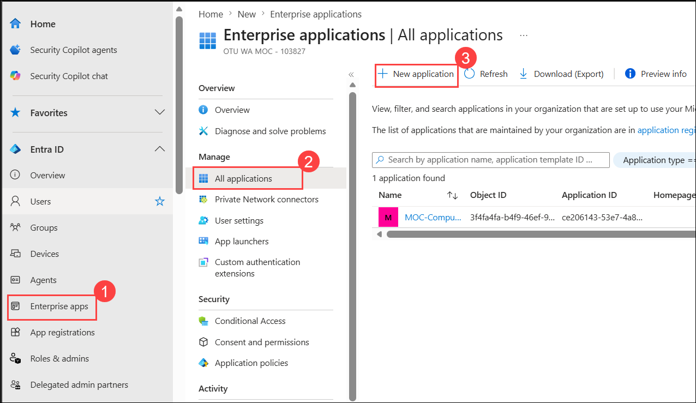

1. Seach for **Salesforce (1)**. Once you find it, click on **Salesforce (2)**. Click on **Create (3)**, this will add the application.

   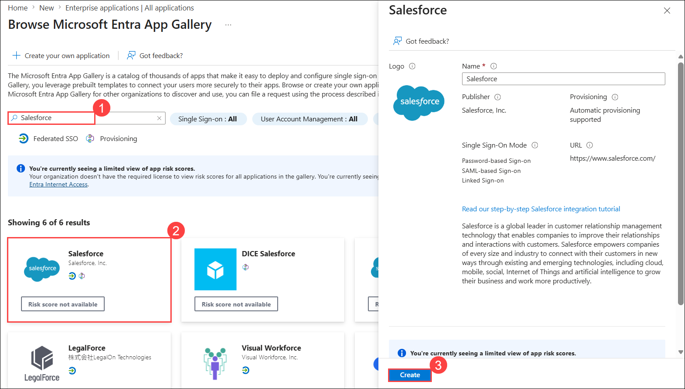

1. On the left navigation pane, expand **Entra ID** then navigate to **Conditional Access (1)** > **Policies (2)**.

1. Select the policy **Block access outside Trusted Network (3)**, then select **View or Edit (4)** button.

   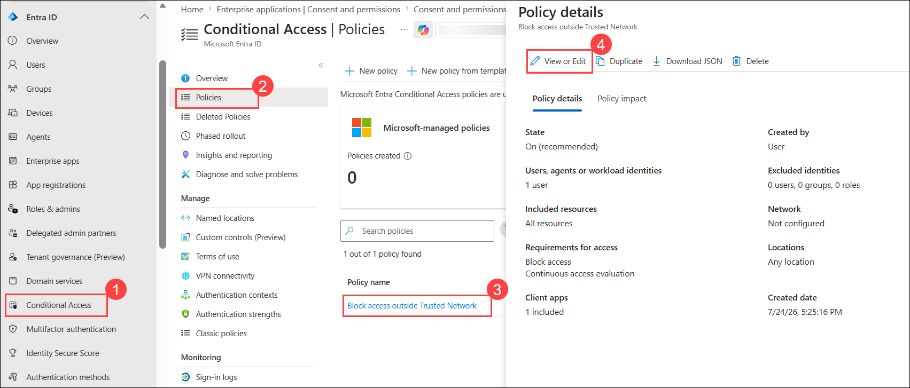

1. Under **Users or agents** select **Specific users included (1)**.

   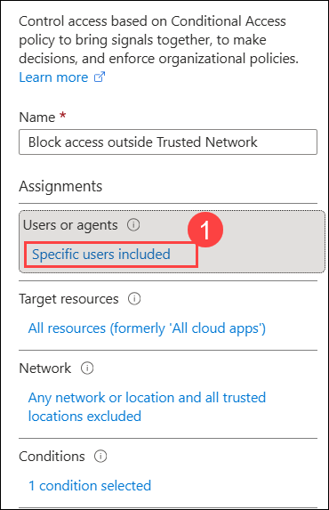

1. Select **All users (2)**.

1. In the warning that appeared on the bottom of the window select **Exclude current user, <inject key="AzureAdUserEmail"></inject>, from this policy (3)**.

1. Select **Save (4)**.

   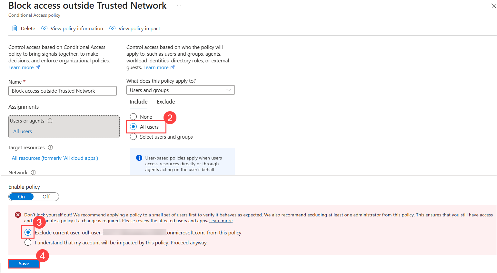

> **Note**: You have now configured an active working Conditional Access policy that prevents users from logging in outside the trusted network you defined as the company's external IP address. This was tested using a limited user scope to ensure that all cloud applications remain accessible. Lastly you have rolled out the CA policy to all users.

> **Success!** You have successfully restricted access from outside the trusted network.

### Task 5 - Require MFA for Salesforce

In this task, you create a CA policy to enforce the authentication strenth you created in the previous exercise when signing into Salesforce.

> **IMPORTANT**: This task will skip the testing phase. In a real world scenario you would test with a limited user scope first as seen in the previous tasks and perform a full rollout after a successful testing phase.

2. On the left navigation pane, expand **Entra ID** then navigate to **Conditional Access (1)** > **Policies (2)**.

3. Select **+ New policy (3)**.

   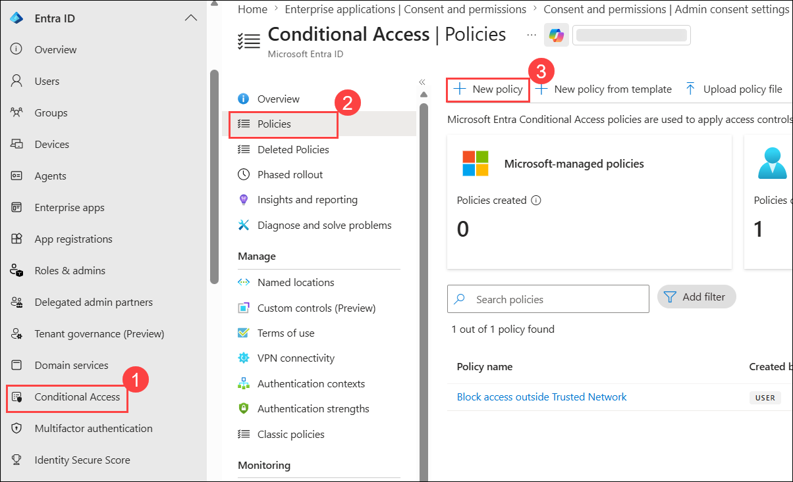

4. Enter the name **`Salesforce authentication strength` (1)**

5. Select **0 users and groups selected (2)**.

   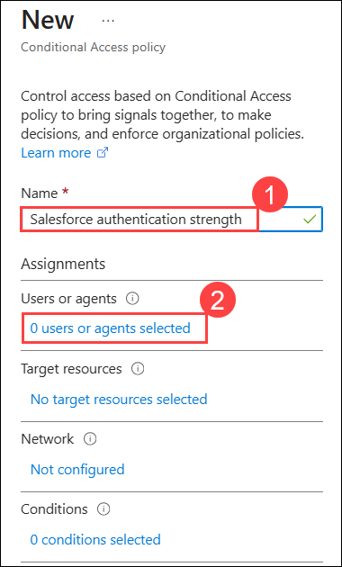

6. Under **Include (1)** select **Select users and groups (2)** and tick **Users and groups (3)**.

7. Select **Alex Wilber (4)** from Sales as the sole test user for the policy, then select **Select (5)** at the bottom of the page.

   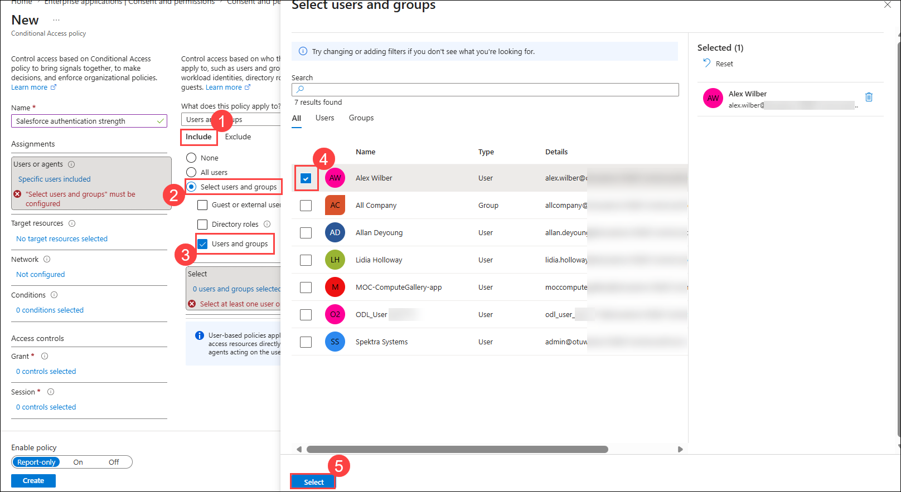

8. Under **Target resources**, select **No target resources selected (1)**.
   1. Under **Include (2)** select **Select resources (3)**.
   2. Under **Select specific resources** select **None (4)** and search for **Salesforce (5)**.
   3. Select **Salesforce (6)**, then Confirm your choice with **Select (7)**.

      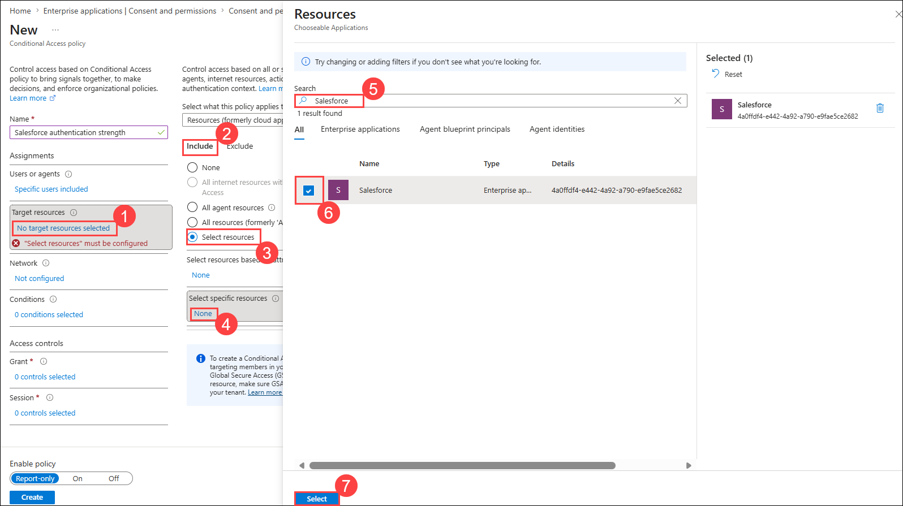

9. Under **Grant** select **0 controls selected (1)**
   1. Enable **Require authentication strength (2)**.
   1. From the drop-down menu, select your custom created authentication strength **Hardened MFA (3)** and confirm with the **Select (4)** button.

      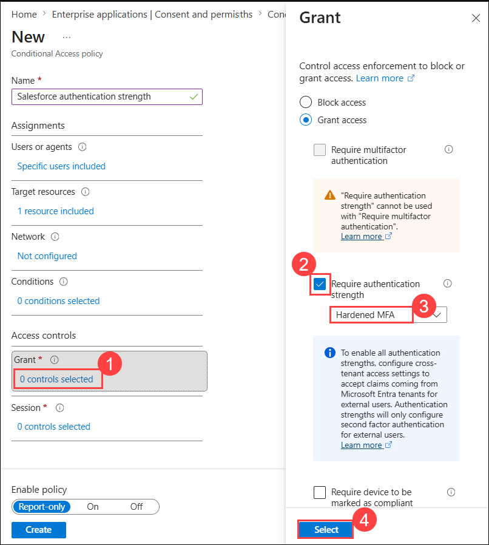

10. Now set the policy to **On (1)** using the control bar at the bottom and select **Create (2)**.

    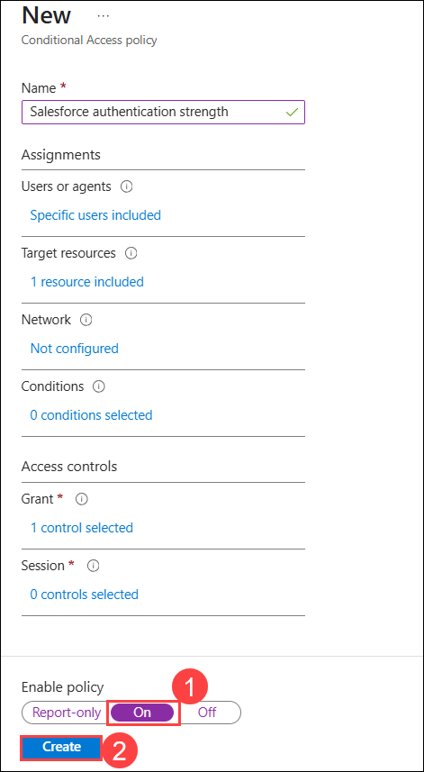

11. After a successful testing phase with your limited user scope select **Salesforce authentication strength**.

    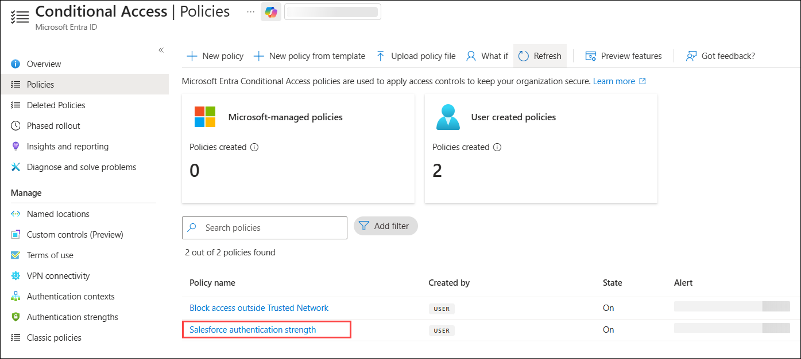

12. On the **Policy details** pane, select **View or Edit** button.

    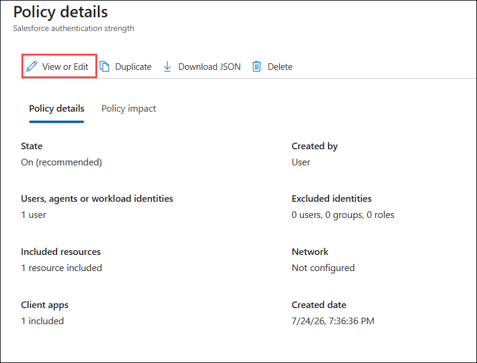

13. Under **Users or agents** select **Specific users included**.

    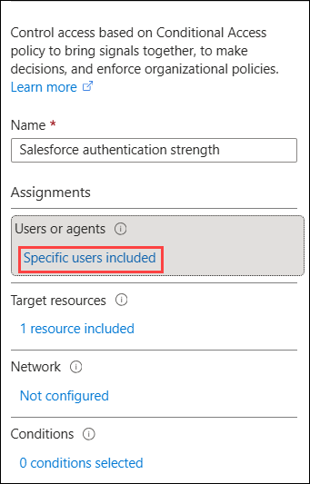

14. Select **All users (1)**.

15. Select **Save (2)**.

    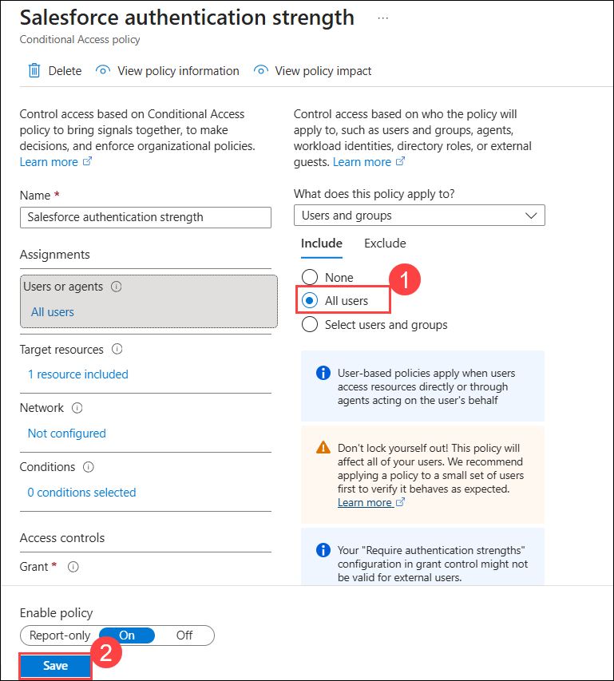

> **Success!** You have now created a CA policy to enforce your authentication strength policy to Salesforce excluding SMS OTP and therefore prevent successful attacks using SMS interception.

> **Congratulations** on completing the task! Now, it's time to validate it. Here are the steps:

- Hit the Validate button for the corresponding task. If you receive a success message, you can proceed to the next task.
- If not, carefully read the error message and retry the step, following the instructions in the lab guide.
- If you need any assistance, please contact us at cloudlabs-support@spektrasystems.com. We are available 24/7 to help

<validation step="ab7de097-f109-48c9-82ef-c69c8122bc37" />

### Review

In this exercise, you have completed the following:

- Created trusted network.
- Created new Conditional Access Policy with limited scope.
- Tested the configured Policy.
- Configured an active working Conditional Access policy that prevents users from logging in outside the trusted network.
- Created a CA policy to enforce your authentication strength policy to Salesforce.

### You have successfully finished the exercise. Click on **Next** to move on to the next exercise.

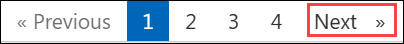
