# Lab 01: Security Operations Center

## Estimated Duration: 40 Minutes

## Lab Overview

Contoso's Security Operations Center (SOC) needs to deploy Microsoft Sentinel as their SIEM solution and configure appropriate access controls. The SOC has two roles—security analysts and security engineers—each with different permission requirements, plus a network team that requires access to only specific logs.

## Lab Objectives

In this lab, you will perform

- **Task 1:** Create a Log Analytics workspace  
- **Task 2:** Deploy Microsoft Sentinel to the workspace
- **Task 3:** Configure role-based access control for SOC roles
- **Task 4:** Review the steps to create a custom dashboard for incidents and alerts

## Architecture Diagram

   

## Explanation of Components

The architecture for this lab involves the following key components:

   - **Log Analytics Workspace**: Centralized environment for collecting, storing, and analyzing logs from Azure resources.  

   - **Azure Sentinel**: Security analytics tool integrated with Log Analytics for real-time threat detection and response.  

   - **Role-Based Access Control (RBAC)**: Manages access securely by assigning roles to users and groups.  

   - **Workbooks**: Interactive dashboards for visualizing and analyzing data trends and security insights.

## Task 1 - Create Log Analytics Workspace

In this task, you'll create a log analytics workspace which is required to house all of the data that Microsoft Sentinel will be ingesting and using for its detections and analytics.

1. Open Edge and sign into the Azure portal **`https://portal.azure.com`** using the following credentials:
   
   - **Username** <inject key="AzureAdUserEmail"></inject>
   
   - **Password:** <inject key="AzureAdUserPassword"></inject>

1. In the Search bar of the Azure portal, type **Log Analytics (1)**, then select **Log Analytics workspaces (2)**.

   

1. Click On **+ Create**.

   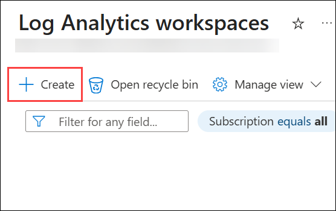

1. On Create Log Analytics workspace tab, please enter the following details:
   | Settings | Values |
   | -- | -- |
   | Subscription | _Leave default subscription_ **(1)** |
   | Resource group | Select the resource group name **sc-100-lab1** from the dropdown list **(2)** |
   | Name | **law-sentinel-<inject key="DeploymentID" enableCopy="false" /></inject> (3)** |
   | Region | **<inject key="Resource group Region" enableCopy="false" ></inject> (4)** |

   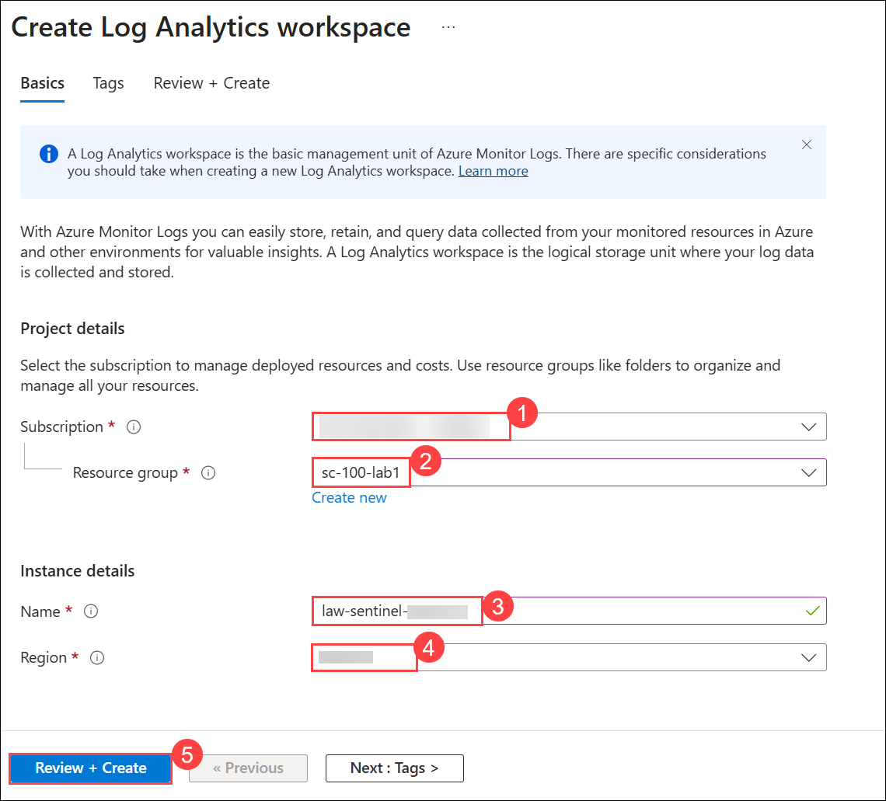

1. Select **Review & Create (5)**.

1. Once the workspace validation has passed, select **Create**.

   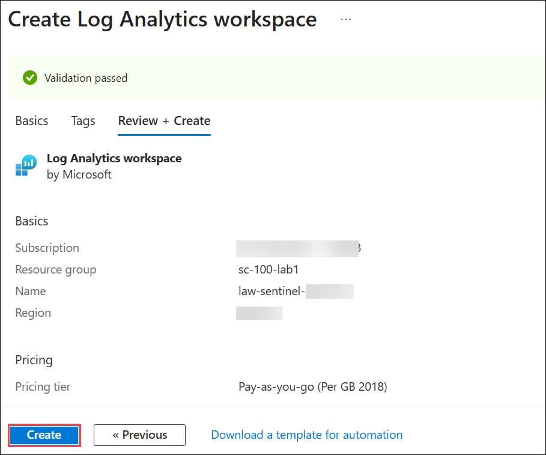

> **Congratulations** on completing the task! Now, it's time to validate it. Here are the steps:
	
 - Hit the Validate button for the corresponding task. If you receive a success message, you can proceed to the next task.
 - If not, carefully read the error message and retry the step, following the instructions in the lab guide.
 - If you need any assistance, please contact us at cloudlabs-support@spektrasystems.com. We are available 24/7 to help you out.
    
<validation step="76fe2891-2386-4c8f-872c-46eb9701d50c" />

   >**Success!** You successfully created the log analytics workspace for your Sentinel deployment.

## Task 2 - Create Sentinel

1. In the Search bar of the Azure portal, type **microsoft sentinel (1)**, then select **Microsoft Sentinel (2)**.

     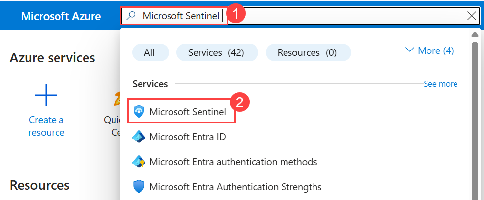

1. From the **Microsoft Sentinel** page, select **+ Create**.

     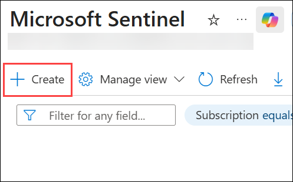

1. In the **Add a Microsoft Sentinel to a workspace page** the previously created log analytics workspace should be listed. Select **law-sentinel-<inject key="DeploymentID" enableCopy="false" /></inject> (1)** then select **Add (2)**.

     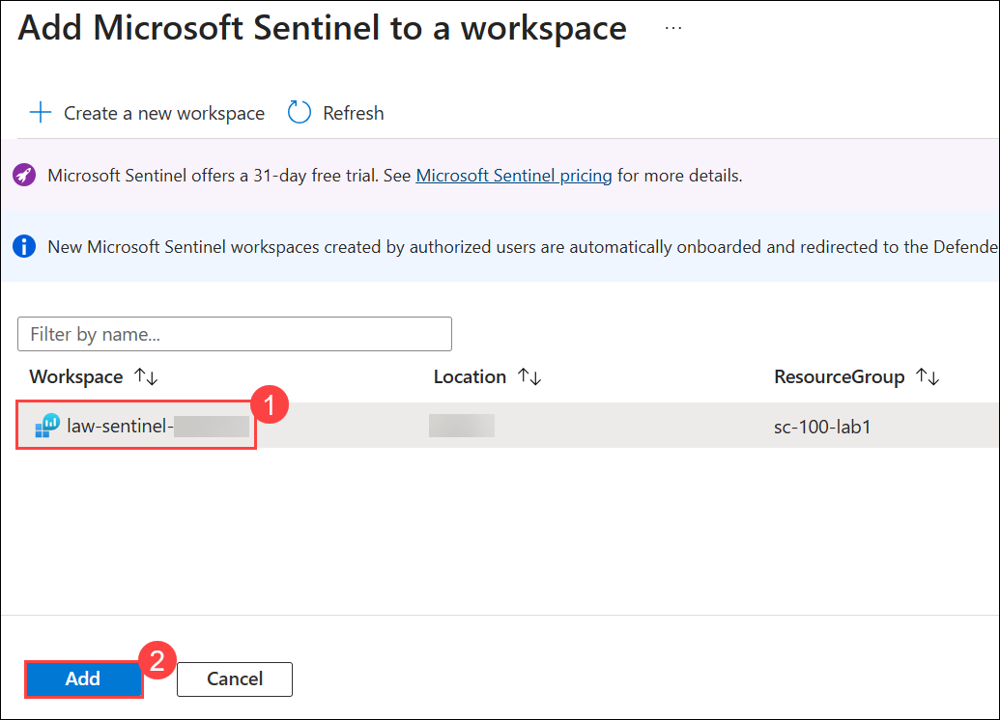

1. It may take a few minutes to add Sentinel to the workspace. Once it's added, the **Microsoft Sentinel | Guides** page is displayed.  You're notified that the Microsoft Sentinel free trial is activated.  Select **Ok**.

     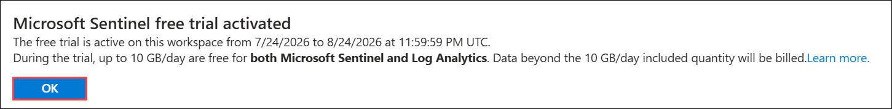

1. From the center of the page, select **Go to content hub**. The content hub is where you would go to download solutions. Explore the content hub, at will.

## Task 3 - Setup RBAC

#### Permission requirements

| Role | Permissions |
|---|---|
| Security analyst | View data, incidents, workbooks and other Sentinel resources and Assigning/dismissing incidents. |
| Security engineer | Create and edit workbooks and analytics rules  Install and update solutions from content hub |

---

1. In the top searchbar, search for **Resoure groups** and select **sc-100-lab1** resource group.

1. In the left navigation pane, select **Access control (IAM) (1)**.

1. Select **Add (2)**, from the dropdown select **Add role assignment (3)**.

     

1. Search for **`Microsoft Sentinel Responder` (1)** and select **View (2)** in the Details column.

1. Review that the permissions match the requirements.

1. Close the window with **X** in the top right corner.

1. Select **Next (3)**.

     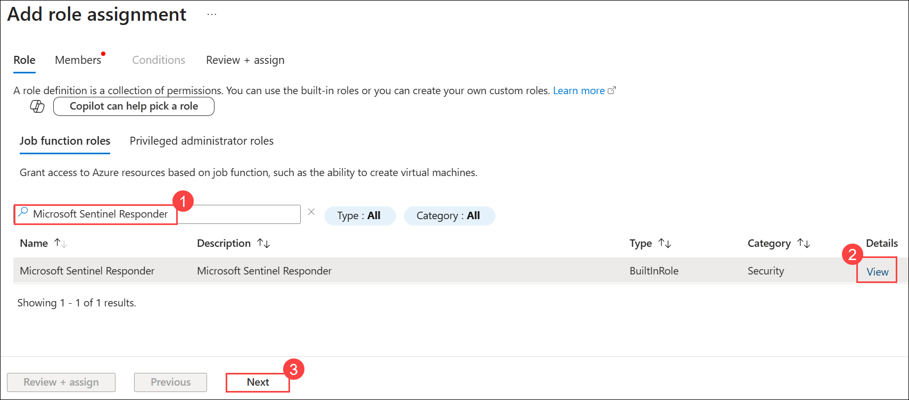

1. Select **+ Select members (1)**.

1. Search for **`SOC Analysts` (2)** Group, select **SOC Analysts** from the search results, press **Select (3)** and add the role assignment.

     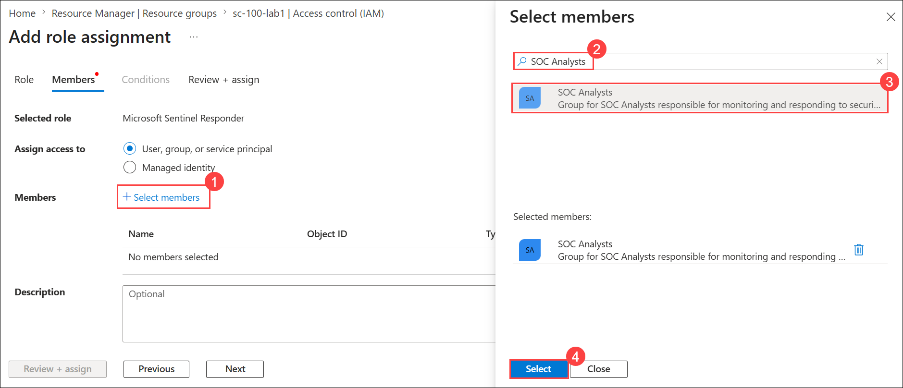

1. Select **Review + assign** twice.

     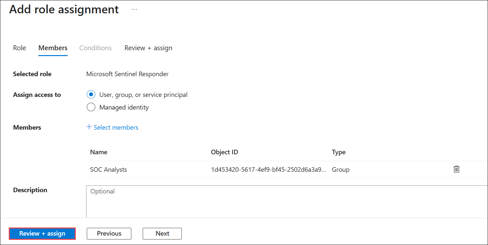

1. You'll repeat the steps for the Sentinel Contributor role. Select **Add**, from the dropdown select **Add role assignment**.

1. Search for **`Microsoft Sentinel Contributor` (1)** and select the role **(2)**.

1. Select **Next (3)**.

     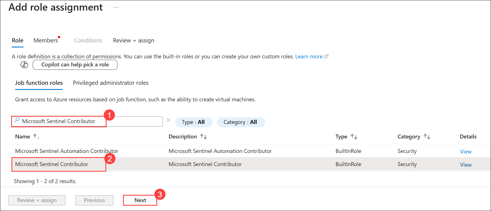

1. Select **+ Select members (1)**.

1. On the **Select members** blade, search for the **`SOC Engineers` (2)** Group. From the search results select **SOC Engineers** press **Select (3)** to add the role assignment and select **Apply**.

     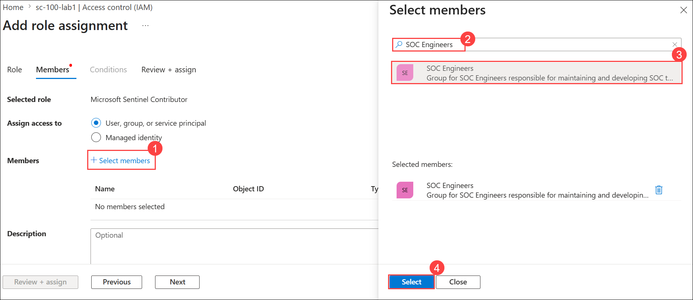

1. Select **Review + assign** twice.

1. Select **Role assignments tab**, Confirm that the role assignments are set.

## Task 4 - Create Workbook

In this task, you´ll create a workbook, to get a dashboard with custom views and current incidents and their alerts.

> **Note:** The steps to create a dashboard with custom views for incidents and their alerts are included for information purposes only, as there is no data available upon which to do this task. Executing the steps will not return any data.

1. Open the Edge browser and navigate to the **Defender portal** using the link below:

     ```
     https://security.microsoft.com/
     ```

1. If prompted, please close the **Microsoft Defender XDR quick tour** to go ahead.

1. On **Microsoft Defender** page, if the left navigation pane is collapsed, select **Show navigation** to expand it.

     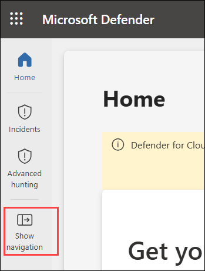

1. In the **Microsoft Sentinel (1)** menu, expand **Threat management (2)**, select **Workbooks (3)**, and then select **Add Workbook (4)**.

     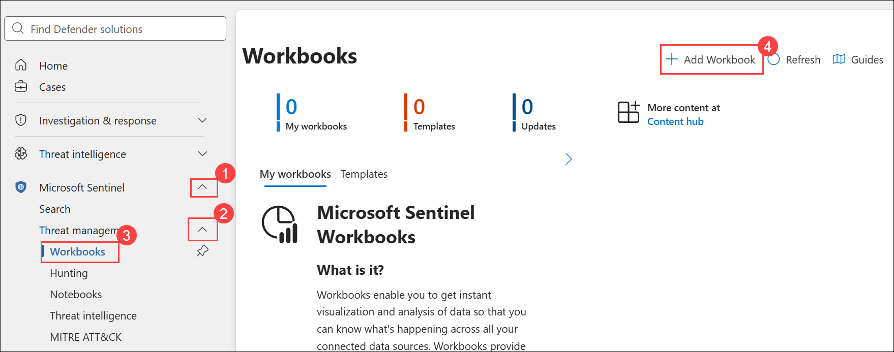

1. In the workbook, select the **Edit** icon.

     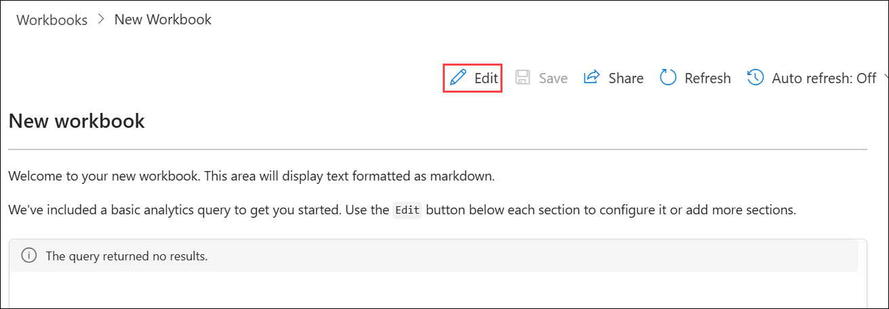

1. Select the first **Edit** button on the right side.

     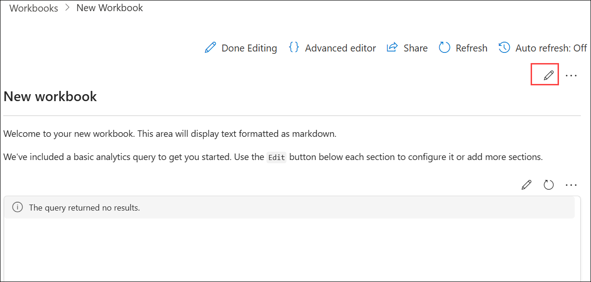

1. In edit mode, select the **More actions (1)** menu, expand **Add (2)**, and then select **Add parameters (3)**.

     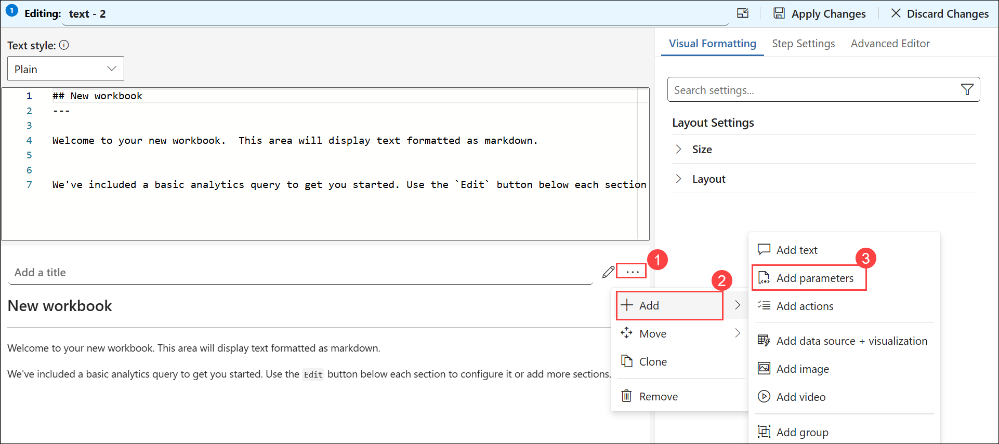

1. Select **Edit inline** to expand the text editor into inline editing mode.

     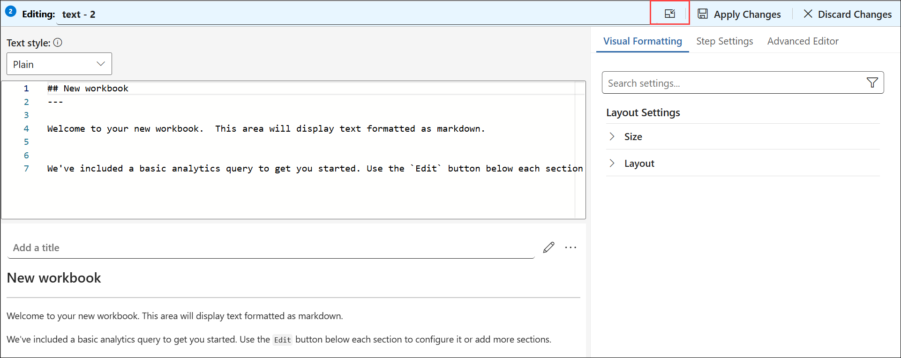

1. Select **Add** to create a new workbook parameter.

     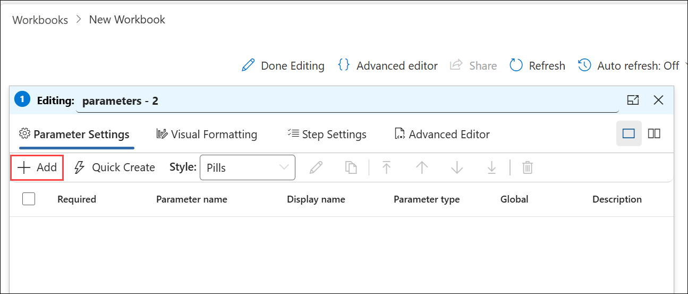

1. In the **New Parameter** pane, enter **TimeRange (1)** as the **Parameter name**, select **Time range picker (2)** as the **Parameter type**, and select **Required? (3)**.
   
     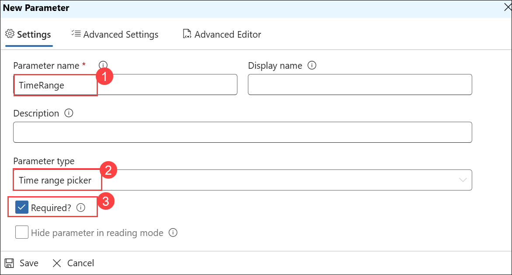

1. In the **New Parameter** pane, select **Last 7 days (1)** under **Available time ranges**, and then select **Save (2)**.

    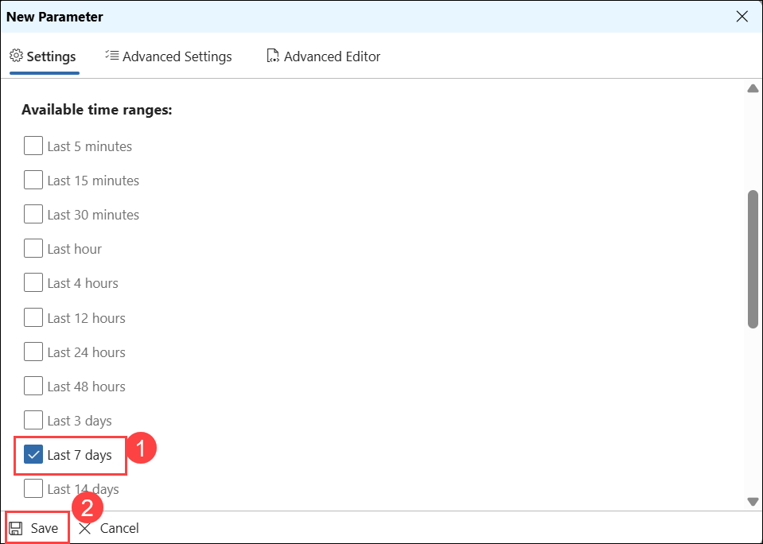

1. In the **TimeRange** parameter, select **Last 7 days (2)**, and then select **Apply (3)**.

     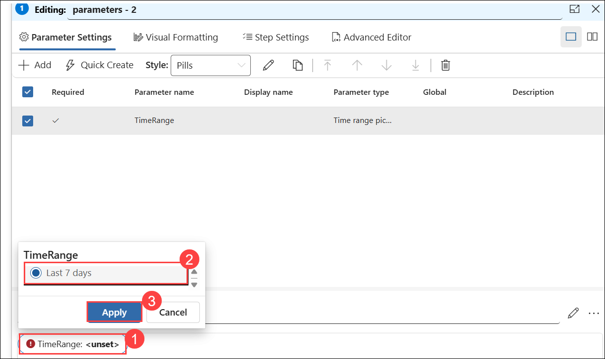

1. Select **Add** to create another parameter.

     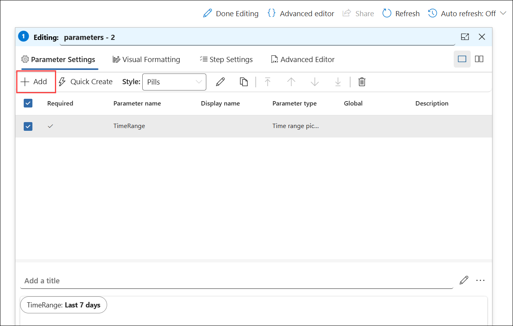

1. In the **New Parameter** pane, configure the following settings:
    - **Parameter name (1):** AlertSeverity
    - **Parameter type (2):** Drop down

    - Select the following options **(3)**:
      - **Required?**
      - **Allow multiple selections**
      - **Hide parameter in reading mode**

      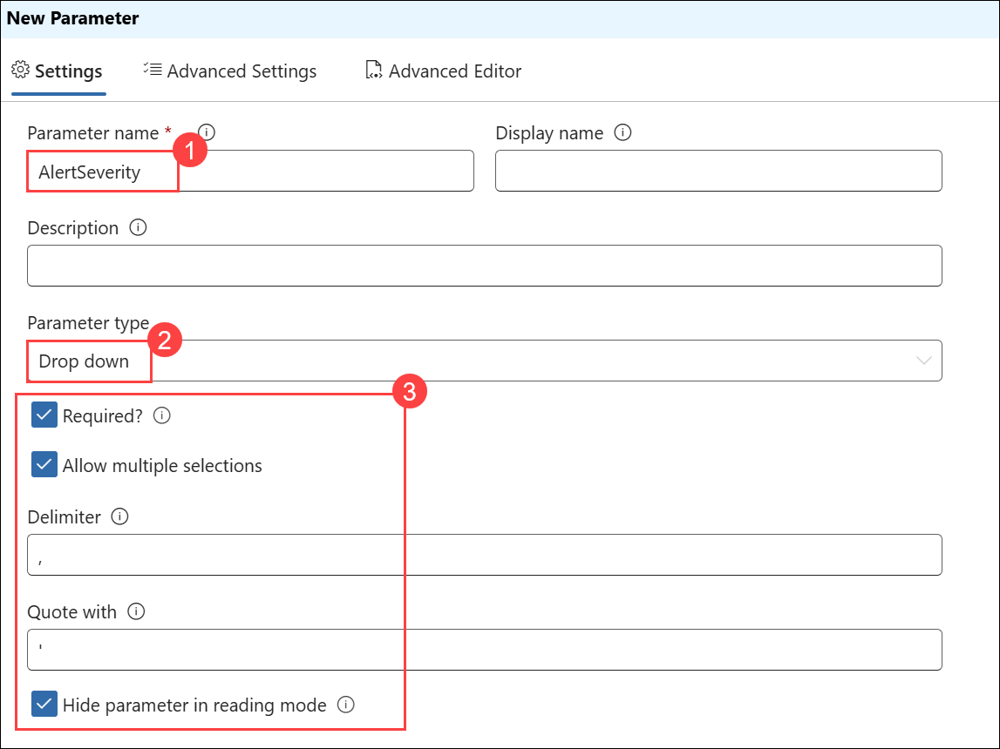

1. Under **Get data from**, select **Query (1)**, set **Time range (2)** to **TimeRange**, and enter the following query in the **Logs (Analytics) Query (3)** field.

    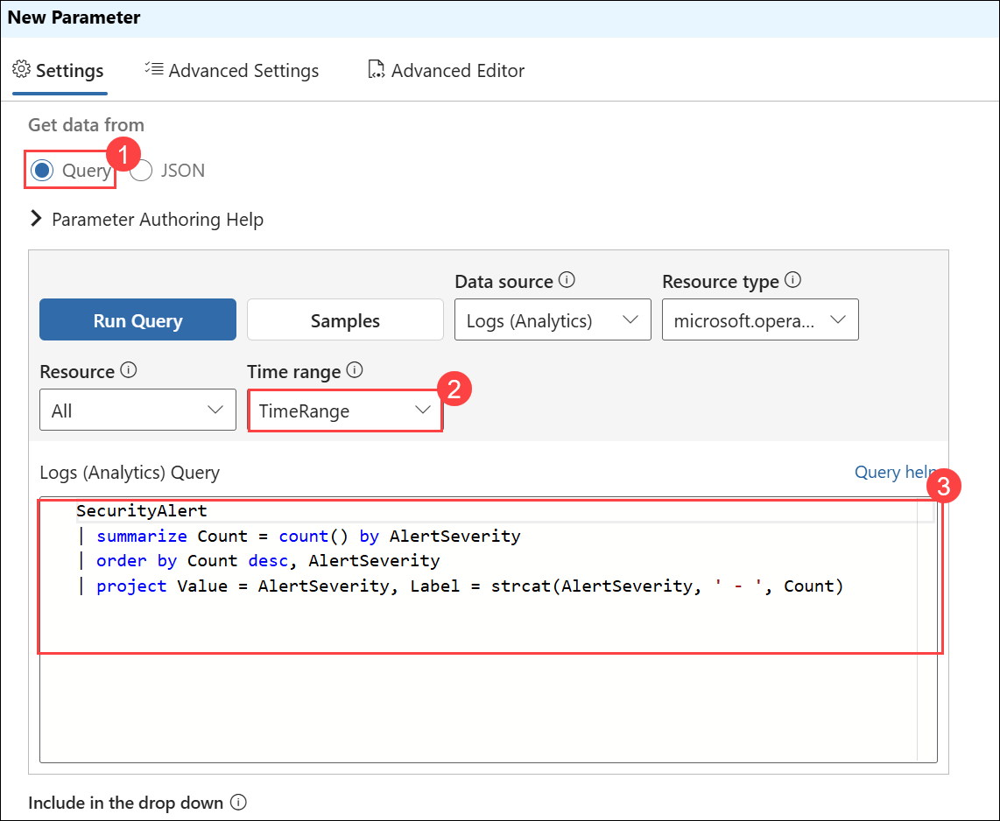

     ```KQL
     SecurityAlert
     | summarize Count = count() by AlertSeverity
     | order by Count desc, AlertSeverity
     | project Value = AlertSeverity, Label = strcat(AlertSeverity, ' - ', Count)
     ```

1. Scroll down to **Include in the drop down**, select **All (1)**, set **Default selected item (2)** to **All**, and then select **Save**.

    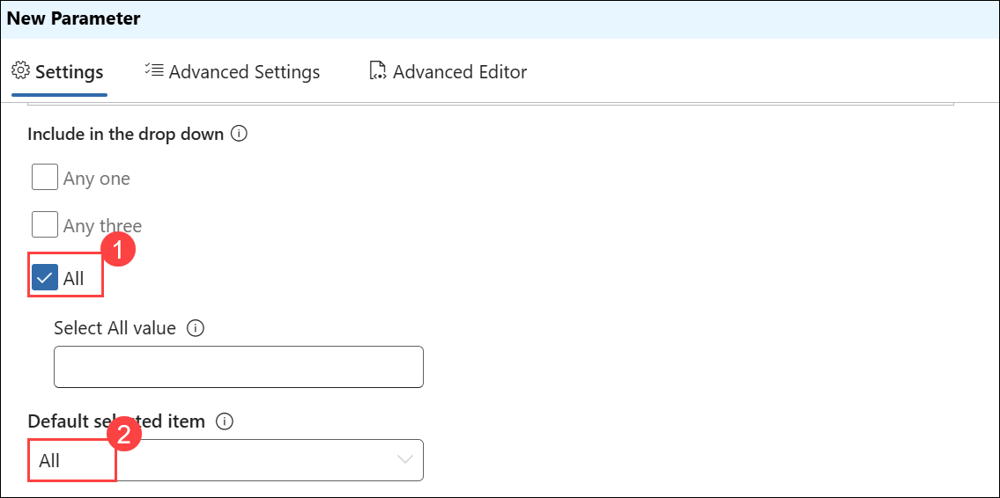

    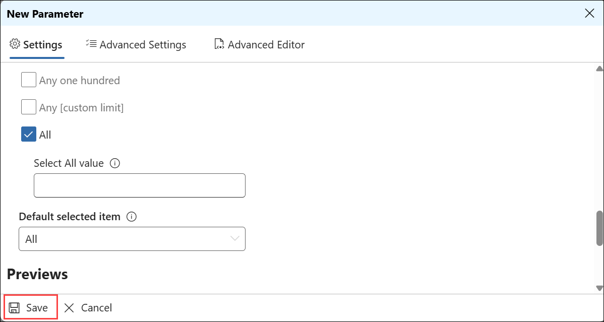

1. Select **Add** to create another parameter.

     

1. In the **New Parameter** pane, configure the following settings:

     - **Parameter name:** ProductName
     - **Parameter type:** Drop down

1. Check the following settings:
     - **Required?**
     - **Allow multiple selections**
     - **Hide parameter in reading mode**

1. Under **Get data from**, select **Query**, set **Time range** to **TimeRange**, and enter the following query in the **Logs (Analytics) Query** field.

    ```KQL
    SecurityAlert
    | summarize Count = count() by ProductName
    | order by Count desc, ProductName asc
    | project Value = ProductName, Label = strcat(ProductName, ' - ', Count)
    ```

1. Scroll down to **Include in the drop down**, check **All** and set **Default selected item** to **All**.

1. Select **Save**.

1. From the bottom of the Editing parameters window, select **More options (1)**, expand **Add (2)**, and then select **Add data source + visualization (3)**.

    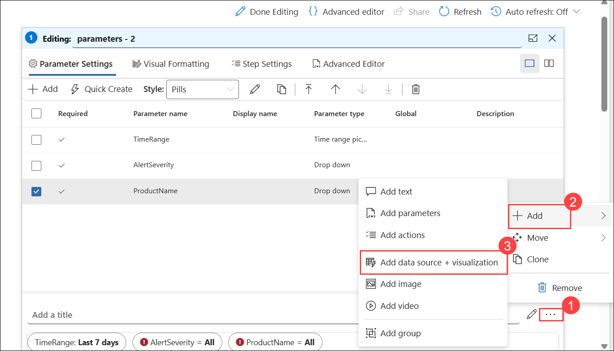

1. In the **Editing: query** pane, enter the following query in the **Logs (Analytics) Query (1)** field, set **Time range (2)** to **Set in query**, and then select **Step Settings (3)**.

    ```KQL
    SecurityIncident
    | where CreatedTime {TimeRange:value}
    | summarize arg_max(TimeGenerated,*) by tostring(IncidentNumber)
    | extend IncidentID = IncidentName
    | extend Alerts = extract("\\[(.*?)\\]", 1, tostring(AlertIds))
    | mv-expand AlertIds to typeof(string)
    | join
    (
        SecurityAlert
        | extend AlertEntities = parse_json(Entities)
        | mv-expand AlertEntities
    ) on $left.AlertIds == $right.SystemAlertId
    | summarize AlertCount=dcount(AlertIds) by IncidentNumber, Status, Severity, Title, Alerts, IncidentUrl, IncidentID
    | project IncidentNumber, IncidentID, Title, Severity, Status, AlertCount, Alerts, IncidentUrl
    | order by Severity
    ```

     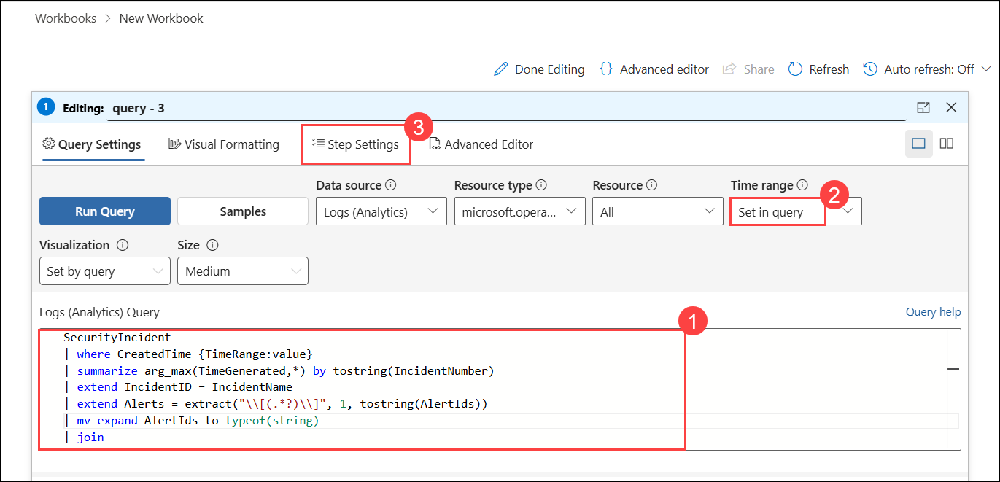

1. On the **Step Settings** tab, select **When items are selected, export parameters (1)**, and then select **+ Add Parameter (2)**.

     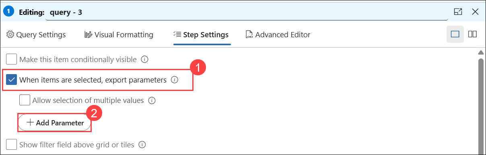

1. In the **Add Parameter** pane, enter **Alerts (1)** in the **Field to export** field, enter **Alerts (2)** in the **Parameter name** field, and then select **Apply (3)**.

    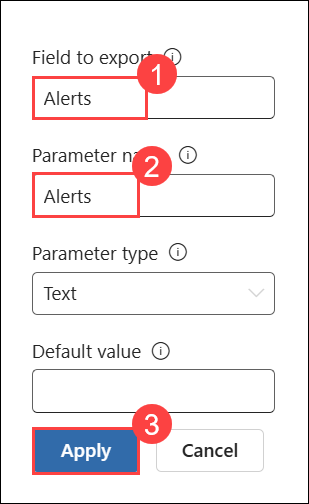 

1. From the bottom of the Editing query window, select **Done Editing**.

     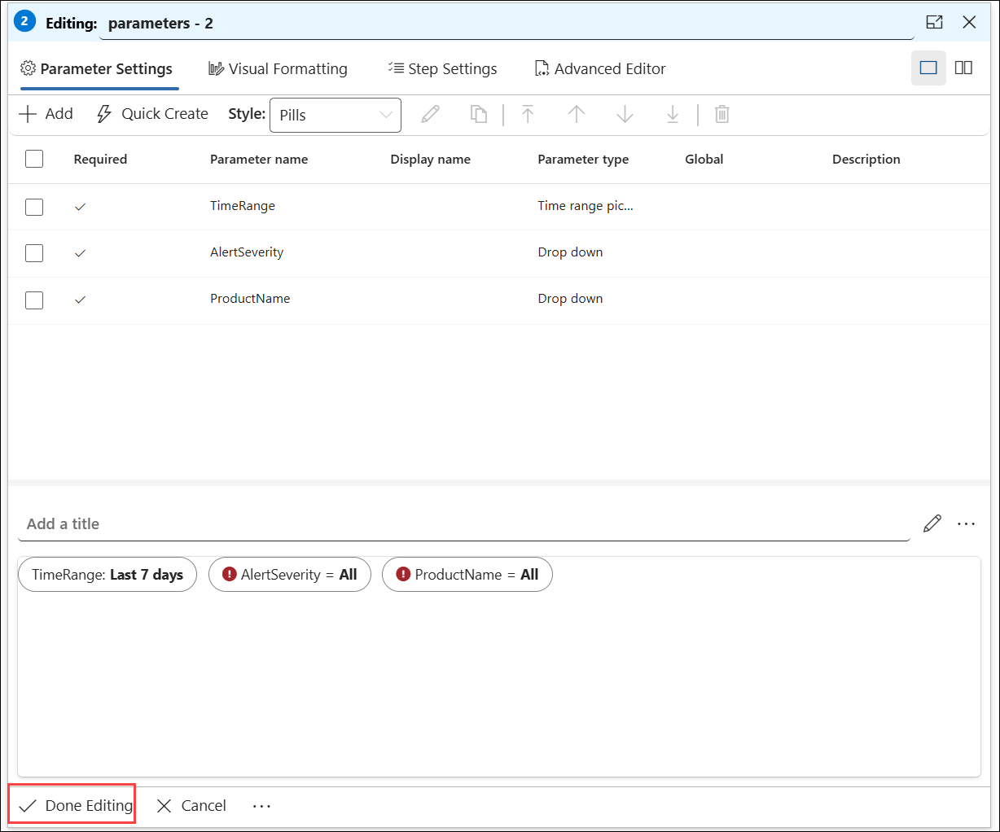 

1. Select **Done Editing** in the top bar of the **New workbook** window.

     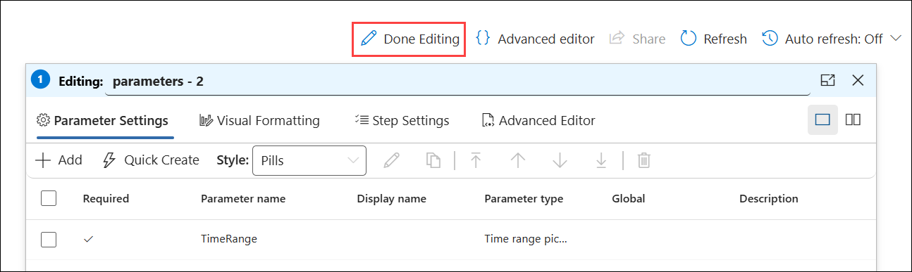 

1. Select **Save (1)**.

1. In the **Save Workbook** pane, enter **New Workbook (2)** as the **Title**, verify the **Workspace (3)** and **Location (4)** values, and then select **Save (5)**.

    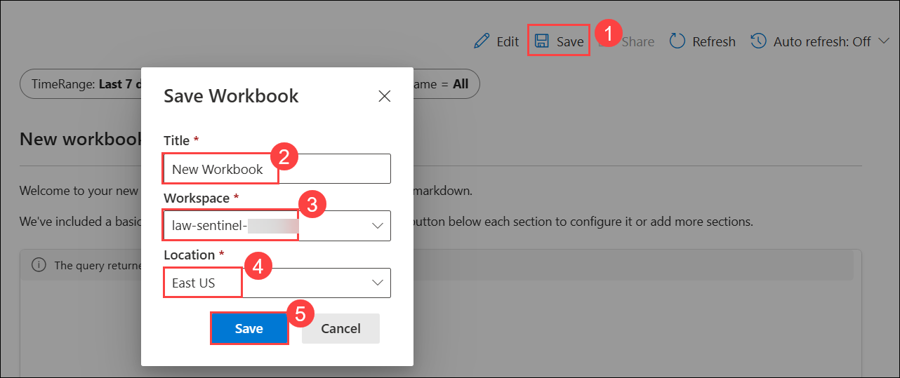 

> **Congratulations** on completing the task! Now, it's time to validate it. Here are the steps:
	
 - Hit the Validate button for the corresponding task. If you receive a success message, you can proceed to the next task.
 - If not, carefully read the error message and retry the step, following the instructions in the lab guide.
 - If you need any assistance, please contact us at labs-support@spektrasystems.com. We are available 24/7 to help you out.
    
<validation step="80e42d63-07d4-44b8-bce9-022ddf79ca4d" />

   >**Success!** You successfully created a dashboard with custom views for incidents and the associated alerts.

## Review

In this exercise, you have completed the following:
- Created the log analytics workspace for your Sentinel deployment.
- Deployed Sentinel to the log analytics workspace and added data.
- Created role based access model for the role requirements for Contoso´s security operations team.
- Created a dashboard with custom views for incidents and the associated alerts.

### You have successfully finished the exercise. Click on **Next** to move on to the next exercise.
