# Lab 03: Shadow-IT

## Exercise Overview

Contoso's IT infrastructure has evolved over the past few decades, providing various server instances, applications, and services. Recently, the company has prioritized securing its environment by implementing Device Management, data governance, and Identity and Application Protection over the last two years. However, the process of restricting users to only specific applications deployed by the company has not yet been established, allowing users to install applications from various sources. As the organization's cyber security architect, your goal is to have a complete overview of all applications used by employees. Your protection measure is to block insecure applications in your environment.

## Exercise Objectives

After completing this exercise, you'll be able to:

- Integrate Microsoft Defender for Endpoint with Defender for Cloud Apps for unified security management.
- Investigate and identify Shadow IT within the organization (Contoso Ltd.).
- Block unsecure applications to enhance security posture.
- Automate the blocking of unsecure applications for continuous protection.

### Estimated Duration: 45 Minutes

## Architecture Diagram

## Explanation of Components

The architecture for this lab involves the following key components:

- **Integration of Defender for Endpoint with Defender for Cloud Apps**: Connects endpoint protection with cloud security to provide enhanced visibility and control over applications and user activities.

- **Shadow IT Investigation**: Identifies and analyzes unauthorized or unmanaged applications within Contoso Ltd's environment to uncover potential security risks.

- **Blocking Unsecure Applications**: Implements policies to restrict access to applications that fail to meet security standards, protecting organizational resources.

- **Automated Application Blocking**: Configures automation to detect and block unsecure applications proactively, ensuring continuous compliance and reducing manual intervention.

## Part 1: Design a solution

### Design Approach

In the given scenario, your initial action is to analyze and uncover all applications currently in use by employees. Unauthorized applications installed by users can pose security risks to the company, highlighting the need to identify Shadow IT. The subsequent step involves remedying the risks posed by these unsafe applications.

Defender for Cloud Apps is a security solution designed to address Shadow IT risks within cloud environments. It aids organizations in discovering and monitoring unauthorized cloud applications utilized by employees, evaluating their security posture, and enforcing policies to ensure compliance and safeguard data. By offering visibility and control over Shadow IT, Defender for Cloud Apps assists organizations in mitigating security risks associated with unauthorized cloud usage, thereby enhancing the security of their cloud environment.

### Proposed Solution

| Requirement                   | Solution                          | Action plan                                             |
| ----------------------------- | --------------------------------- | ------------------------------------------------------- |
| Discover Shadow IT            | Microsoft Defender for Cloud Apps | Investigate all applications in the Contoso environment |
| Block all unsafe applications | Microsoft Defender for Cloud Apps | Mark unsafe applications as unsanctioned                |

## Part 2: Implement the solution

### Task 1: Integrate Microsoft Defender for Endpoint with Defender for Cloud Apps

In order to control the use of application on users company owned devices you must integrate Defender for Endpoint with Defender for Cloud Apps.

1. Open a new tab in the Microsoft edge. Sign-in to the Microsoft Defender portal **`https://security.microsoft.com`** using below credentials
   - **Email/Username:** <inject key="AzureAdUserEmail"></inject>

   - **Password:** <inject key="AzureAdUserPassword"></inject>

1. Close the welcome tour by clicking the **X (Close)** button in the upper-right corner of the page.

   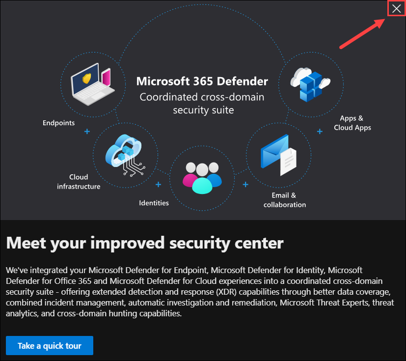

1. In the Microsoft Defender portal, select **Show navigation (1)**, expand **Investigation & response (2)** then expand **Hunting (3)** and select **Advanced Hunting (4)**. Wait for the completion of the new spaces preparation. This step is only for the purpose of setting up the new spaces, there is no hunting in this step.

   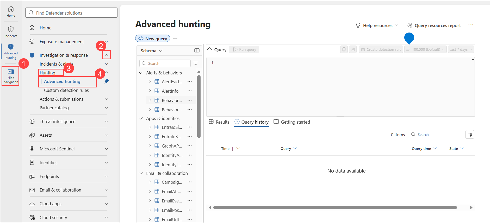

1. In the Microsoft Defender portal, in the left navigation page expand **System (1)** then select **Settings (2)**.

1. On the **Settings** page select **Endpoints (3)**.

   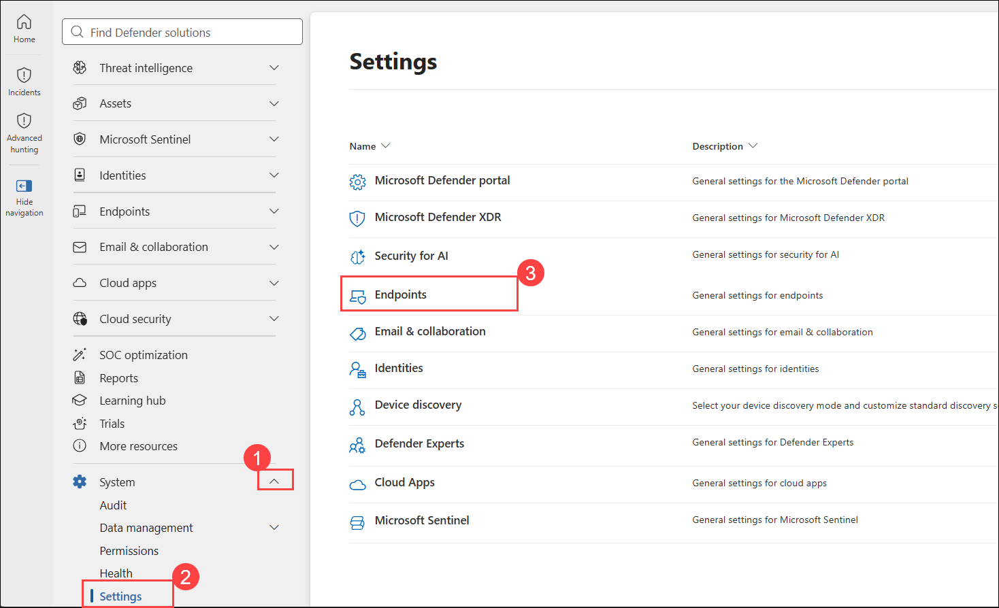

   > **Note:** It can take anywhere from 10 minutes to 24 hours for this option to appear. If after 10 minutes, you don't see it, continue with another exercise and then come back to this step.

1. Under **Endpoints**, select **Optional features (1)**. Scroll down until you see **Microsoft Defender for Cloud Apps**. Select the slider to set it to **On (2)**.

1. At the bottom of the page, select **Save preferences (3)**.

   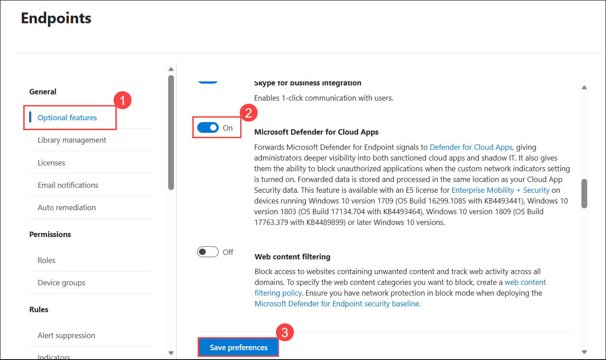

> **Success!** You have successfully enabled Microsoft Defender for Cloud Apps for Endpoints. With this set-up all signals coming from Microsoft Defender for Endpoints are forwarded to Defender for Cloud Apps giving you the ability to block unsecure applications. All applications tagged as **Unsanctoned** will now be blocked.

### Task 2: Investigate the Shadow-IT of Contoso Ltd

In this task, you will analyze all the applications currently used in your company. You will take a closer look at various applications and their respective risk assessment as well as their assessment structure.

1. In the Microsoft Defender portal, in the left navigation page expand **Cloud apps (1)** and select **Cloud app catalog (2)**.

   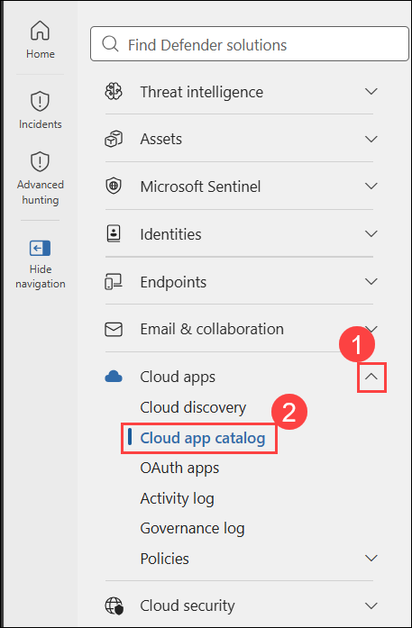

1. The **Cloud app catalog** blade displays all applications currently utilized within your organization. Explore multiple applications and their associated risk scores by selecting each respective application.

   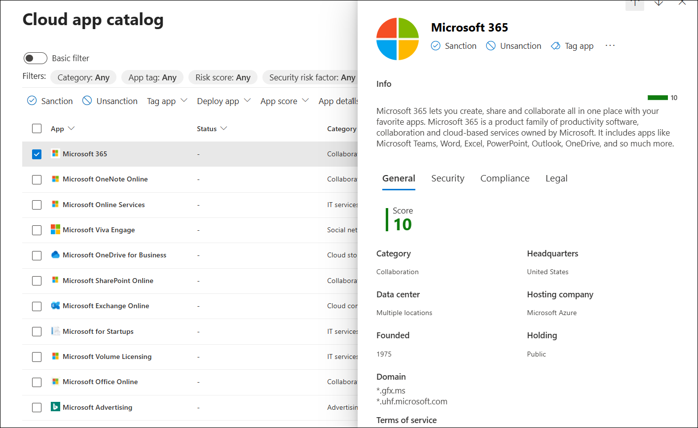

   > **NOTE**: Defender for Cloud Apps assesses risks by evaluating regulatory certification, industry standards, and best practices. The score reflects the maturity of the app's suitability for enterprise use. It calculates a total score for each app by averaging weighted subscores across various risk categories that include considerations for reliability.

   > **Success!** You have successfully reviewed several applications that are currently used at Contoso.

### Task 3: Block unsecure applications

Once you have successfully gained an overview of the use of applications in your environment, your first remediation action is to block unsafe applications.

1. In the Microsoft Defender portal, in the left navigation page expand **Cloud apps (1)** and select **Cloud app catalog (2)**.
1. Set the filter for **Risk score (3)** to **0 - 4 (4)** (2) and then select **Apply (5)**.

   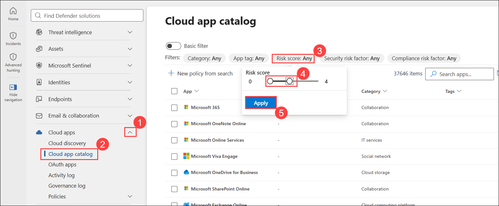

1. Select the **checkbox** in the header row to select all the listed cloud apps.

   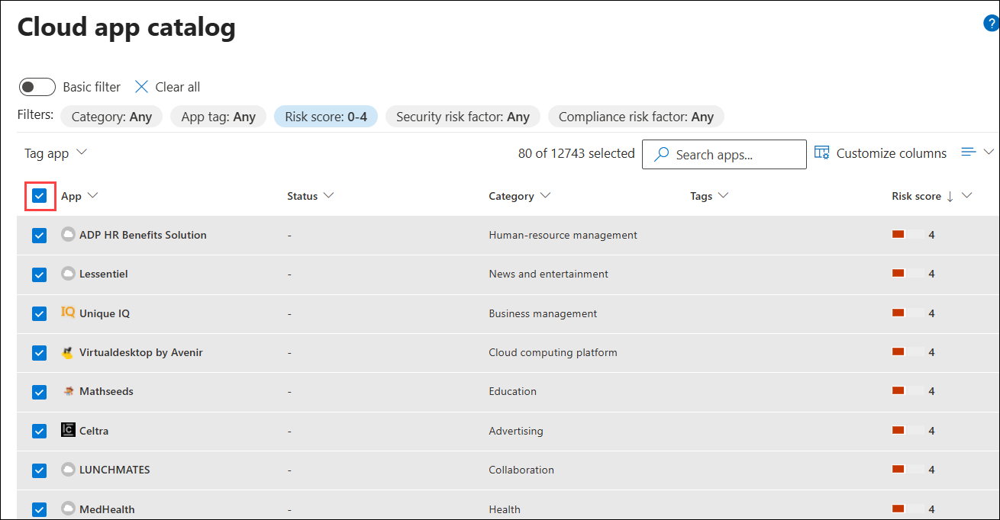

1. Click on **Tag apps (1)** drop-down and select **Tag as Unsanctioned (2)**.

   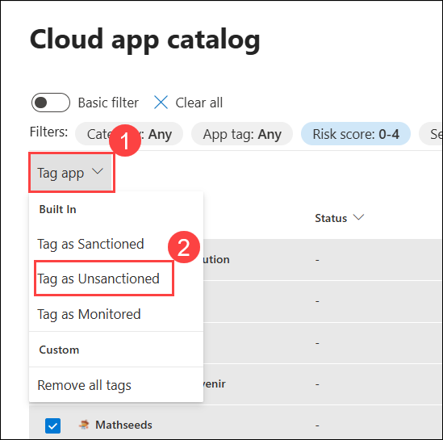

   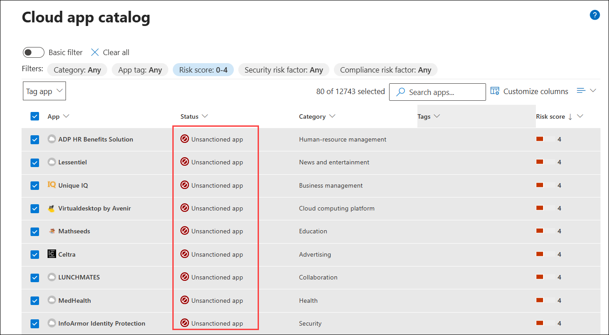

   > **Success!** You have successfully blocked vulnerable applications from being used by users.

### Task 4: Block unsecure applicatons automatically

In order to automatically block unsafe applications in the future, you will create a custom app discovery policy. This policy will tag unsafe applications as **Unsanctioned**. As you have integrated Defender for Endpoint with Defender for Cloud Apps, these applications will be blocked automatically.

1. In the Microsoft Defender portal, in the left navigation page expand **Cloud apps** and select **Cloud app catalog (1)**.

1. On the **Cloud app catalog** page select **+ New policy from search (2)**.

   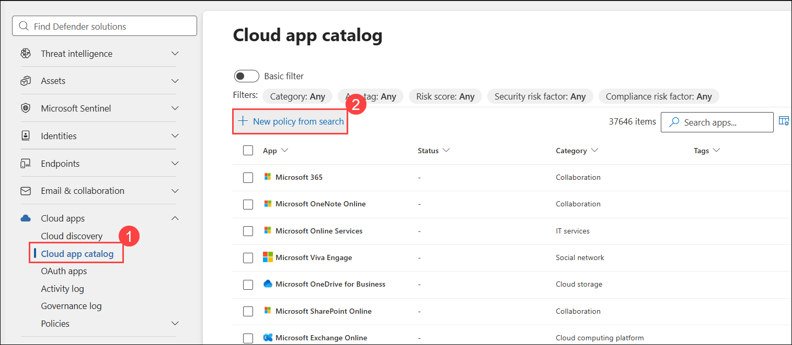

1. Enter the following information:
   - **Policy Name**: `Tag unsafe apps as unsanctioned` **(1)**
   - **Policy severity**: Medium **(2)**
   - **Description for users**: `Applications with a risk score of 4 or lower will be unsanctioned and blocked automatically.` **(3)**

     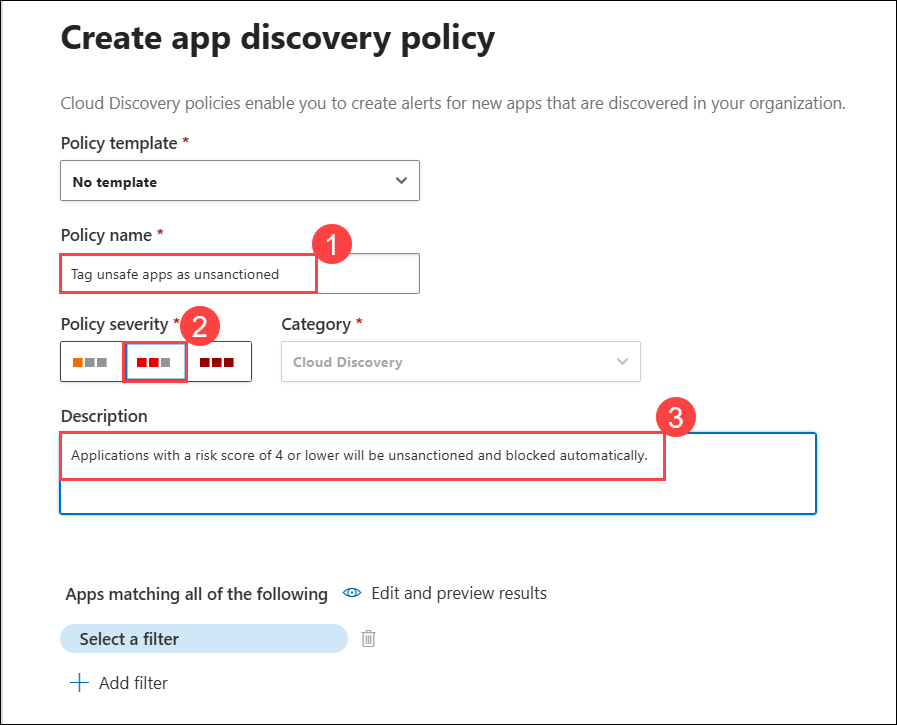

1. Under **Apps matching all of the following**, click **Select a filter (1)** and choose **Risk score (2)**. Next, click **Select an operator (3)** and select **equals (4)**. Then, click the **Any** field **(5)**, move the slider to select the **Risk score range 0–4 **(6)\***\*, and click **Apply (7)\*\*.

   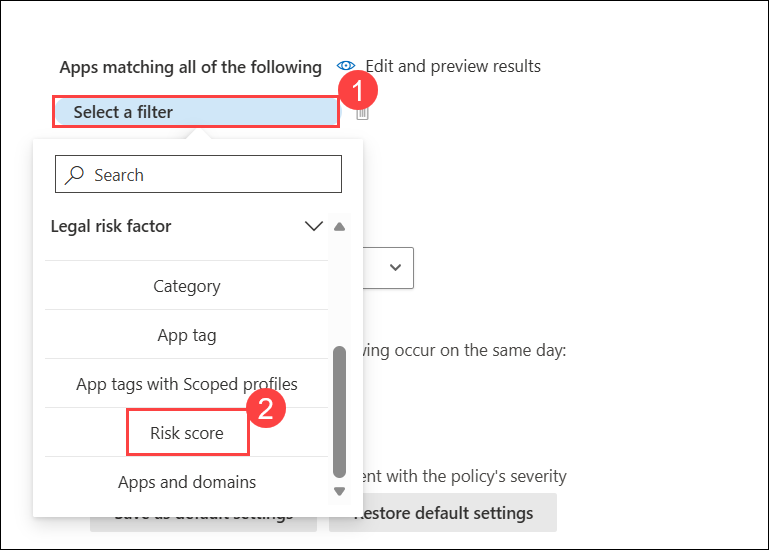

   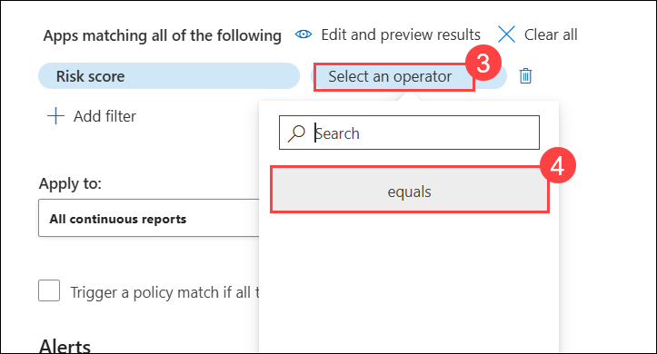

   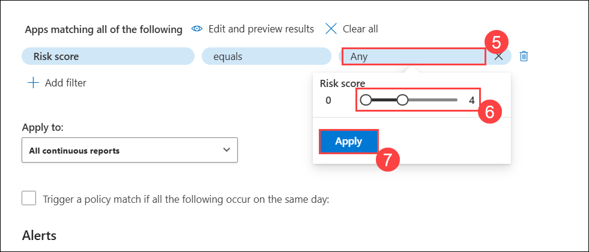

1. Under **Alerts** select **Create an alert for each matching event with the policy's severity (1)** and set the value for **Daily alert limit per policy (2)** to 5.

1. Under **Governance actions** select **Tag app as unsanctioned (3)**.

1. Select **Create (4)**.

   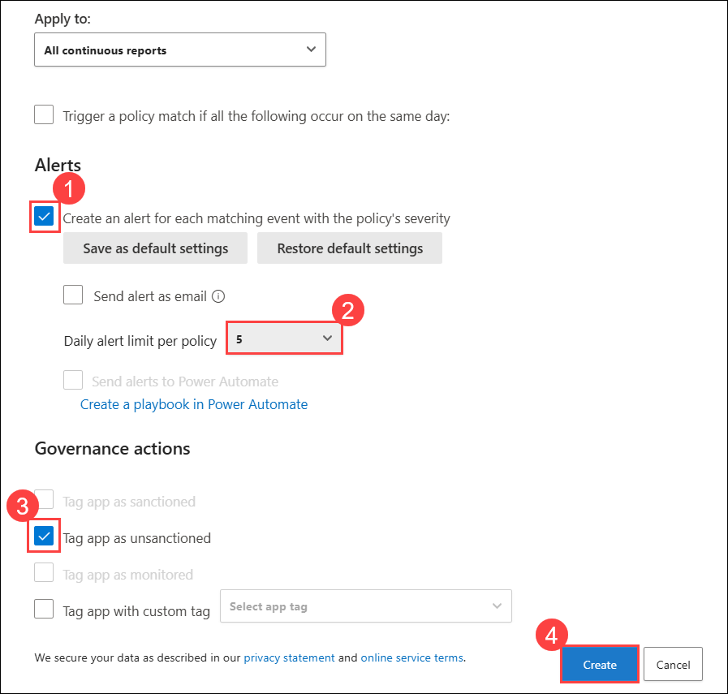

> **Success!** You have successfully created a policy to tag applications with a risk score of 5 or lower as unsanctioned.

### Review

In this exercise, you have completed the following:

- Integrated Microsoft Defender for Endpoint with Defender for Cloud Apps.
- Investigated the Shadow-IT of Contoso Ltd.
- Blocked unsecure applications.
- Blocked unsecure applicatons automatically.

### You have successfully completed the lab.
