# Lab 02: Data classification framework

## Exercise Overview
You have been assigned the task of structuring data classification for Contoso Ltd. in preparation for an ISO-27001:2022 audit. The goal is to establish a robust framework that is crucial for ensuring effective data protection against leakage, deletion, and loss. Your role involves integrating a new project ID system for construction projects within the company. To comply with government regulations, all documents that contain a certain project-ID must be kept for 5 years.

You were given following examples to classify Project IDs:

|Project ID|
|----|
|PAR-1023-DA|
|BER-0822-AB|
|Rom-0419-bm|
|sTr*1223-Se|
|BaR#0418-ag|
|dui0522-in|

## Exercise Objectives

After completing this exercise, you'll be able to:

- Create a custom sensitive information type for data protection.
- Set up a retention label to manage data lifecycle.
- Publish and automatically apply the retention label to all documents containing project IDs.

### Estimated Duration: 45 Minutes

## Architecture Diagram

 

## Explanation of Components

The architecture for this lab involves the following key components:  

- **Custom Sensitive Information Type**: Defines tailored criteria for identifying and classifying sensitive data specific to organizational needs.  

- **Retention Label**: Establishes rules for managing the lifecycle of content, ensuring compliance with data retention policies.  

- **Automatic Retention Label Application**: Configures automation to apply retention labels to content based on predefined criteria, streamlining data governance processes.  

## Part 1: Design a solution

### Design Approach

This introduction of a new project ID necessitates the creation of a corresponding sensitive information type (SIT), which requires the development of a custom pattern incorporating a regular expression. Subsequently, this SIT can then be used to devise a retention label and an associated auto-labeling policy.

### Proposed Solution

|Requirement|Solution|Action plan|
|----|----|----|
|Identify documents containing project IDs|Microsoft Purview Information Protection|Create a custom sensitive information type|
|Comply with government regulation to retain data for 5 years| Microsoft Purview Data Lifecycle Management|Deploy a retention policy|

## Part 2: Implement the solution

### Task 1: Create a custom sensitive information Type

In this task, you will create a **custom sensitive information type** to detect documents containing **project IDs**.

1. Sign-in to the Microsoft Purview Compliance portal **`https://purview.microsoft.com/`** as per the credentials mentioned below:
    - **Email/Username:** <inject key="AzureAdUserEmail"></inject>
    - **Password:** <inject key="AzureAdUserPassword"></inject>
    
1. You're taken to the new Microsoft Purview portal landing page, then select **Get started**.

    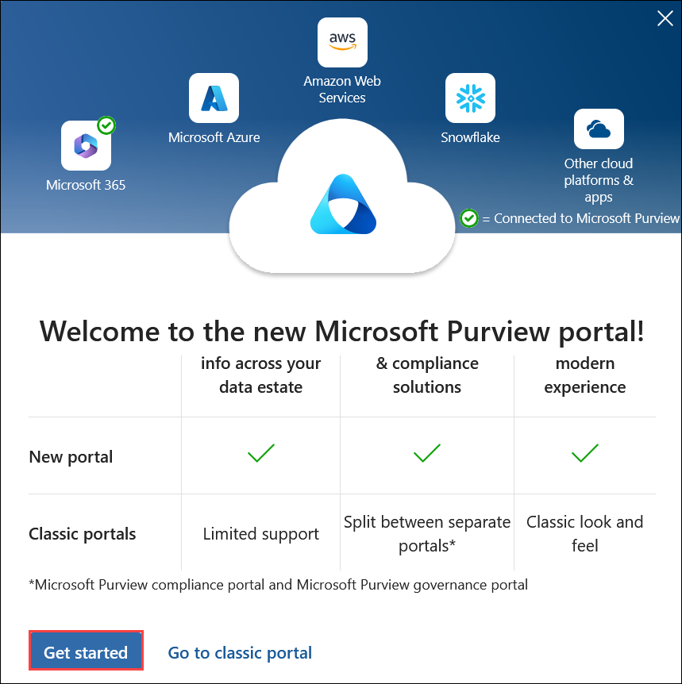

1. From the left navigation panel, select **Solutions** (1) then select **Information Protection** (2). Alternatively, from the main window you can select the **View all solutions** tile, then select the **Information Protection** tile listed under Data Security.

    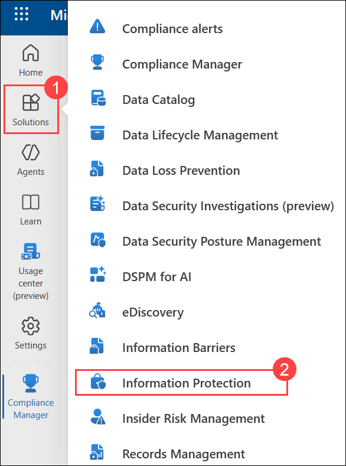

1. Expand **Classifiers** (1) then select **Sensitive info types** (2).

1. From the **Sensitive info types** page, select **Create sensitive info type** (3).

    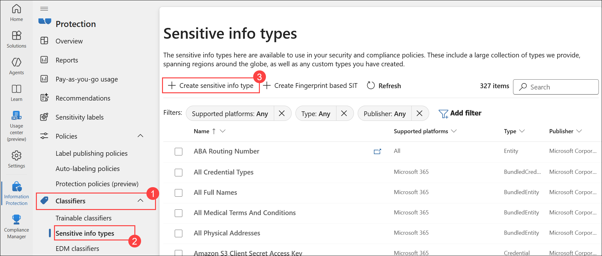

    >**NOTE :** If you get any Client error select Ok.
    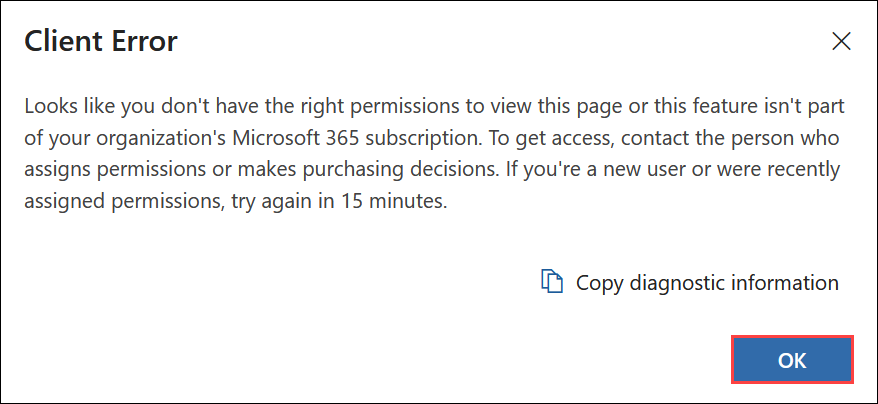

1. On the **Name your sensitive info type** page enter following information:
    - Name: **`Project Identification Number`** (1)
    - Description: **`Identifies project identification number`** (2)

1. Select **Next** (3).

    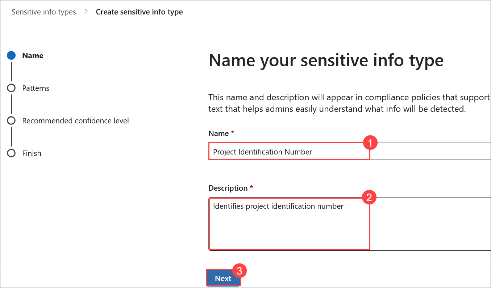

1. On the **Define patterns for this sensitive info type** page, select **Create pattern** (1).

1. On the **New pattern** page, select **Add primary element** (2) and then **Regular expression** (3).

    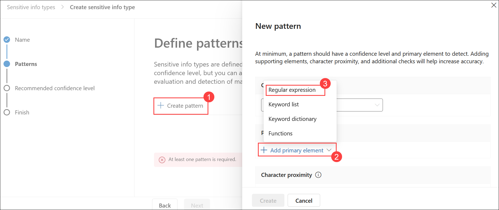

1. On the **Add a regular expression** page in the **ID** text box, type **`ProjectID`** (1).

1. In the text box **Regular expression** enter the following expression:

    **`[a-zA-Z]{3}(\W)?[\d]{4}(\W)?[a-zA-Z]{2}`** (2)

    >[!NOTE] The provided regular expression is crafted to identify a sequence characterized by three letters, followed by potentially optional non-word characters, then four digits, followed once again by optional non-word characters, and ultimately ending with two letters. The presence of non-word characters is discretionary, and the overarching pattern is intended to correspond to a specific format or structure within the data.

1. Under the Regular expression text box, select **String match** (3) then select **Done** (4).

    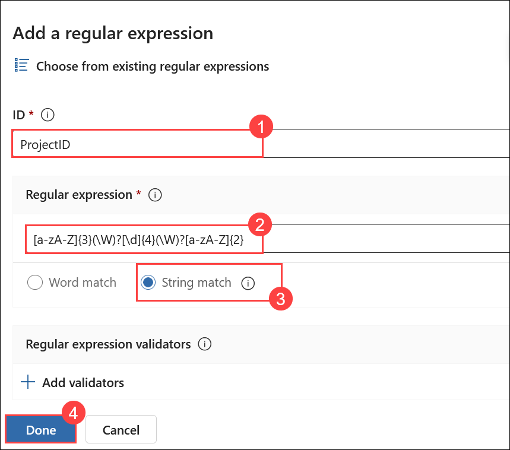

1. On the **New pattern** window, for the **Confidence level**, select **High confidence**, select **Create**, then select **Next**.    

1. On the **Choose the recommended confidence level to show in compliance policies** page, leave the setting to **High confidence level**, then select **Next**.

    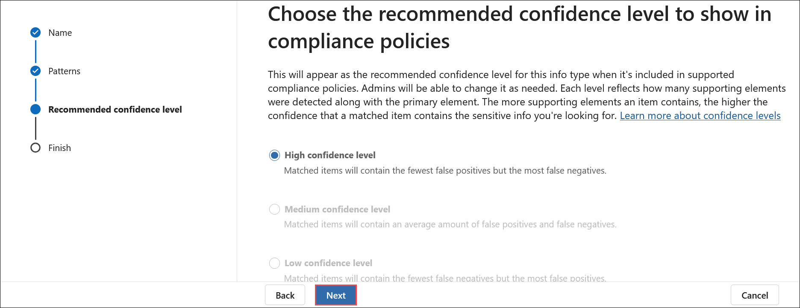

1. On the **Review settings and finish**, verify the settings, select **Create**, then when the policy is created select **Done**.

    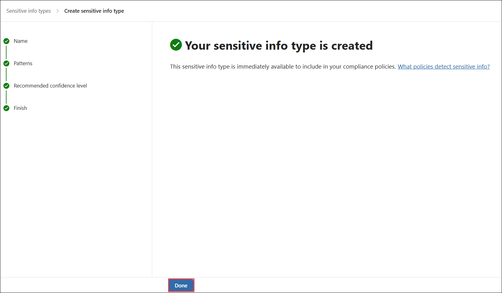

    >**Success!** You have successfully created a new sensitive information type to identify project IDs.

### Task 2: Create a retention label

In this task, you will create a **retention label** to retain all documents related to **construction projects** for **5 years**.

1. From the left navigation panel, select **Solutions** (1) then select **Data Lifecycle Management** (2).

    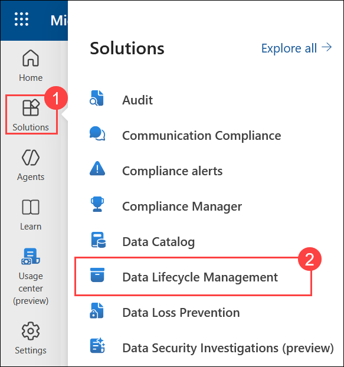

1. Select **Retention Labels** (1).

1. On the **Labels** page, select **Create a label** (2).

    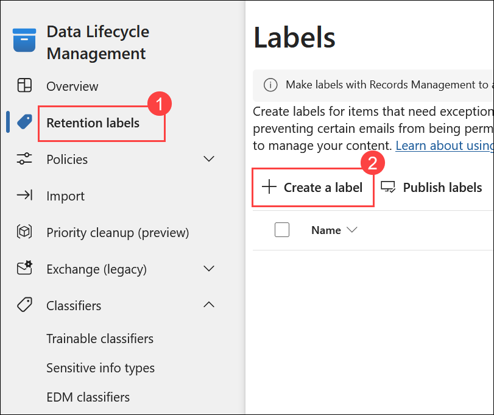

1. On the **Name your retention label** page, enter the following information:

    - Name: **`Retention of Construction Project Documentation`** (1)
    - Description for users: **`The construction project documentation Retention Policy dictates the retention of all project-related documents for five years following project completion.`** (2)
    - Description for admins: **`This label is applied to retain construction project documents for a period of five years, and it is utilized in conjunction with auto-labeling.`** (3)

1. Select **Next**. (4)

    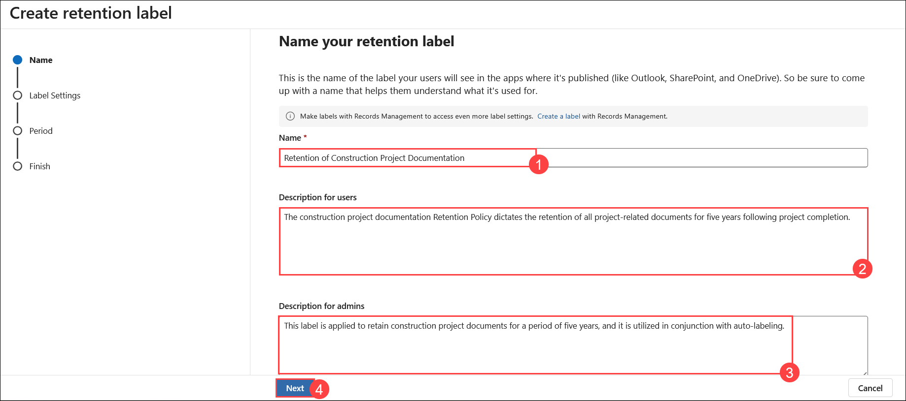

1. On the **Define label settings** page, select **Retain items forever or for a specific period** and select **Next**.

1. On the **Define the retention period** page, enter the following information:

    - Retain items for: **5 years** (1)
    - Start the retention period based on: **When items were created** (2)

1. Select **Next**. (3)

    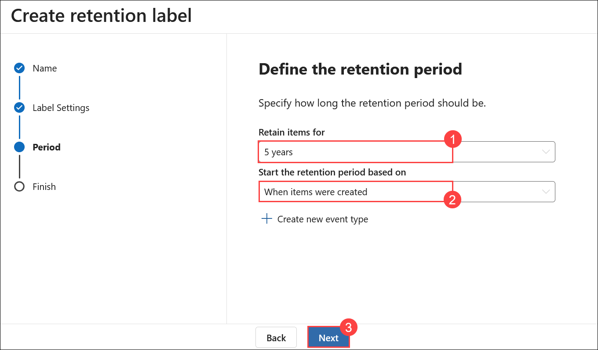

1. On the **Choose what happens after retention period** page, select **Deactivate retention settings** then select **Next**.

    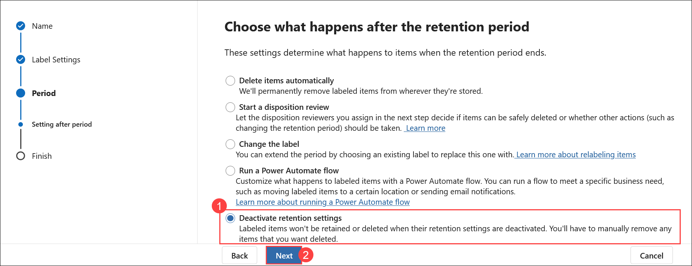

1. On the **Review and finish** page, review the settings, select **Create label**.

1. On the **Your retention label is created** page, you have several options.  Select **Do Nothing** (1) then select **Done** (2). You will create the auto-apply policy in the next task. Selecting Auto-apply this label to a specific type of content, walks you through the steps in the subsequent task, starting on step 4.

    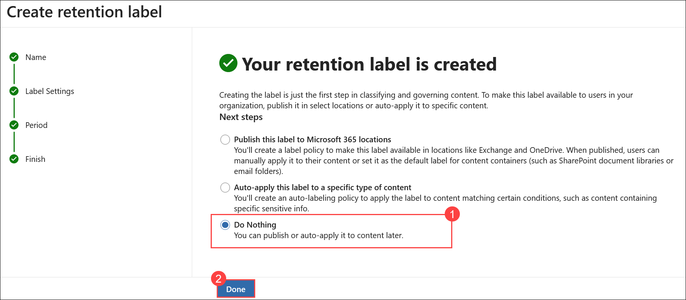

1. Keep the browser tab open for the next task.

   >**Success!** You have successfully created a retention label with a retention period of 5 years.

### Task 3: Auto-apply the retention label

In this task, you will use the **sensitive information type** created earlier to **auto-apply** the **retention label** to relevant documents.

1. Navigate to **`https://purview.microsoft.com/`** > **Solutions** > **Data Lifecycle Management**.

1. On the **Data lifecycle management** pane, expand **Policies** (1) select **Label policies** (2).

1. On the **Label policies** blade, select **Auto-apply a label** (3).

    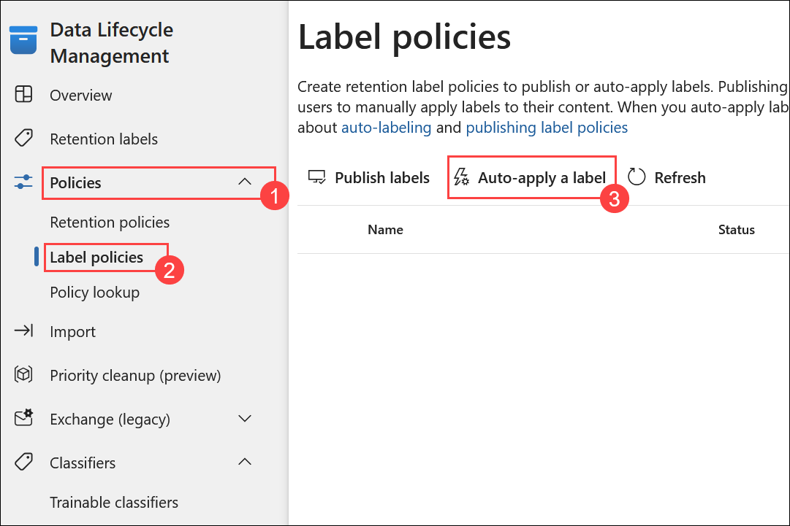

1. On the **Let's get started** page, enter the following information:

    - Name: **`Label documents related to construction projects`** (1)
    - Description: **`This policy automatically enforces the "Construction Project Documentation Retention" policy on any document pertaining to construction projects.`** (2)

1. Select **Next** (3).

    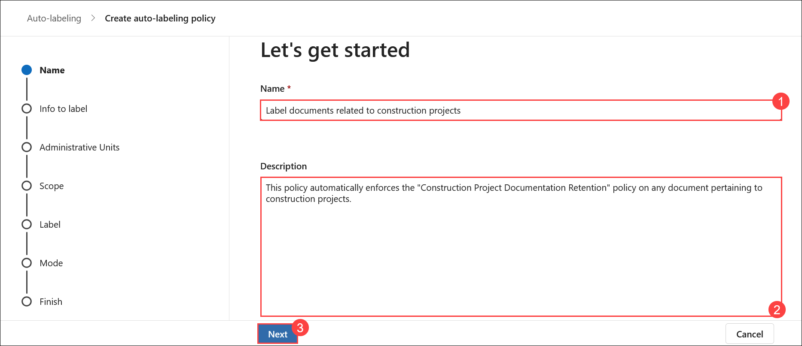

1. On the **Choose the type of content you want to apply this label to** page, select **Apply label to content that contains sensitive info** and select **Next**.

1. On the **Content that contains sensitive info** page, select **Custom** (1), then select **Custom policy** (2) and select **Next** (3).

    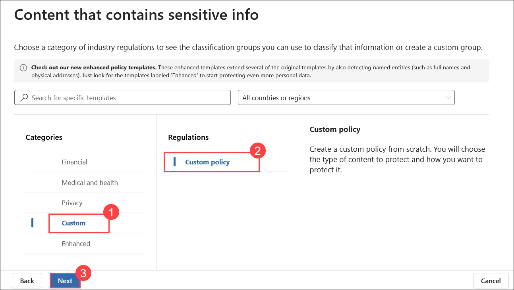

1. On the **Define content that contains sensitive info**, specify the following settings:
    - Group name: **`Project ID lookup`** (1)
    - Under Sensitive info types, select **Add** (2) and select **Sensitive info types** (3).  
    - In the Sensitive info types page, in the search field, enter the name of the label you created **`Project Identification number`** (4) and press return.  Select **Project Identification number** (5) then select **Add** (6).

    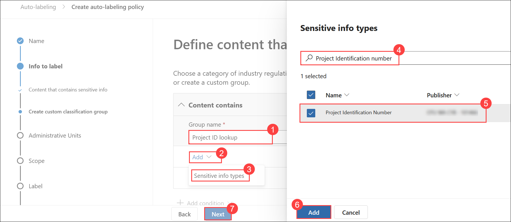

    - Leave the Confidence level to **High confidence**.
    - Leave the instance count as **1 to Any**.
    - Select **Next** (7).

1. On the **Policy scope** page, leave the Admin Units
setting to **Full directory** and select **Next**.

1. On the **Choose the type of retention policy to create** page, select **Static** (1) and select **Next** (2).

    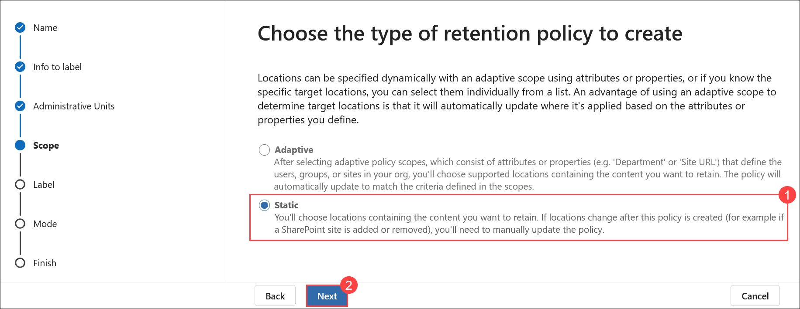

1. On the **Choose where to automatically apply the label**, verify the status is set to **On** for all available
locations then select **Next**.

1. On the **Choose a label to auto-apply**, select **Add label** (1), then select the label **Retention of construction project documentation** (2) you created in the previous task, select **Add** (3), then select **Next** (4).

    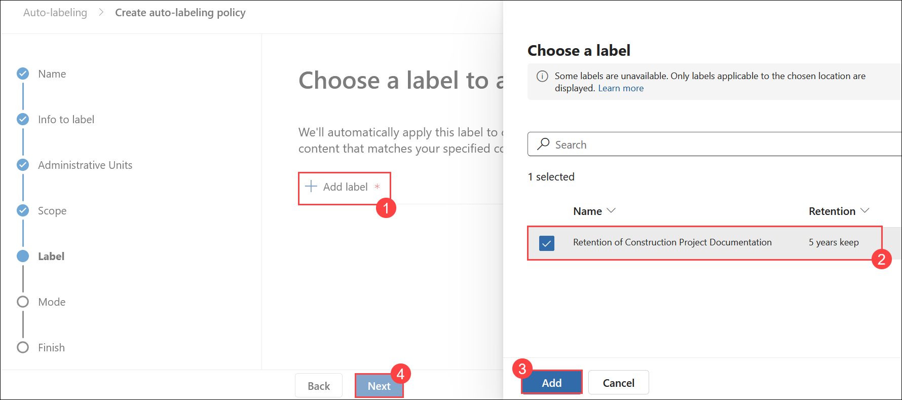

1. In the **Decide whether to test or run your policy**, select **Turn on policy** then select **Next**.

1. On the **Review and finish** page, review all your settings, select **Submit**, then select **Done**.

    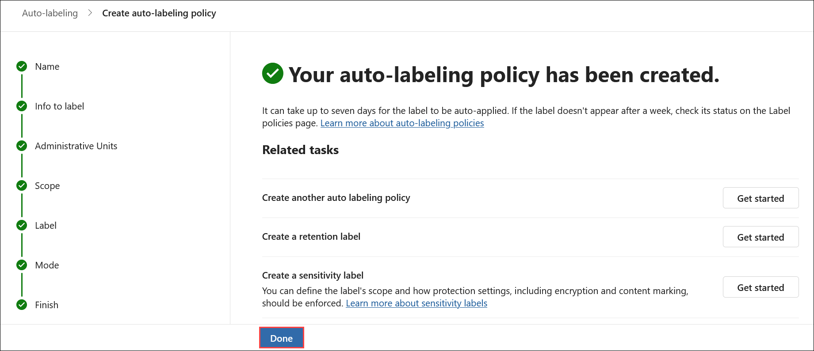
   
**Congratulations** on completing the task! Now, it's time to validate it. Here are the steps:
- Hit the Validate button for the corresponding task. If you receive a success message, you can proceed to the next task. 
- If not, carefully read the error message and retry the step, following the instructions in the lab guide.
- If you need any assistance, please contact us at labs-support@spektrasystems.com. We are available 24/7 to help
  
<validation step="d2427f90-04b0-4bcf-b0a7-a8ab39226ad5" />

>**Success!** You have successfully published and auto-applied the retention label to all documents that contain project IDs.

### Review

In this exercise, you have completed the following:
- Created a custom sensitive information Type.
- Created a retention label.
- Published and auto-applied the retention label to all documents that contain project IDs.

### You have successfully finished the exercise. Click on **Next** to move on to the next exercise.
