# Data classification framework

You have been assigned the task of structuring data classification for Contoso Ltd. in preparation for an ISO-27001:2022 audit. The goal is to establish a robust framework that is crucial for ensuring effective data protection against leakage, deletion, and loss. Your role involves integrating a new project ID system for construction projects within the company. To comply with government regulations, all documents that contain a certain project-ID must be kept for 5 years.

You were given following examples to classify Project IDs:

|Project ID|
|----|
|PAR-1023-DA|
|BER-0822-AB|
|Rom-0419-bm|
|sTr*1223-Se|
|BaR#0418-ag|
|dui0522-in|

## Part 1: Design a solution (required)

In this task you will design a concept to address the issues Contoso Ltd. is facing.

### Design Approach

This introduction of a new project ID necessitates the creation of a corresponding sensitive information type (SIT), which requires the development of a custom pattern incorporating a regular expression. Subsequently, this SIT can then be used to devise a retention label and an associated auto-labeling policy.

### Proposed Solution

|Requirement|Solution|Action plan|
|----|----|----|
|Identify documents containing project IDs|Microsoft Purview Information Protection|Create a custom sensitive information type|
|Comply with government regulation to retain data for 5 years| Microsoft Purview Data Lifecycle Management|Deploy a retention policy|

## Part 2: Implement the solution (optional)

### Task 1: Create a custom sensitive information Type

You will create a custom sensitive information type to detect documents that contain project IDs.

1. Sign-in to the Microsoft Purview Compliance portal **`https://purview.microsoft.com/`** as per the credentials provided below:
    - **Email/Username:** <inject key="AzureAdUserEmail"></inject>
    - **Password:** <inject key="AzureAdUserPassword"></inject>
    
1. You're taken to the new Microsoft Purview portal landing page. Select the box next to the statement, **I agree to the terms of data flow disclosure and Privacy Statements**, then select **Get started**.
1. From the left navigation panel, select **Solutions** then select **Information Protection**. Alternatively, from the main window you can select the **View all solutions** tile, then select the **Information Protection** tile listed under Data Security.

    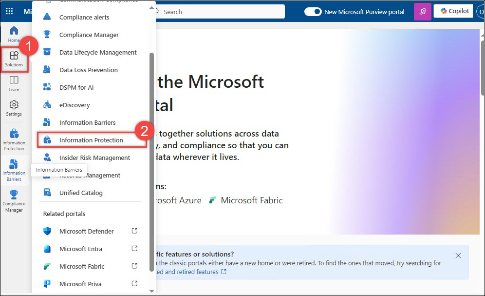

1. Expand **Classifiers** then select **Sensitive info types**.
1. From the **Sensitive info types** page, select **Create sensitive info Type**.

    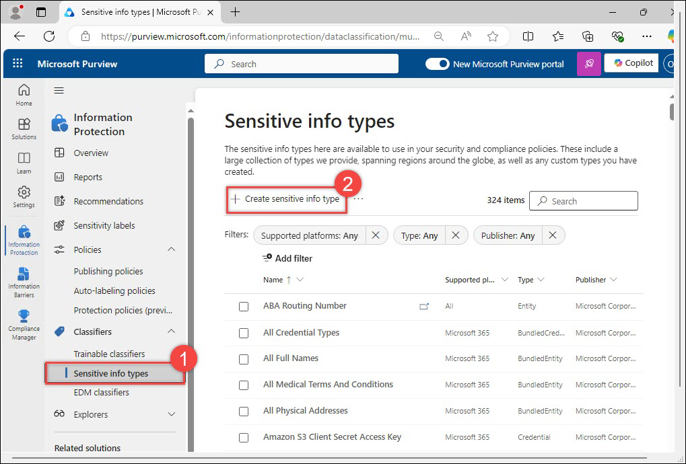

1. On the **Name your sensitive info type** page enter following information:
    - Name: **`Project Identification Number`**
    - Description: **`Identifies project identification number`**
1. Select **Next**.

    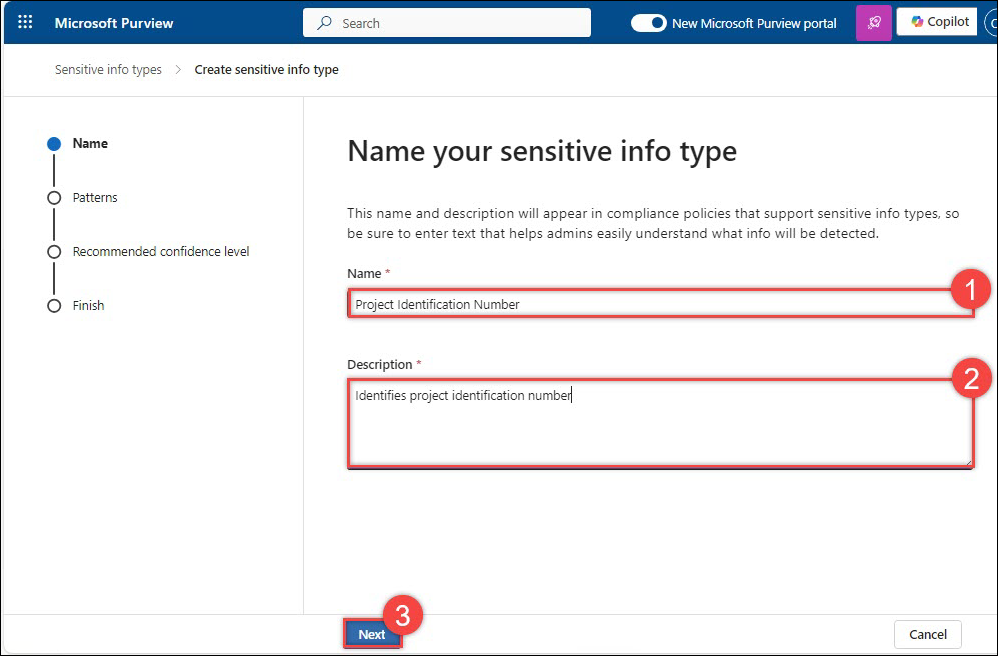

1. On the **Define patterns for this sensitive info type** page, select **Create pattern**.
1. On the **New pattern** page, select **Add primary element** and then **Regular expression**.

    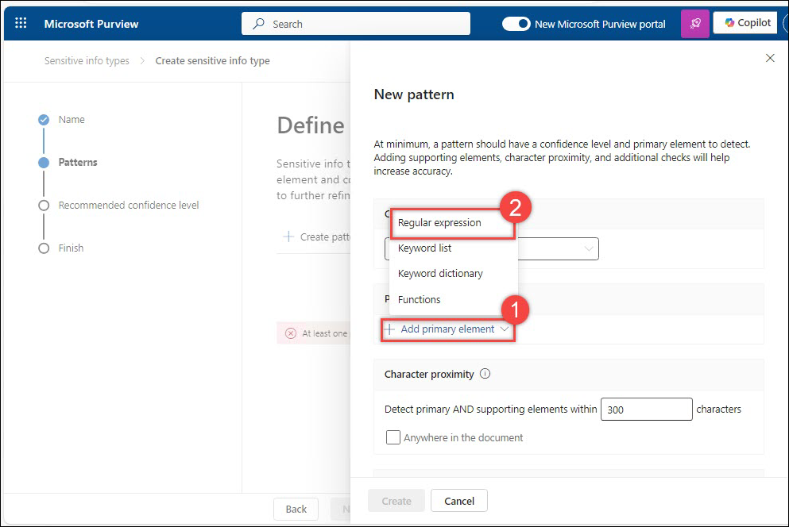

1. On the **Add a regular expression** page in the **ID** text box, type **`ProjectID`**.
1. In the text box **Regular expression** enter the following expression:

    **`[a-zA-Z]{3}(\W)?[\d]{4}(\W)?[a-zA-Z]{2}`**

    >[!NOTE] The provided regular expression is crafted to identify a sequence characterized by three letters, followed by potentially optional non-word characters, then four digits, followed once again by optional non-word characters, and ultimately ending with two letters. The presence of non-word characters is discretionary, and the overarching pattern is intended to correspond to a specific format or structure within the data.

1. Under the Regular expression text box, select **String match** then select **Done**.

    

1. On the **New pattern** window, for the **Confidence level**, select **High confidence**, select **Create**, then select **Next**.    
1. On the **Choose the recommended confidence level to show in compliance policies** page, leave the setting to **High confidence level**, then select **Next**.

    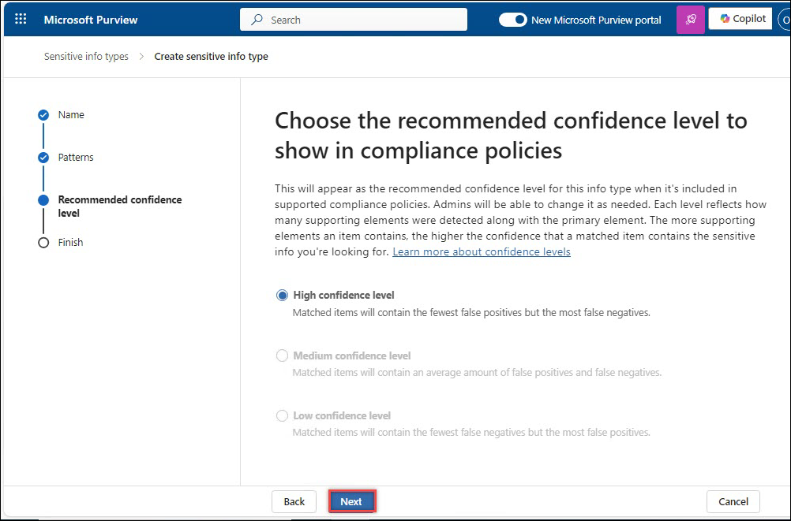

1. On the **Review settings and finish**, verify the settings, select **Create**, then when the policy is created select **Done**.

    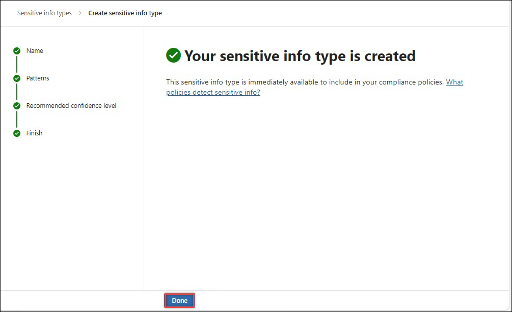

You have successfully created a new sensitive information type to identify project IDs.

### Task 2: Create a retention label

You will create a retention label to retain all documents related to construction projects for 5 years.

1. You should still be logged into the Microsoft Purview portal **https://purview.microsoft.com/**.
1. From the left navigation panel, select **Solutions** then select **Data Lifecycle Management**.

    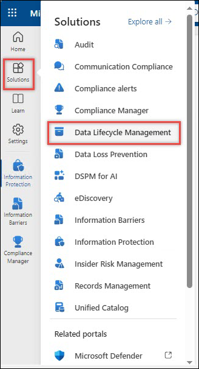

1. Select **Retention Labels**.
1. On the **Labels** page, select **Create a label**.

    

1. On the **Name your retention label** page, enter the following information:

    - Name: **`Retention of Construction Project Documentation`**
    - Description for users: **`The construction project documentation Retention Policy dictates the retention of all project-related documents for five years following project completion.`**
    - Description for admins: **`This label is applied to retain construction project documents for a period of five years, and it is utilized in conjunction with auto-labeling.`**

1. Select **Next**

    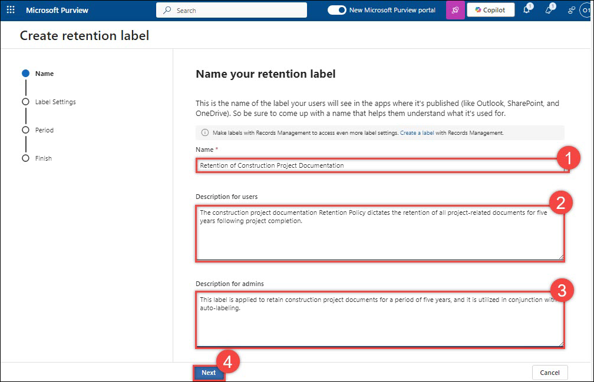

1. On the **Define label settings** page, select **Retain items forever or for a specific period** and select **Next**.
1. On the **Define the retention period** page, enter the following information:

    - Retain items for: **5 years**
    - Start the retention period based on: **When items were created**

1. Select **Next**.

    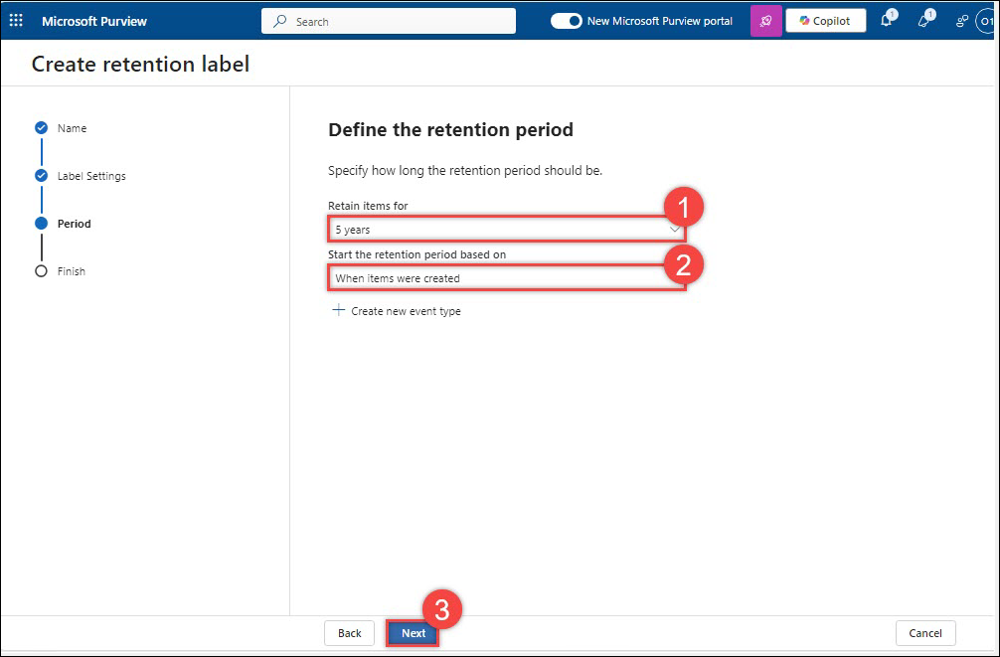

1. On the **Choose what happens after retention period** page, select **Deactivate retention settings** then select **Next**.
1. On the **Review and finish** page, review the settings, select **Create label**.
1. On the **Your retention label is created** page, you have several options.  Select **Do Nothing** then select **Done**.  You will create the auto-apply policy in the next task. Selecting Auto-apply this label to a specific type of content, walks you through the steps in the subsequent task, starting on step 4.

    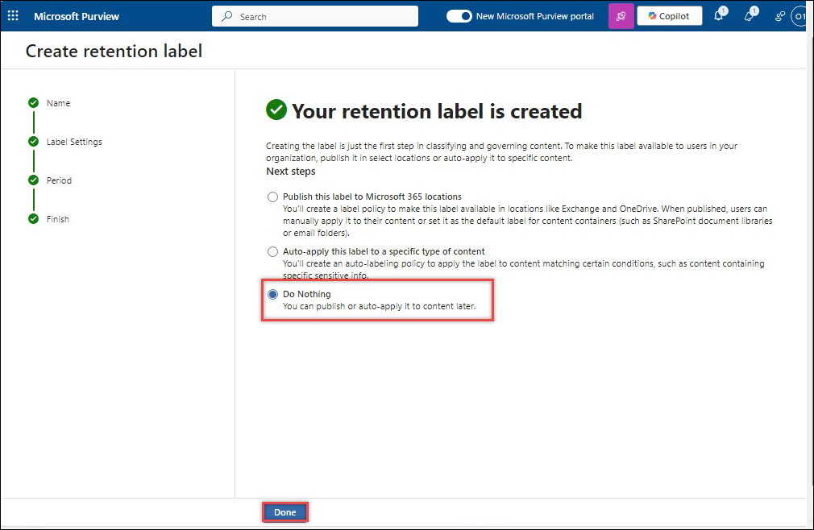

1. Keep the browser tab open for the next task.

You have successfully created a retention label with a retention period of 5 years.

### Task 3: Auto-apply the retention label

You will use the sensitive information type you created in this exercise to auto-apply the retention label.

1. You should still be logged into the Data Lifecycle Management solution in the Microsoft Purview portal.  If not, navigate to **`https://purview.microsoft.com/`** > **Solutions** > **Data Lifecycle Management**.
1. On the **Data lifecycle management** pane, select **Label policies**.
1. On the **Label policies** blade, select **Auto-apply a label**.

    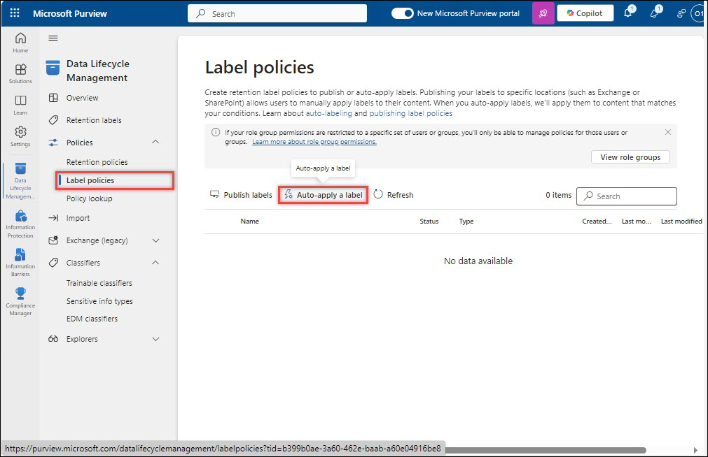

1. On the **Let´s get started** page, enter the following information:

    - Name: **`Label documents related to construction projects`**
    - Description: **`This policy automatically enforces the "Construction Project Documentation Retention" policy on any document pertaining to construction projects.`**

1. Select **Next**.

    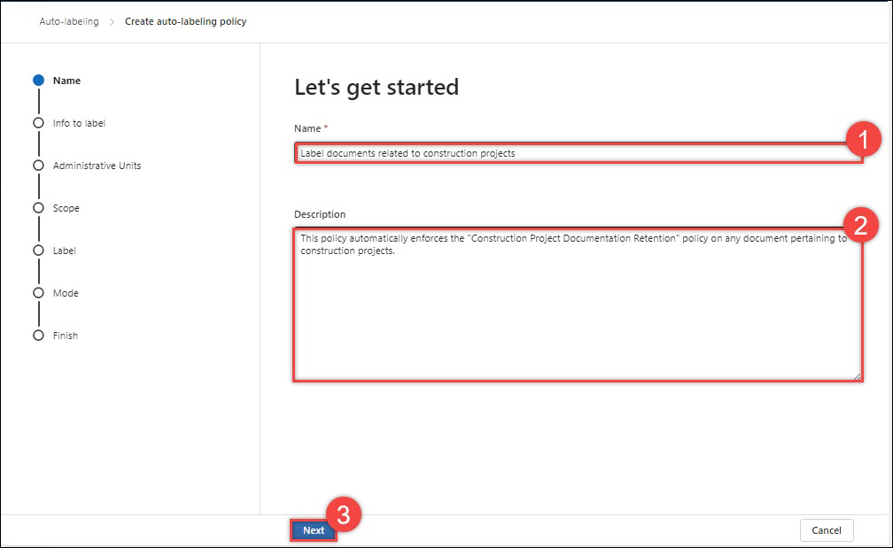

1. On the **Choose the type of content you want to apply this label to** page, select **Apply label to content that contains sensitive info** and select **Next**.
1. On the **Content that contains sensitive info** page, select **Custom**, then select **Custom policy** and select **Next**.

    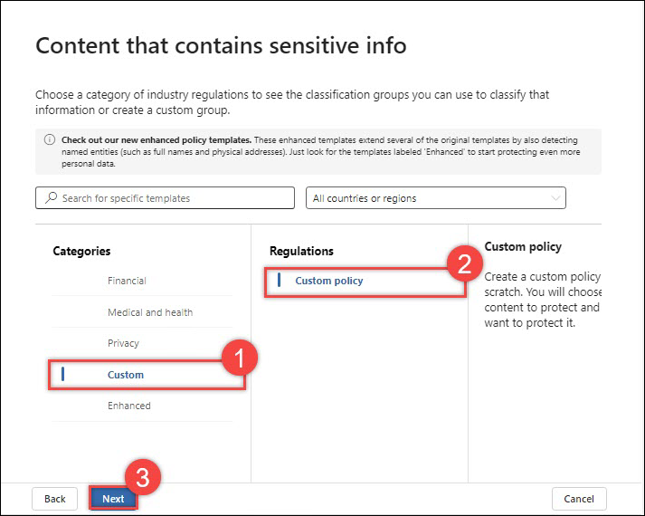

1. On the **Define content that contains sensitive info**, specify the following settings:
    - Group name: **`Project ID lookup`**
    - Under Sensitive info types, select **Add** and select **Sensitive info types**.  
    - In the Sensitive info types page, in the search field, enter the name of the label you created **`Project Identification number`** and press return.  Select **Project Identification number** then select **Add**.

        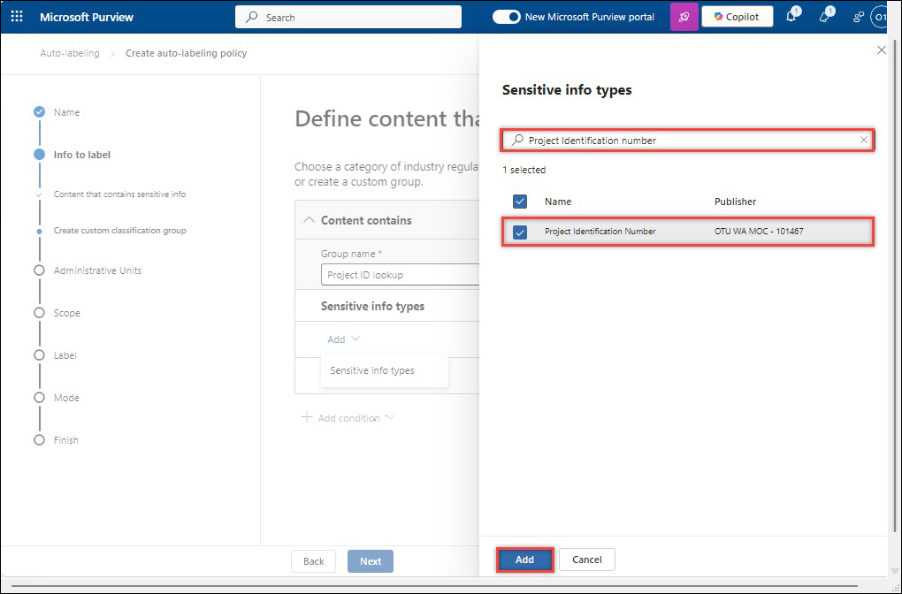

    - Leave the Confidence level to **High confidence**.
    - Leave the instance count as **1 to Any**.
    - Select **Next**
1. On the **Policy scope** page, leave the Admin Units setting to **Full directory** and select **Next**.
1. On the **Choose the type of retention policy to create** page, select **Static** and select **Next**.
1. On the **Choose where to automatically apply the label**, verify the status is set to **On** for all available locations then select **Next**.
1. On the **Choose a label to auto-apply**, select **Add label**, then select the label **Retention of construction project documentation** you created in teh previous task, select **Add**, then select **Next**.

    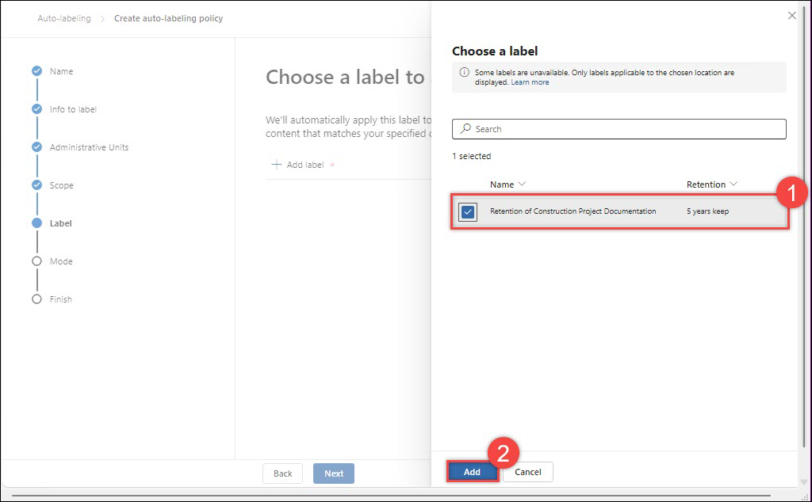

1. In the **Decide whether to test or run your policy**, select **Turn on policy** then select **Next**.
1. On the **Review and finish** page, review all your settings, select **Submit**, then select **Done**.

    

You have successfully published and auto-applied the retention label to all documents that contain project IDs.
