# Lab 02: Managing External Attack Surface

## Estimated Duration: 40 Minutes

## Exercise Overview

Contoso aims to enhance its cybersecurity posture by identifying and managing its external attack surface. This surface includes assets that are hosted on different cloud providers. To achieve this goal, Contoso wants to integrate its attack surface data with Sentinel, its cloud-native SIEM solution. This integration will enhance its security monitoring and incident response capabilities. 

## Exercise Objectives

In this Exercise, you will perform

- **Task 1:** Create a Microsoft Defender EASM workspace
- **Task 2** Discover Contoso's external-facing assets 
- **Task 3:** Configure a data connection to a Log Analytics workspace
- **Task 4:** Review security dashboards and label assets for investigation
- **Task 5:** Manage and categorize discovered assets by state

## Architecture Diagram

   

## Explanation of Components

  The architecture for this lab involves the following key components:

 - **Defender External Attack Surface Management (EASM)**: Provides continuous monitoring and management of an organization's external attack surface to identify and mitigate vulnerabilities.  

 - **Discovery**: Automates the identification of internet-facing assets to uncover potential security risks and gaps.  

 - **Data Connector and Log Analytics Workspace**: Integrates data from various sources into a centralized workspace for comprehensive analysis and security insights.  

 - **Dashboards and Asset Labeling**: Offers visual tools to review data, label assets, and track their status for effective security management.  

 - **Asset Management**: Enables monitoring, organizing, and securing identified assets to maintain a strong security posture.

## Task 1 - Setup Defender EASM

In this Task, you´ll create a Defender EASM workspace.

1. In the **Search** box, enter **Microsoft Defender EASM (1)**, and then select **Microsoft Defender EASM (2)** from the search results.

    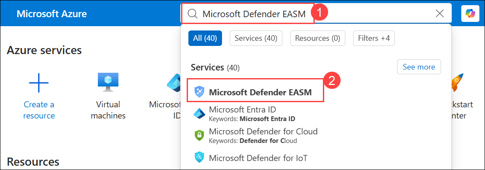

1. Select **+ Create**.

1. On Create Microsoft Defender EASM Resource, select the existing resource group **sc-100-lab1**.

1. In Instance details enter the following details and select on **Review & Create (5)**:
    | Settings | Values |
    |  -- | -- |
    | Subscription | *Leave default subscription* **(1)** |
    | Resource group | Select the resource group name **sc-100-lab1** from the dropdown list **(2)** |
    | Name | **EASM<inject key="DeploymentID" enableCopy="false" /></inject> (3)** | 
    | Region | **<inject key="Resource group Region" enableCopy="false" ></inject> (4)** | 

     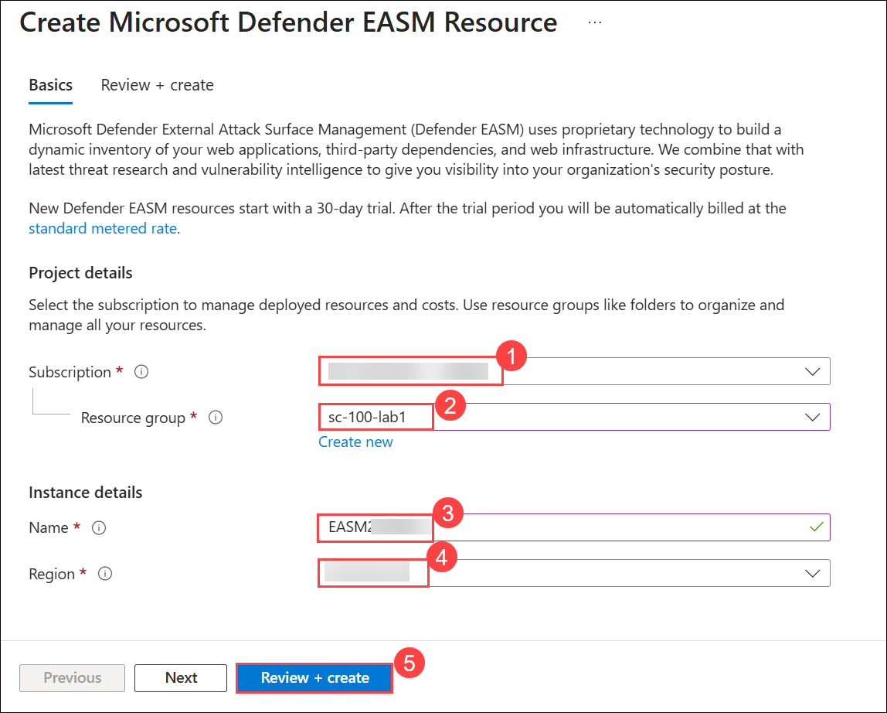

1. Select **Create**.

    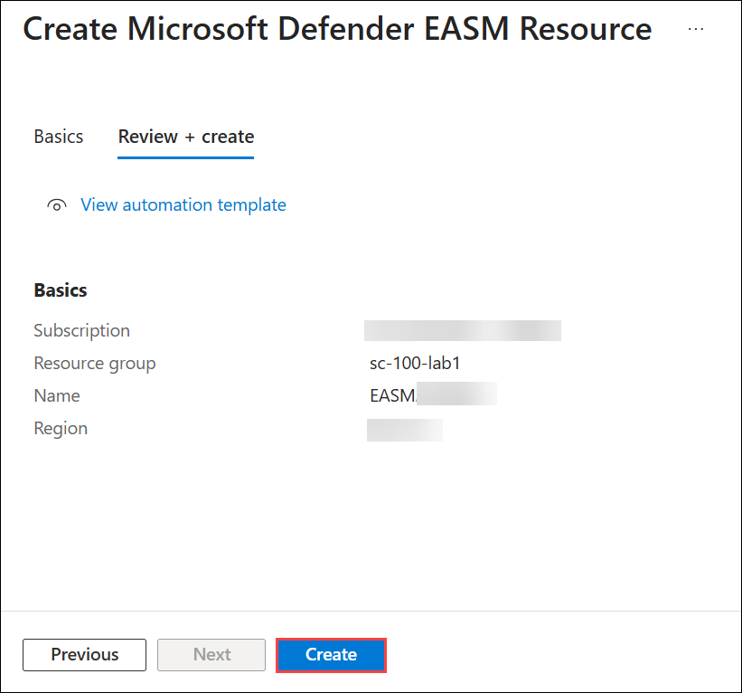

> **Congratulations** on completing the task! Now, it's time to validate it. Here are the steps:
	
 - Hit the Validate button for the corresponding task. If you receive a success message, you can proceed to the next task.
 - If not, carefully read the error message and retry the step, following the instructions in the lab guide.
 - If you need any assistance, please contact us at cloudlabs-support@spektrasystems.com. We are available 24/7 to help you out.
    
<validation step="f10c8d8e-403f-40ca-8055-fb57c65221e1" />

   >**Success!** You successfully created the Defender EASM workspace.

## Task 2 - Create Discovery

In this Task, you´ll create a Discovery on Contoso Ltd. outside facing assets. After you have created an instance you need to populate it with actual data. Therefore you will now create a discovery.

1. In the Azure portal, navigate to **Microsoft Defender EASM**.

1. Select the **EASM<inject key="DeploymentID" enableCopy="false" /></inject>** workspace you created in the last task.

      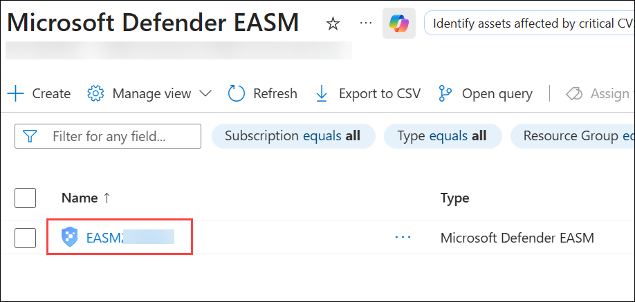

1. Search for **Contoso (1)** in the **Search for an organization** search field.

1. Select **Contoso Ltd. (2)**.

1. Select **Start attack surface discovery (3)**.

    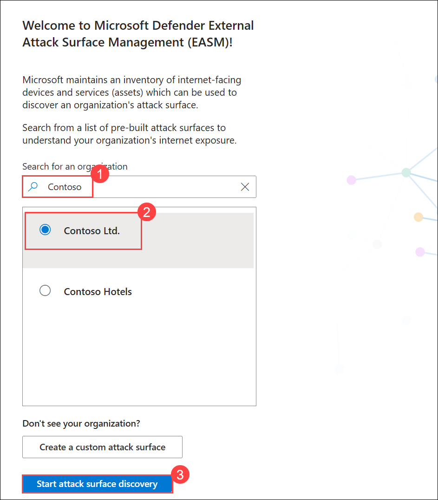

    >**Success!** You successfully created the Discovery of Contoso´s External Attack Surface and populated the EASM instance with actionable data.

## Task 3 - Setup data connector and log analytics workspace

In this Task, you´ll configure a data connection from Defender EASM to an log analytics workspace that will be used for Sentinel. Defender EASM asset or insights information can be used in Log Analytics to enrich existing workflows with other security data.

1. Navigate to the **sc-100-lab1** resource group in the Azure portal.

1. In the left navigation pane, select **Access control (IAM) (1)**.

1. Select **Add (2)**, from the dropdown select **Add role assignment (3)**.

     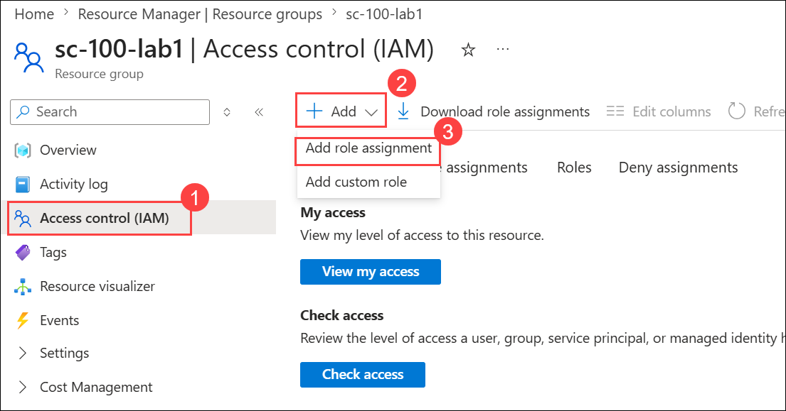

1. Search for **`Reader` (1)** and select the role **(2)**.

1. Select **Next (3)**.

    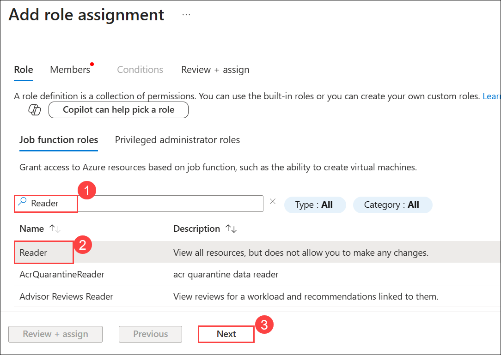

1. Select **+ Select members (1)**.

1. On the **Select members** blade, search for the **`EASM API` (2)**. From the search results select **EASM API ** press **Select (3)** to add the role assignment and select **Apply (4)**.

     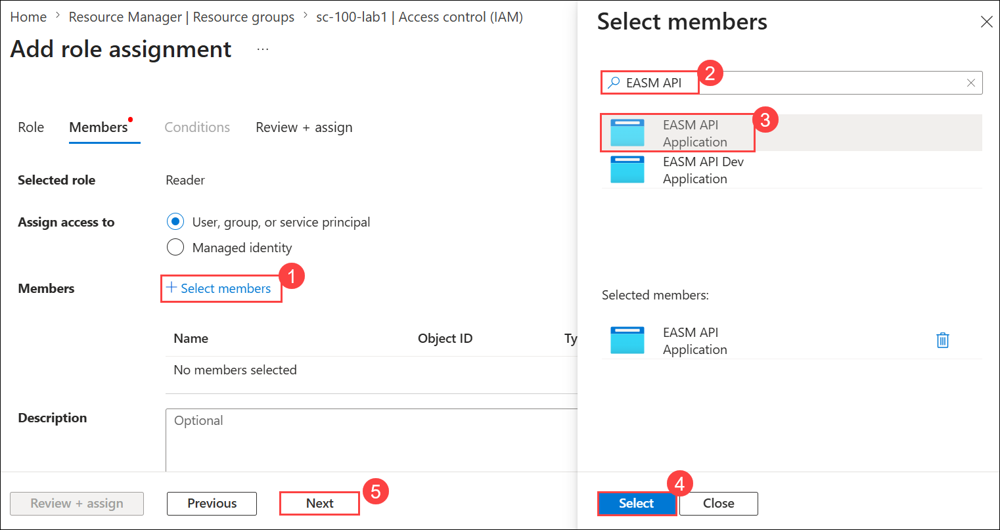

1. Select **Next**.

1. Select **Review + assign** twice.

    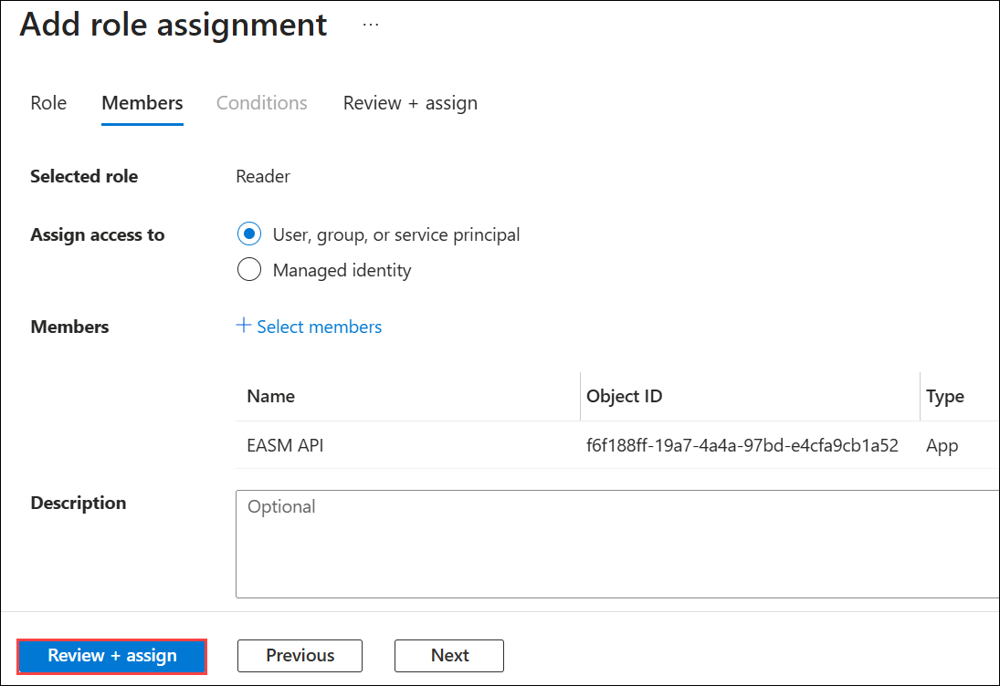

1. Select **Role assignments tab**, Confirm that the role assignments are set.

1. Repeat this and add the **Monitoring Contributor**, **Log Analytics Contributor**, and the **Monitoring Metrics Publisher** roles for the EASM API app.

1. The role assignments for the EASM API may take a few minutes to be assigned after. After configuring the assignments, please wait for a few minutes to create a new data connection.

1. In the Search bar of the Azure portal, type **Log Analytics (1)**, then select **Log Analytics workspaces (2)**.

   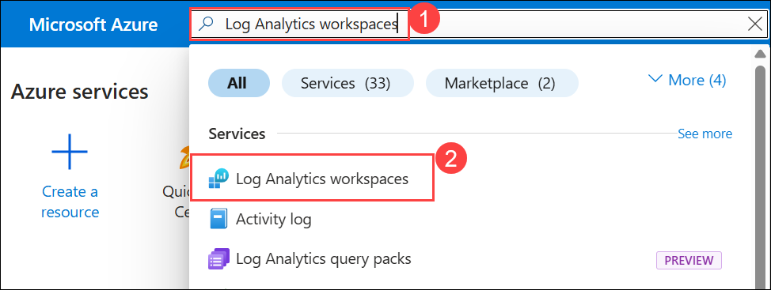

1. Select your **law-sentinel-<inject key="DeploymentID" enableCopy="false" /></inject>** workspace from the last exercise.

1. Leave the page as it is and open another tab and log into the Azure portal **`https://portal.azure.com`**.

1. In the Azure portal, navigate to **Microsoft Defender EASM**.

1. Select your **EASM<inject key="DeploymentID" enableCopy="false" /></inject>** workspace.

1. In the left navigation pane, expand **Manage (1)** and select **Data connections (2)**.

1. Under Log Analytics, select **Add connection (3)**.

    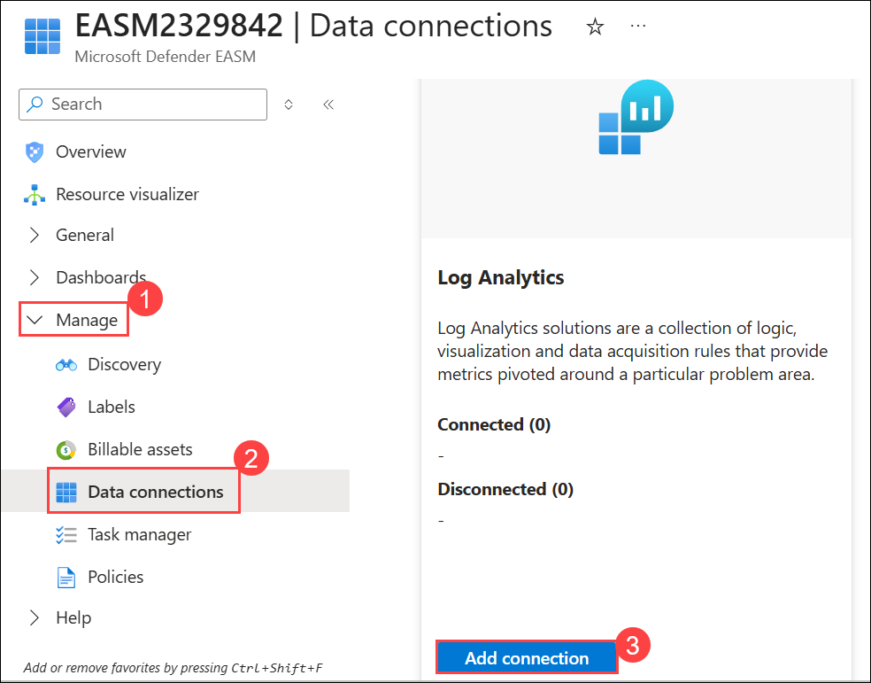

1. Name it **law-sentinel-<inject key="DeploymentID" enableCopy="false" /></inject> (1)**.

1. Switch to the previous tab with the log analytics workspace that should be open.

1. In the **Settings (1)** menu, select **Properties (2)**, and then copy the **Workspace ID (3)**.
    
     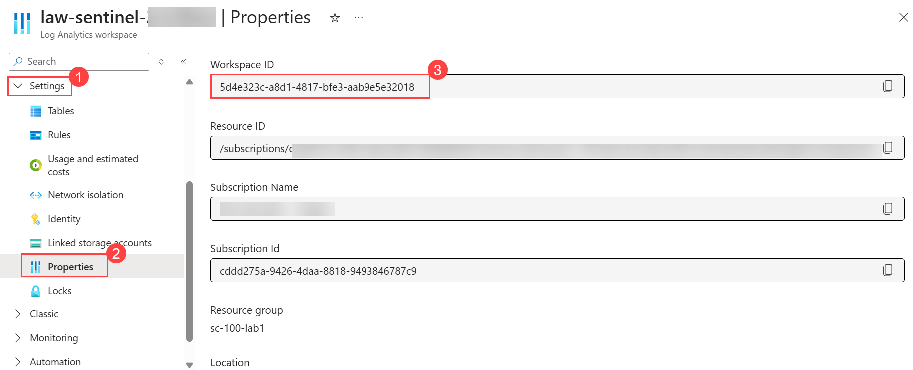

1. In Content select **All (3)**.

1. In Frequency select **Daily (4)**.

1. Select **Add (5)**.

     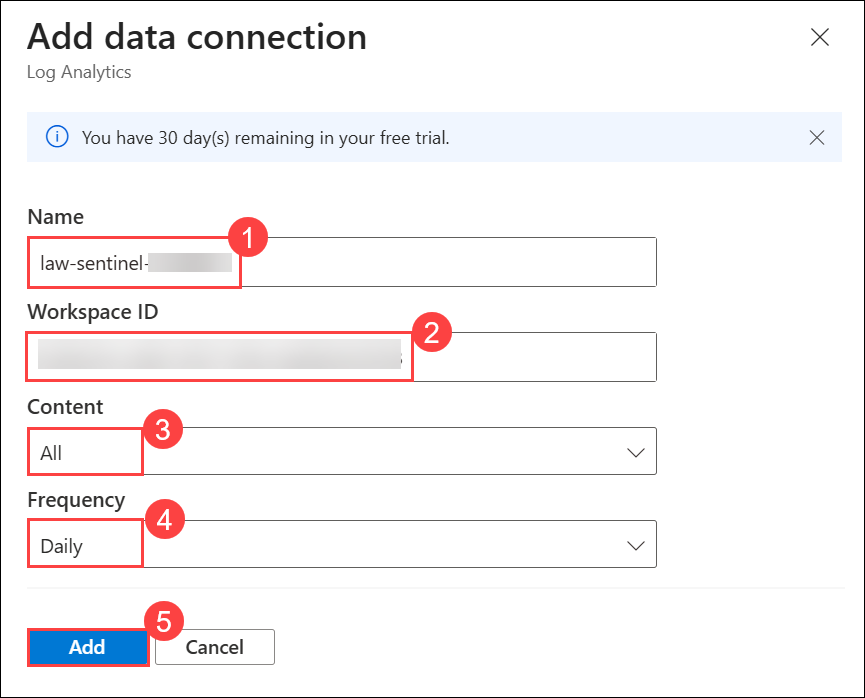

1. The Log Analytics card of the Data connections page should now show law-sentinel, listed under Connected.

     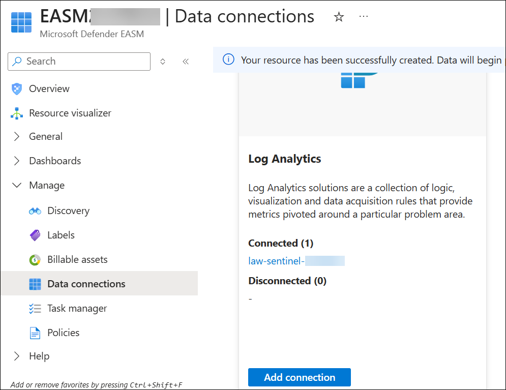

After the connection has been created, custom log tables are created in the log analytics workspace. In Sentinel, this data can then be used to create or enrich security incidents, build investigation playbooks, train machine learning algorithms or trigger remediation actions.

   >**Success!** You successfully setup the connection between Defender EASM and a log analytics workspace.

## Task 4 - Review Dashboards and label assets

In this Task, you´ll review the Defender EASM Security posture and get information about findings.

1. In the Azure portal, navigate to **Microsoft Defender EASM**.

1. Select your **EASM<inject key="DeploymentID" enableCopy="false" /></inject>** workspace.

1. In the left navigation pane, expand **Dashboards (1)** and select **Attack surface summary (2)**. The Attack Surface Summary dashboards provide key insights and high level overview of the impacted core assets of your attack surface.

     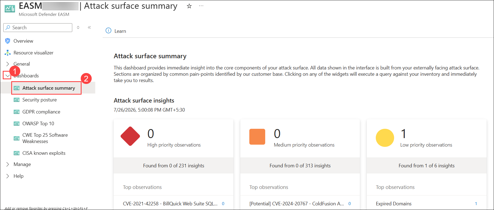
    
1. Review the **Attack surface summary** Dashboard.

1. In the left navigation pane, select **Security posture (1)**.

1. Review the different categories for open vulnerabilities.

1. Under the category **Open ports (2)**, select **Web servers (3)**.

     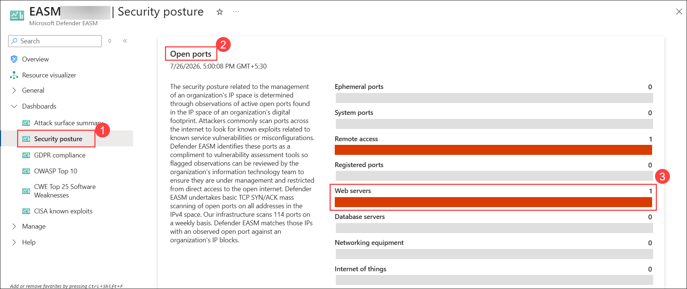

1. Select the found ip address **34.223.124.45**.

     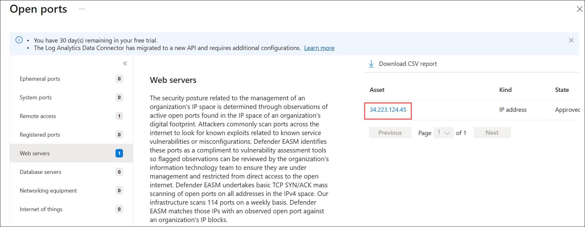

1. You decide to label the asset for further investigation.

1. Select **Modify Asset (1)**.

1. Select **Create new label (2)**.

     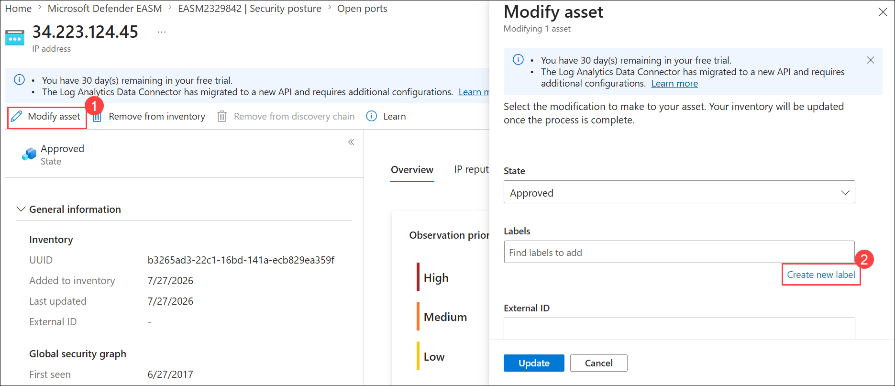

1. Name it **Open ports** (1) and select **Add** (2).

     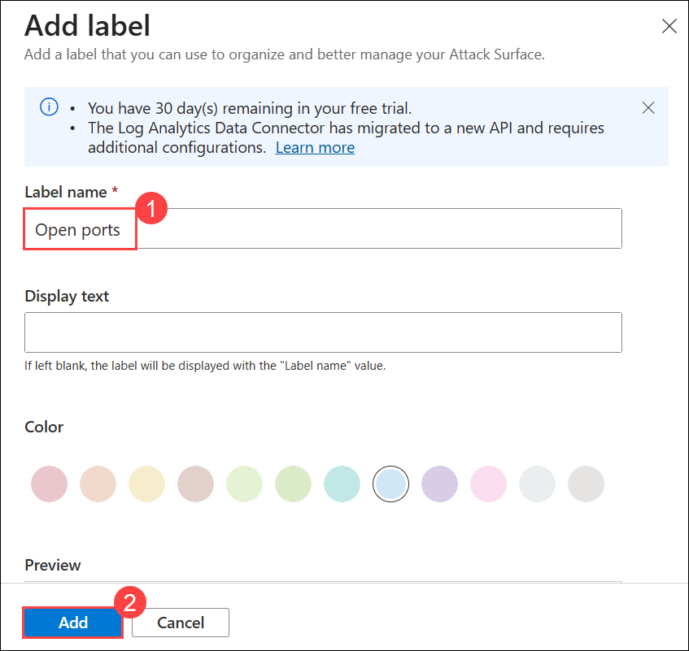
     
1. Select **Update**.

     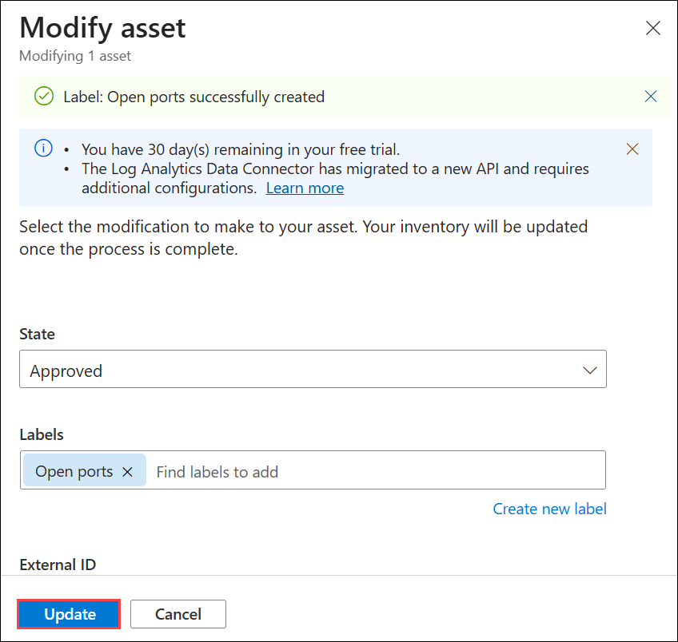

> **Congratulations** on completing the task! Now, it's time to validate it. Here are the steps:
	
 - Hit the Validate button for the corresponding task. If you receive a success message, you can proceed to the next task.
 - If not, carefully read the error message and retry the step, following the instructions in the lab guide.
 - If you need any assistance, please contact us at cloudlabs-support@spektrasystems.com. We are available 24/7 to help you out.
    
<validation step="3923d260-f803-495e-8b59-018c7ab6f6bc" />

   >**Success!** You successfully reviewed the Security posture and labeled an asset for further investigation.

## Task 5 - Manage Assets

In this task, you´ll manage and categorize the discovered assets.

1. In the Azure portal, navigate to **Microsoft Defender EASM**.

1. Select your **EASM<inject key="DeploymentID" enableCopy="false" /></inject>** workspace.

1. In the left navigation pane, expand **General (1)** and select **Inventory (2)**.

    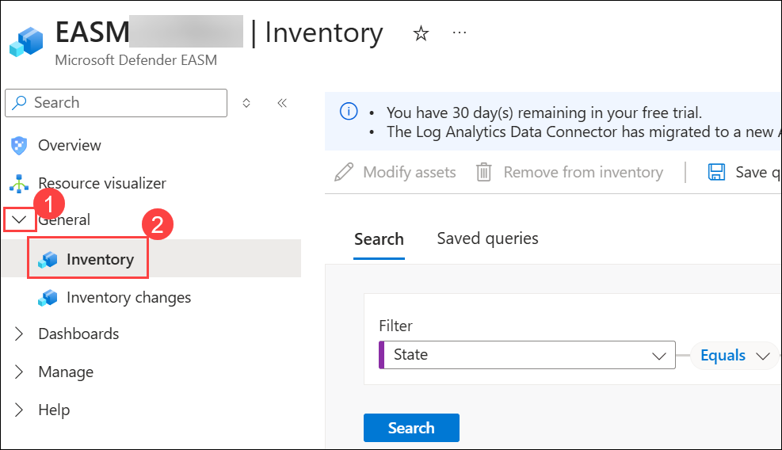

1. In the EASM | Inventory page, the Search tab is selected (underlined). In the search field use the dropdown menu to select **Labels (1)**.

1. In the dropdown menu below choose the label you recently created, **Open ports (2)**.

1. Select **Search (3)**.

1. Open the found asset **34.223.124.45 (4)**.

     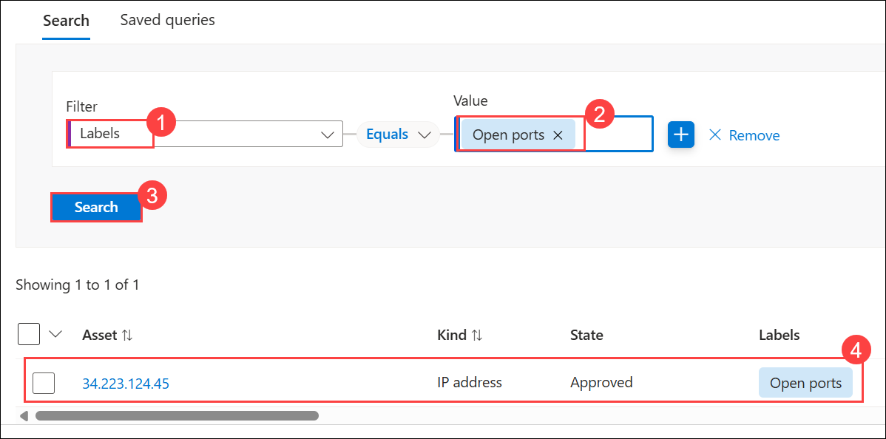

1. Select the **Web components (1)** tab.

1. You identify that this asset is hosted on Amazon, there are also open CVE´s on some of the components, but these are not active as you can see in the **Recent** and **Last seen** column. These originate from earlier discovery runs.
Since this asset is hosted by a third party but still belongs to your attack surface, you categorize it based on their role in your organization.

1. Select **Modify Asset (2)**.

     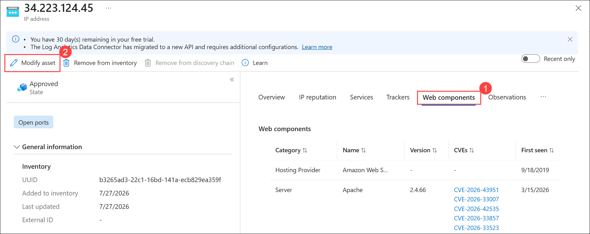

1. In the Modify Asset window, use the drop-down the **State** field to select **Dependency (1)**.

1. Select **Update (2)**.

     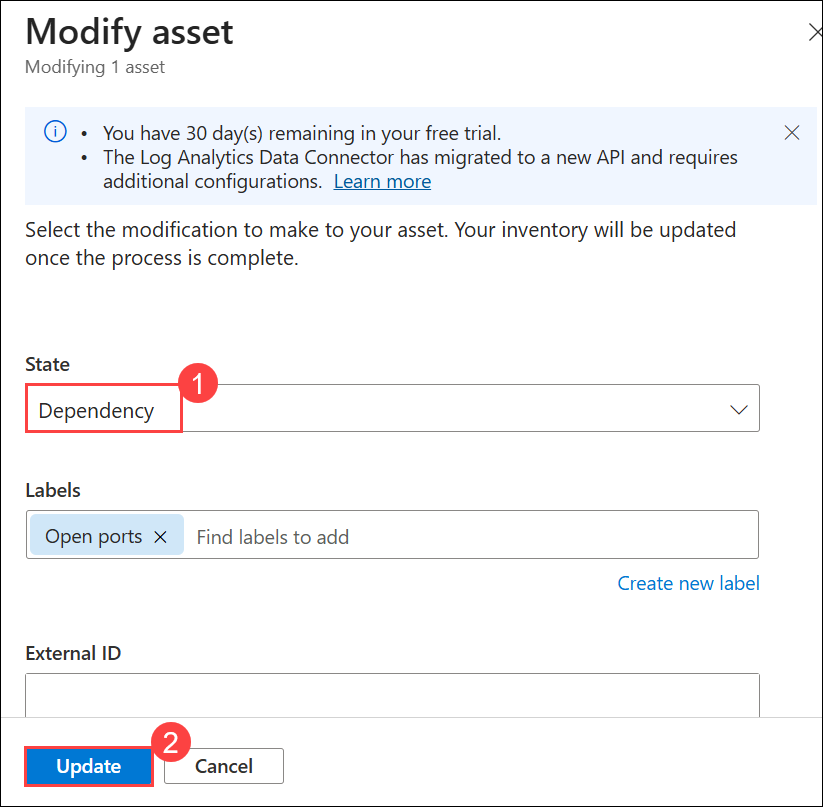
    
    >**NOTE**: In this Case you choose Dependency, because the asset is Infrastructure that is owned by a third party but is part of your attack surface because it directly supports the operation of your owned assets.
1. Go back to Inventory by selecting **X** in the top right and create a new Search.

1. Modify the search query to **Web Component Name (1) - contains (2) - Amazon (3)**.

1. Select **Search (4)**.

1. Select all Assets **(6)**.

     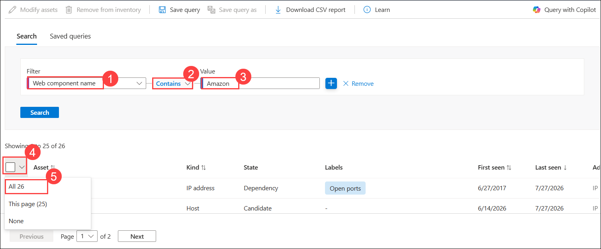

1. Select, **Modify assets (1)**.

    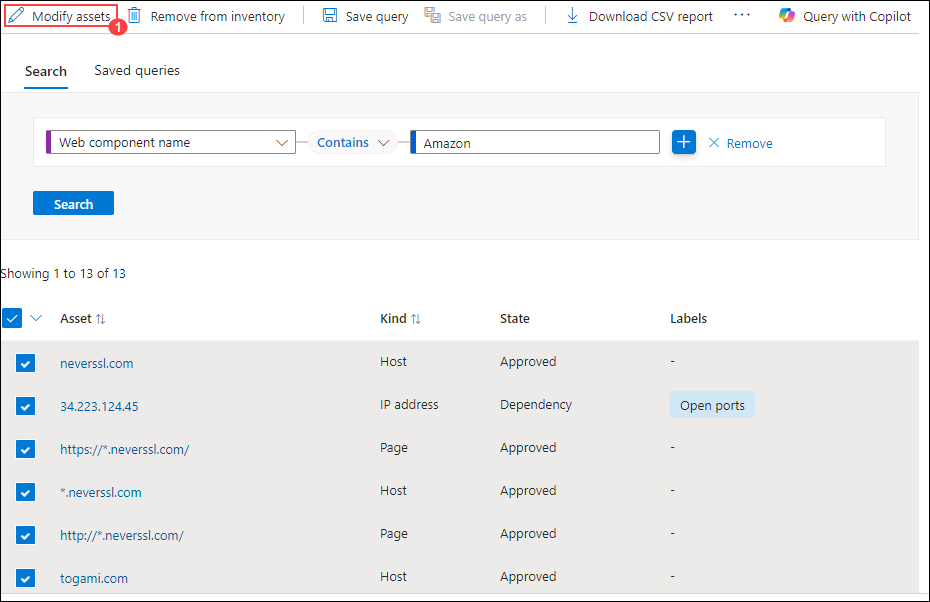

1. Choose **Dependency (1)** in State and select **Update (2)**.

    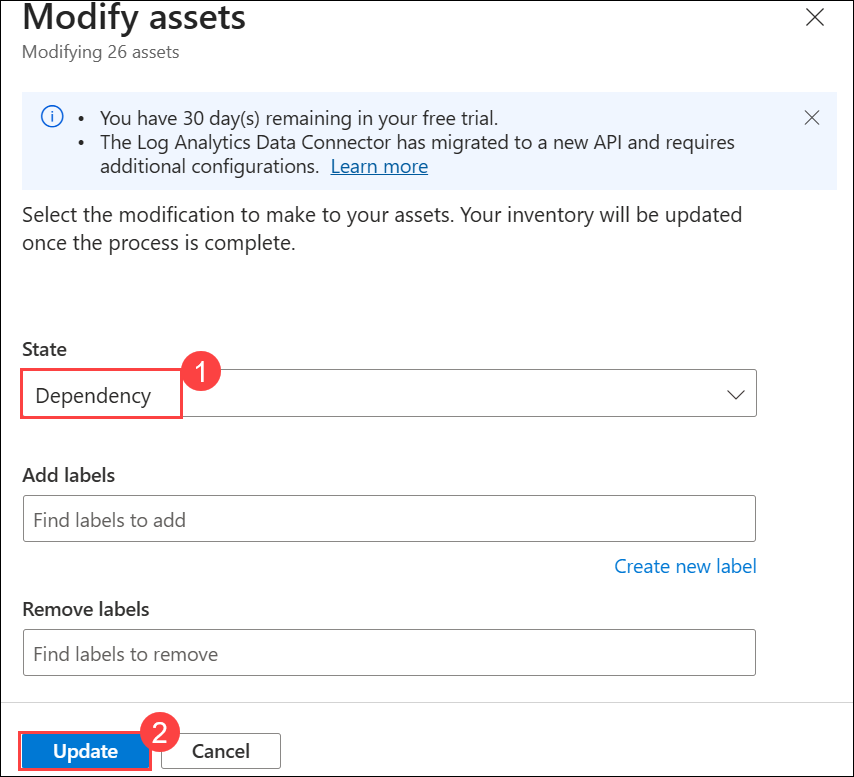

Only if the State is set to **Approved Inventory**, assets are represented in dashboard charts and are scanned daily. For that reason its important to review newly discovered assets and changed their state accordingly.

### Review

In this exercise, you have completed the following:
- Created the Defender EASM workspace.
- Created the Discovery of Contoso´s External Attack Surface.
- Setup the connection between Defender EASM and a log analytics workspace.
- Reviewed the Security posture and labeled an asset.

### You have successfully finished the exercise. Click on **Next** to move on to the next exercise.
