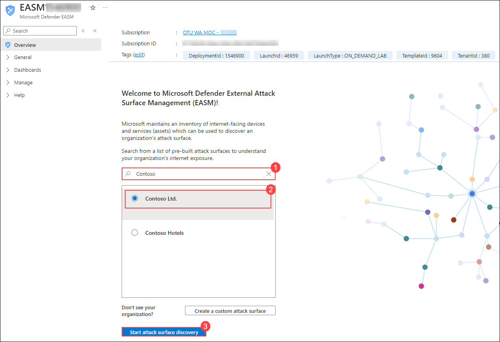
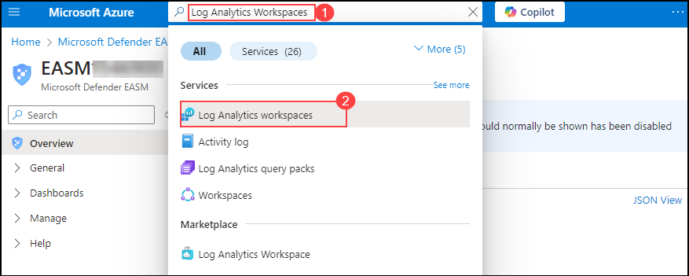
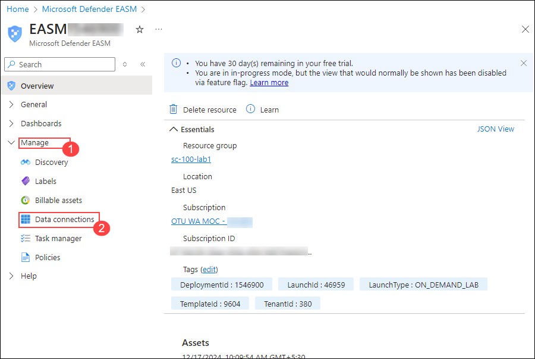
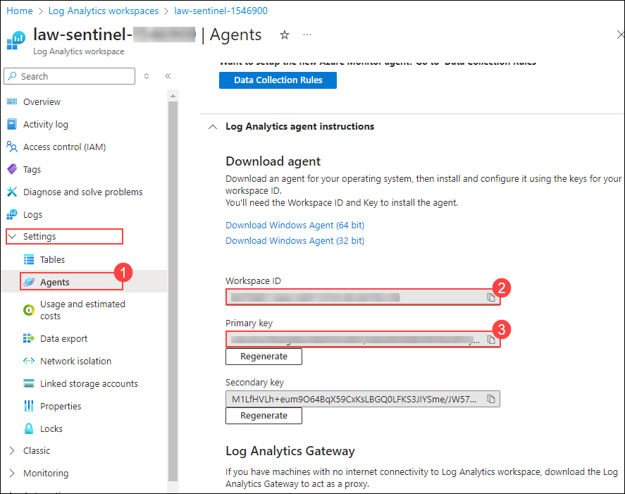
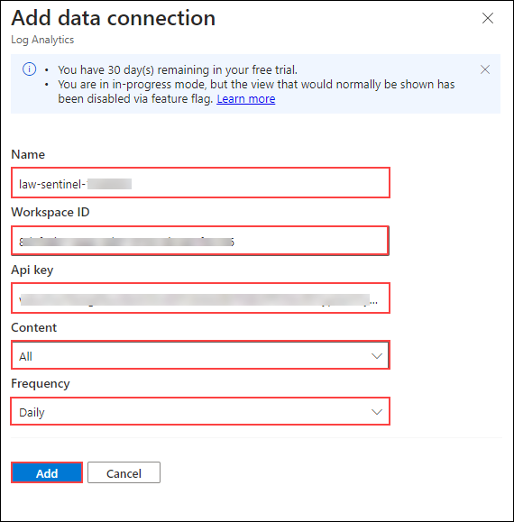

# Managing External Attack Surface

## Exercise Overview

Contoso aims to enhance its cybersecurity posture by identifying and managing its external attack surface. This surface includes assets that are hosted on different cloud providers. To achieve this goal, Contoso wants to integrate its attack surface data with Sentinel, its cloud-native SIEM solution. This integration will enhance its security monitoring and incident response capabilities. 

## Part 1: Design a solution (required)

In this task you´ll design a concept to get an overview on your outside facing assets and their attack surface.

### Design approach

The initial step involves analyzing the requirements based on the described scenario, understanding the objectives and defining the requirements.

Based on the provided use-case, the following requirements can be outlined:

- Contoso´s outside facing assets need to be monitored and secured
- Discover all assets associated with contoso
- Integrate data to Contoso´s SIEM Solution.
- Assets need to be managed and labeled

In the second step examinine Contoso Ltd.'s existing environment. Microsoft Defender External Attack Surface Management (EASM) continuously discovers and maps the digital attack surface, providing an external view of an organization’s online infrastructure. It identifies exposed resources, prioritizes risks, and extends vulnerability and exposure control beyond the firewall.

### Proposed solution

|Requirement|Solution|Action plan|
|----|----|----|
|Contoso´s outside facing assets need to be monitored and secured| Defender EASM | Create Microsoft Defender EASM resource|
|discover all assets associated with contoso | Defender EASM |Create a discovery job on Contoso´s assets  |
|Integrate data to Contoso´s SIEM Solution |Defender EASM, Log Analytics Workspace | Connect Log analytics workspace to Defender EASM |
|Assets need to be managed and labeled | Defender EASM | Manage billable Assets and tags |

## Part 2: Implement the solution (optional)

### Task 1 - Setup Defender EASM

In this Task, you´ll create a Defender EASM workspace.

1. In the top search bar, search for **`Microsoft Defender EASM`**.

    
1. Select **Create**.

    
1. On Create Microsoft Defender EASM Resource, select the existing resource group **sc-100-lab1**.
1. In Instance details enter the following details and select on **Review & Create**:
    | Settings | Values |
    |  -- | -- |
    | Subscription | *Leave default subscription* (1)|
    | Resource group | Select the resource group name **sc-100-lab1** from the dropdown list (2)|
    | Name | **EASM<inject key="DeploymentID" enableCopy="false" /></inject>** (3) | 
    | Region | **<inject key="Resource group Region" enableCopy="false" ></inject>** (4) | 

    

1. Select **Create**.

You successfully created the Defender EASM workspace.

### Task 2 - Create Discovery

In this Task, you´ll create a Discovery on Contoso Ltd. outside facing assets. After you have created an instance you need to populate it with actual data. Therefore you will now create a discovery.

1. On the search bar on the top, search for **`Microsoft Defender EASM`** and open it.

    
1. Select the **EASM<inject key="DeploymentID" enableCopy="false" /></inject>** workspace you created in the last task.
1. Search for **Contoso (1)** in the **Search for an organization** search field.
1. Select **Contoso Ltd. (2)**.
1. Select **Start attack surface discovery (3)**.

    

You successfully created the Discovery of Contoso´s External Attack Surface and populated the EASM instance with actionable data.

### Task 3 - Setup data connector and log analytics workspace

In this Task, you´ll configure a data connection from Defender EASM to an log analytics workspace that will be used for Sentinel. Defender EASM asset or insights information can be used in Log Analytics to enrich existing workflows with other security data.

1. In the top search bar, search for **`Log Analytics Workspaces`**.

    
1. Select your **law-sentinel-<inject key="DeploymentID" enableCopy="false" /></inject>** workspace from the last exercise.
1. Leave the page as it is and open another tab and log into the Azure portal **`https://portal.azure.com`**.
1. On the search bar on the top, search for **`Microsoft Defender EASM`** and open it.

    
1. Select your **EASM<inject key="DeploymentID" enableCopy="false" /></inject>** workspace.
1. In the left navigation pane, expand **Manage (1)** and select **Data connections (2)**.

    
1. Under Log Analytics, select **Add connection**.
1. Name it **law-sentinel-<inject key="DeploymentID" enableCopy="false" /></inject>**.
1. Switch to the previous tab with the log analytics workspace that should be open.
1. Expand **Agents** under Settings.
1. Copy the **Workspace ID** into the corresponding field of the Add data connection window.
1. Copy the ** **Primary key** into the API key field of the Add data connection window.

    
1. In Content select **All**.
1. In Frequency select **Daily**.
1. Select **Add**.

    
1. The Log Analytics card of the Data connections page should now show law-sentinel, listed under Connected (1).

After the connection has been created, custom log tables are created in the log analytics workspace. In Sentinel, this data can then be used to create or enrich security incidents, build investigation playbooks, train machine learning algorithms or trigger remediation actions.

You successfully setup the connection between Defender EASM and a log analytics workspace.

### Task 4 - Review Dashboards and label assets

In this Task, you´ll review the Defender EASM Security posture and get information about findings.

1. On the search bar on the top, search for **`Microsoft Defender EASM`** and open it.
1. Select your **EASM<inject key="DeploymentID" enableCopy="false" /></inject>** workspace.
1. In the left navigation pane, expand **Dashboards** and select **Attack surface summary**. The Attack Surface Summary dashboards provide key insights and high level overview of the impacted core assets of your attack surface.
1. Review the **Attack surface summary** Dashboard.
1. In the left navigation pane, select **Security posture**.
1. Review the different categories for open vulnerabilities.
1. Under the category **Open ports**, select **Web servers**.
1. Select the found ip address **34.223.124.45**.
1. You decide to label the asset for further investigation.
1. Select **Modify Asset**.
1. Select **Create new label**.
1. Name it **Open ports** and select **Add**.
1. Assign the newly created label in the field **Labels**.
1. Select **Update**.

You successfully reviewed the Security posture and labeled an asset for further investigation.

### Task 5 - Manage Assets

In this task, you´ll manage and categorize the discovered assets.

1. On the search bar on the top, search for **`Microsoft Defender EASM`** and open it.
1. Select your **EASM<inject key="DeploymentID" enableCopy="false" /></inject>** workspace.
1. In the left navigation pane, expand **General** and select **Inventory**.
1. In the EASM | Inventory page, the Search tab is selected (underlined). In the search field use the dropdown menu to select **Labels**
1. In the dropdown menu below choose the label you recently created, **Open ports**.
1. Select **Search**.
1. Open the found asset **34.223.124.45**.
1. Select the **Web components** tab.
1. You identify that this asset is hosted on Amazon, there are also open CVE´s on some of the components, but these are not active as you can see in the **Recent** and **Last seen** column. These originate from earlier discovery runs.
Since this asset is hosted by a third party but still belongs to your attack surface, you categorize it based on their role in your organization.
1. Select **Modify Asset**.
1. In the Modify Asset window, use the drop-down the **State** field to select **Dependency**.
1. Select **Update**.
    >**NOTE**: In this Case you choose Dependency, because the asset is Infrastructure that is owned by a third party but is part of your attack surface because it directly supports the operation of your owned assets.
1. Go back to Inventory by selecting **X** in the top right and create a new Search.
1. Modify the search query to **Web Component Name - contains - Amazon**.
1. Select **Search**.
1. Select all Assets.
1. Select, **Modify assets**.
1. Choose **Dependency** in State and select **Update**.

Only if the State is set to **Approved Inventory**, assets are represented in dashboard charts and are scanned daily. For that reason its important to review newly discovered assets and changed their state accordingly.

As part of this exercise you set up Defender EASM, created the discovery of Contoso´s outside facing environment, you got deeper insight of assets and their configuration and you have managed assets so that the dashboards only include data for which Contoso is directly responsible.
