# Lab 03: Secure Infrastructure

## Estimated Duration: 40 Minutes

## Exercise Overview

Contoso Ltd. recently acquired Tailwind Traders, which still uses local file servers for storage. You need to evaluate a solution to secure these file servers with your existing cloud environment using Azure Arc and Microsoft Defender for Cloud. You will set up a test server and integrate it into your cloud infrastructure and security environment.

## Exercise Objectives

In this Exercise, you will perform

- **Task 1:** Enable Defender for Cloud
- **Task 2:** Enable the on premise Server in Azure Arc
- **Task 3:** Add Server to Defender for Cloud and gather Logs.
- **Task 4:** Add regulatory compliance standard

## Architecture Diagram

   

## Explanation of Components

  The architecture for this lab involves the following key components:  

   - **Defender for Cloud**: A comprehensive security solution that provides advanced threat protection and unified security management across hybrid cloud environments.  

   - **Azure Arc for On-Premises Servers**: Enables seamless integration of on-premises servers into Azure for centralized management and monitoring.  

   - **Server Logs and Defender Integration**: Collects logs from connected servers and integrates them with Defender for Cloud to monitor security events and detect threats.  

   - **Regulatory Compliance Standard**: Helps organizations align with industry compliance requirements by assessing and monitoring adherence to regulatory standards.  

## Task 1: Enable Defender for Cloud

In this task, you will enable Defender plans for the resource types you want to secure, ensuring that **Defender for Cloud** can apply the necessary protections to your assets.

1. In the **Search** box, enter **Microsoft Defender for Cloud (1)**, and then select **Microsoft Defender for Cloud (2)** from the search results.

     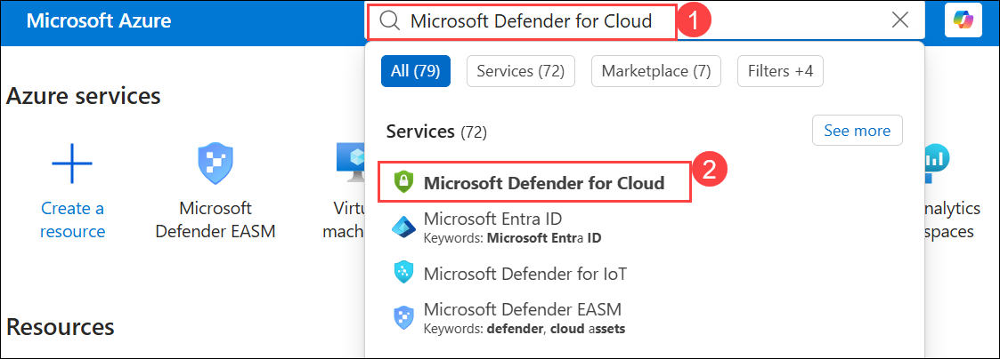

1. In the left navigation pane, expand **Management (1)** and select **Environment settings (2)**.

1. Select **Expand all** and select your Subscription.

1. If the Subscription is shown as **unregistered** reload the page.

1. Select the ellipses **(...) (3)** next to the subscription and select **Edit settings (4)**.

     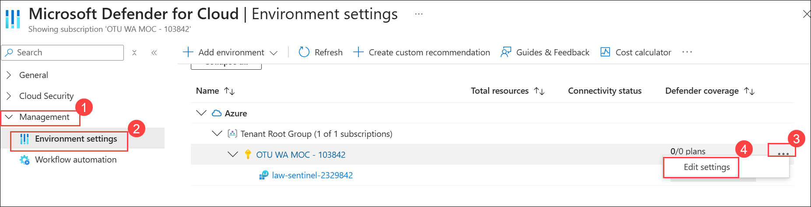

1. Under **Cloud Workload Protection** set the **Servers** plan statUs to **On (1)**.

1. Select **Save (2)** at the top of the page.

     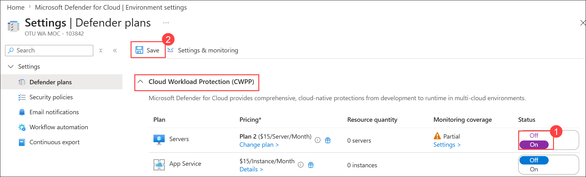

When enabling the Plan for Servers you will see that Defender for Cloud supports many more resource types.

## Task 2: Enable the on premise Server in Azure Arc

In this task, you will configure **Azure Arc** to send data to the **Log Analytics Workspace** used by **Defender for Cloud**, enabling seamless integration and enhanced security monitoring.

1. In the lab virtual machine, Select **VM1** from the desktop.

     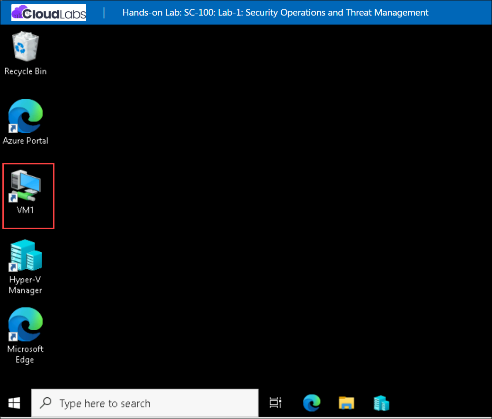

1. Enter the **Password** as **<inject key="VM1 Password"></inject>** when prompted.

     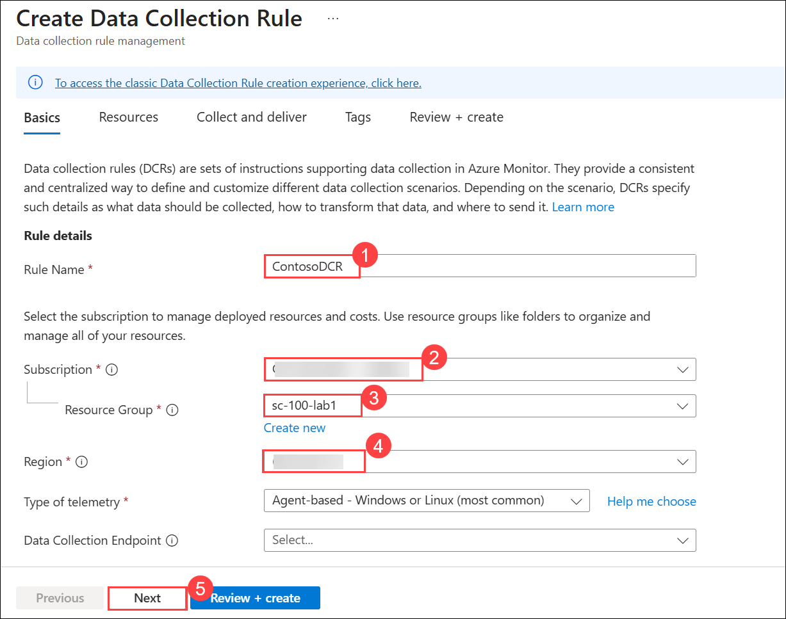

     > **Note:** If the password field is not displayed on the Virtual Machine login screen, click **Action** → **Ctrl+Alt+Delete** (or press **Ctrl+Alt+End**) in the Virtual Machine Connection window. This will bring up the Windows sign-in screen, allowing you to enter the Administrator password and log in.

     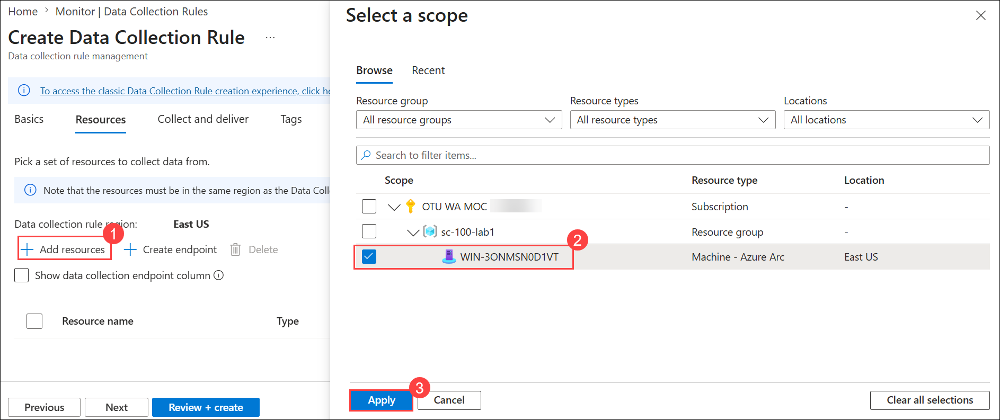

1. Open Edge and sign into the Azure portal **`https://portal.azure.com`** using the following credentials:
   
   - **Username**: <inject key="AzureAdUserEmail"></inject>
   
   - **Password**: <inject key="AzureAdUserPassword"></inject>
   >**Note**: If you are asked to **Stay Signed in**, Click on **Yes**.

1. In the Search bar of the Azure portal, type **Azure Arc (1)**, then select **Azure Arc (2)**.

     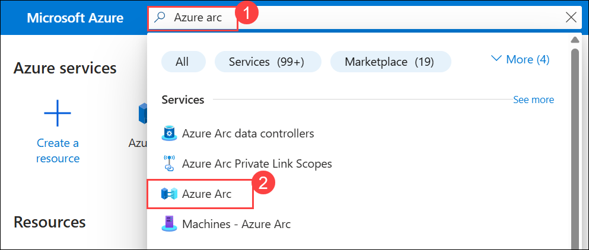

1. On the left side navigation pane under **Azure Arc resources** select **Machines (1)** and then click on **+ Onboard/Create (2)** drop dowm and then click on **Onboard existing machines (3)**.

     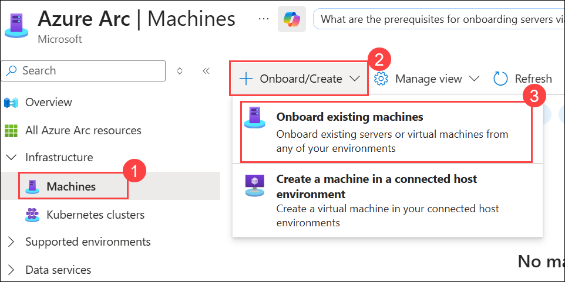

1. On the **Basics** tab, in the Resource group field, use the drop-down menu to select **sc-100-lab1 (1)**.

1. In the Region field, use the drop-down menu to select **<inject key="Resource group Region" enableCopy="false" ></inject> (2)**.

1. Select **Download and run script (3)**.

     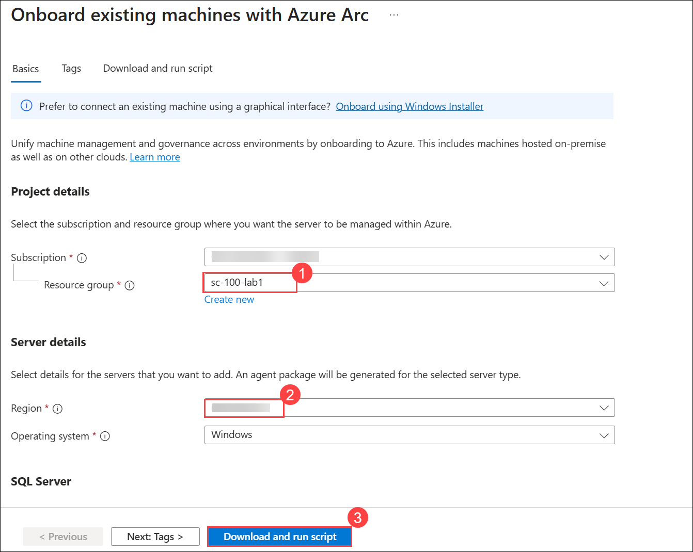

1. Scroll down and select the **Download** button. **Hint:** If your browser blocks the download, take action in the browser to allow it.

     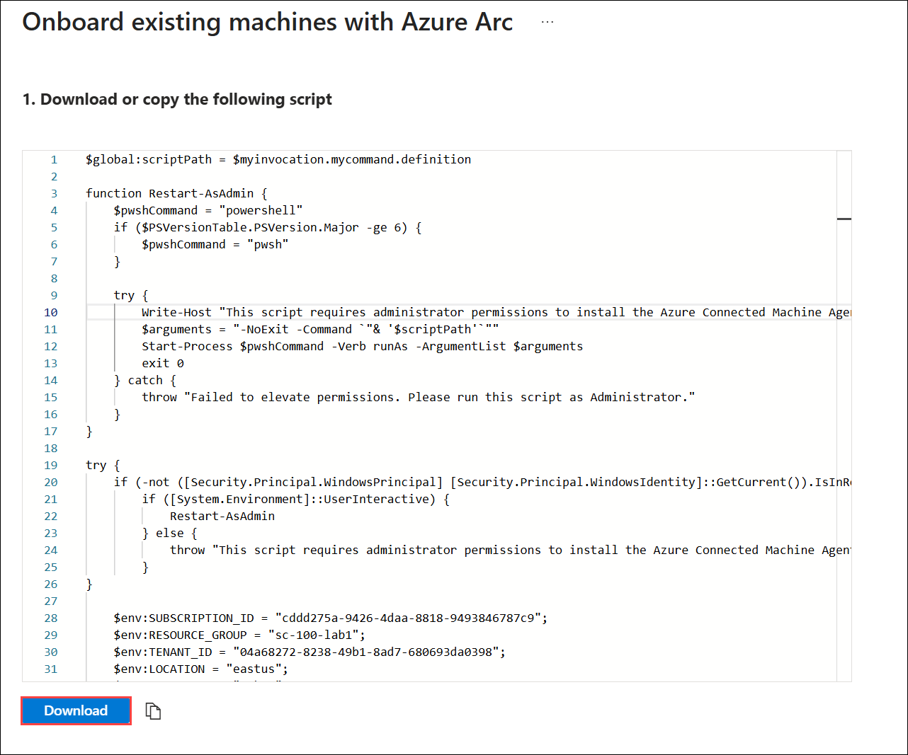

1. In Microsoft Edge Browser, select the ellipsis button (...) **(1)** if needed and then select **Keep (2)**.

     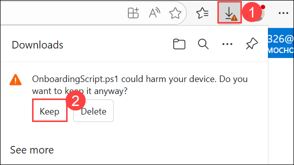

1. Right-click the Windows Start **(1)** button and select **Windows PowerShell (Admin) (2)**.

     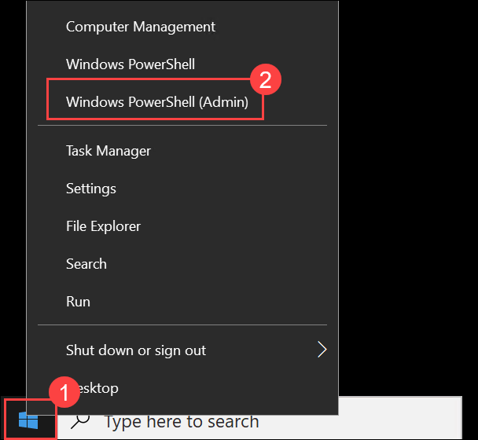

1. Enter the below command.

    ```CommandPrompt
    cd C:\Users\Administrator\Downloads
    ```

    >**Note:** If you are not able to copy the content, then copy the required content to a notepad file using the Clipboard functionality in the top navigation pane of the Hyper V VM in the lab VM and paste it into the Powershell window.

1. Set the Execution Policy to unrestricted.

    ```Powershell
    Set-ExecutionPolicy -ExecutionPolicy unrestricted
    ```

1. Enter **A** for Yes to All and press enter.

     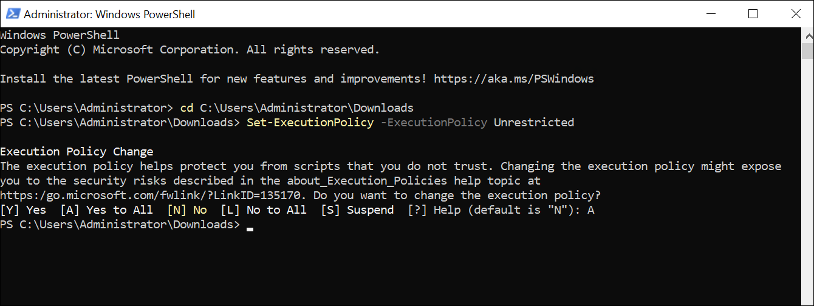

1. Type `.\OnboardingScript.ps1` and press enter.  

    >**Important:** If you get the error **"The term .\OnboardingScript.ps1 is not recognized..."**, make sure you are doing the steps for Task 2 on the VM1 virtual machine. Another issue might be that the name of the file changed due to multiple downloads, search for **".\OnboardingScript (1).ps1"** or other file numbers in the running directory.

     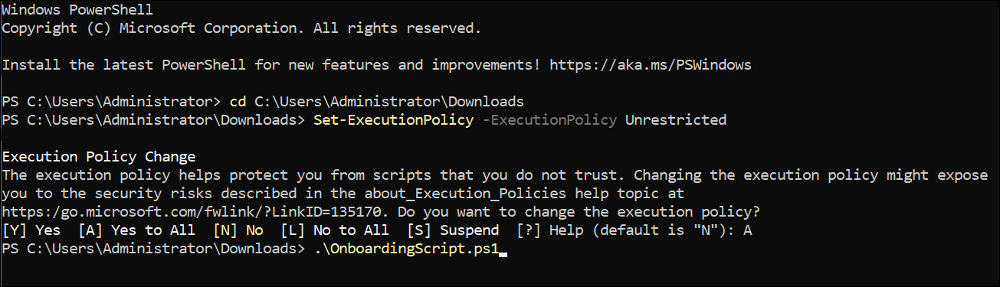

1. Enter **R** to Run once and press enter (this may take a couple of minutes).

     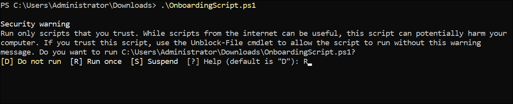

1. The setup process will open a new Edge browser tab to authenticate the Azure Arc agent. Select your admin account, wait for the message "Authentication complete" and then go back to the Windows PowerShell window.

     - **Username**: <inject key="AzureAdUserEmail"></inject>
     - **Password**: <inject key="AzureAdUserPassword"></inject>

       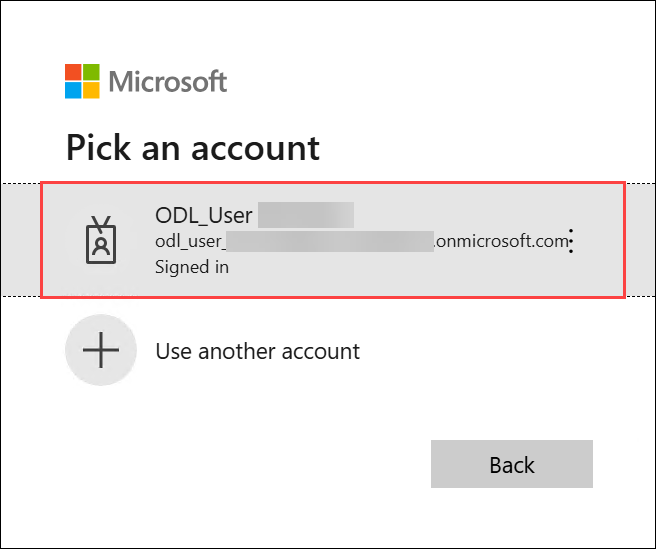

1. When the installation finishes,you will get a output like this in the powershell. 

     

1. Go back to Azure Portal and open Azure Arc.

1. Select **Machines**, select **Refresh** on top of the page and validate your server is successfully deployed to Azure Arc.

     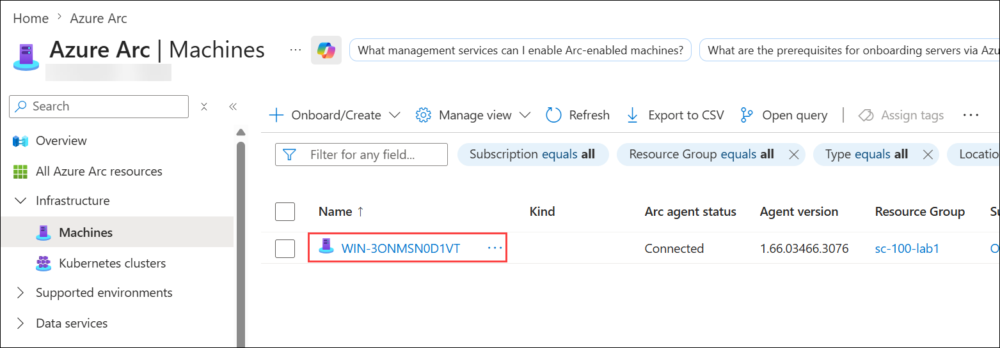

> **Congratulations** on completing the task! Now, it's time to validate it. Here are the steps:
	
 - Hit the Validate button for the corresponding task. If you receive a success message, you can proceed to the next task.
 - If not, carefully read the error message and retry the step, following the instructions in the lab guide.
 - If you need any assistance, please contact us at cloudlabs-support@spektrasystems.com. We are available 24/7 to help you out.
    
<validation step="7905e87b-74c6-4ccc-92fc-21b2e51da913" />

   >**Success!**: You have successfully enabled Azure Arc on the test server and data should start to flow into the log analytics workspace. This process might take some time until you can see anything in the dashboard.

## Task 3: Add Server to Defender for Cloud and gather Logs.

In this task, you will deploy a **Data Collection Rule** to gather event logs from the on-premises server. The rule will automatically install the monitoring agent on the server and forward the logs to the pre-configured **Log Analytics Workspace**.

1. In the Azure portal, navigate to **Microsoft Defender for Cloud**.

1. From the left navigation panel, select **Environment settings (1)** under management.

1. Expand the **Tenant Root Group** and the **Subscrtiption**, now you will see the previously created log analytics workspace, **law-sentinel-<inject key="DeploymentID" enableCopy="false" /></inject>** listed. Select the ellipses **(...) (2)** next to the **law-sentinel-<inject key="DeploymentID" enableCopy="false" /></inject>** and select **Edit settings (3)**.  This will take you to the **Defender plan** page of law-sentinel-<inject key="DeploymentID" enableCopy="false" /></inject>.  

      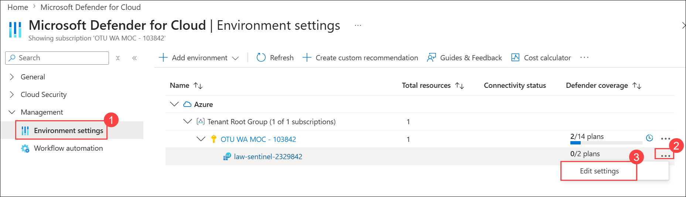

1. On the **Servers** plan, select **On (1)**, then select **Save (2)**, from the top of the page.

      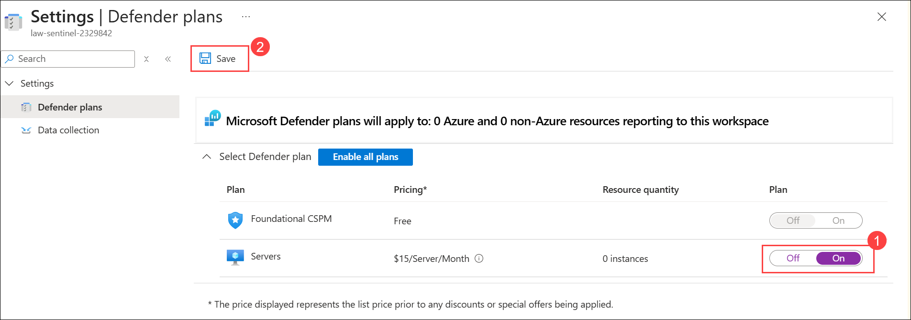

1. In the **Search** box, enter **Data collection rules (1)**, and then select **Data collection rules (2)** from the search results.

      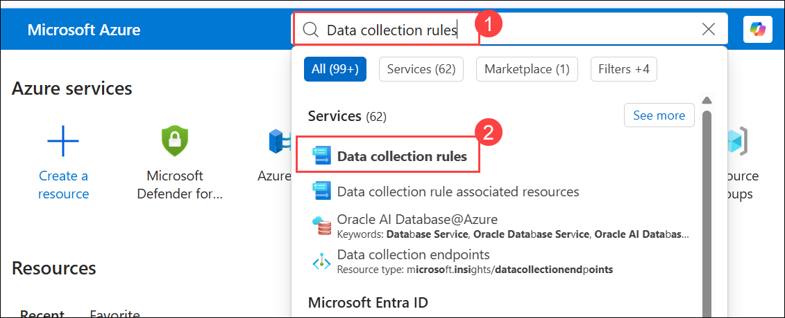

1. Select **+ Create**.

1. Add the following details, and select **Next (5)**:
     - Rule Name: **`ContosoDCR` (1)**
     - Subscription: Select default **(2)**
     - Resource group: **sc-100-lab1 (3)**
     - Region - **<inject key="Resource group Region" enableCopy="false" ></inject> (4)**

        

1. Select **Add resources (1)**. Check the previously onboarded **Azure Arc machine (2)**, then select **Apply (3)**.

      

1. Select **Next: Collect and deliver**.

1. Select **Add data source**.

      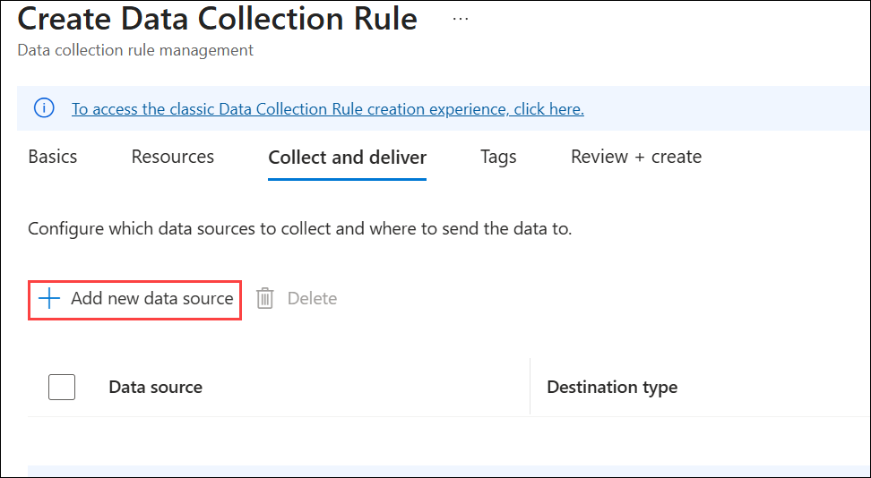

1. Choose Data Source type **Windows Event Logs (1)**.

1. Select every option under **Application, Security and System (2)** event logs.

1. Select **Next: Destination (3)**.

      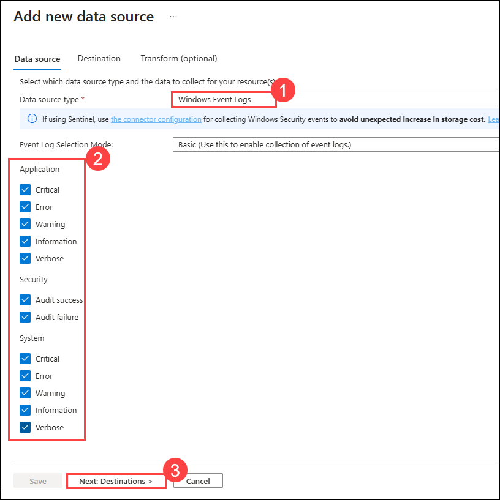

1. Select **Add destination (1)**, and configure the following settings:
     - **Destination type (2):** Log Analytics Workspaces
     - **Subscription (3):** Verify the selected subscription
     - **Log Analytics Workspaces (4):** Select the Log Analytics workspace **law-sentinel-<inject key="DeploymentID" enableCopy="false" /></inject>**

1. Select **Apply (5)**.

      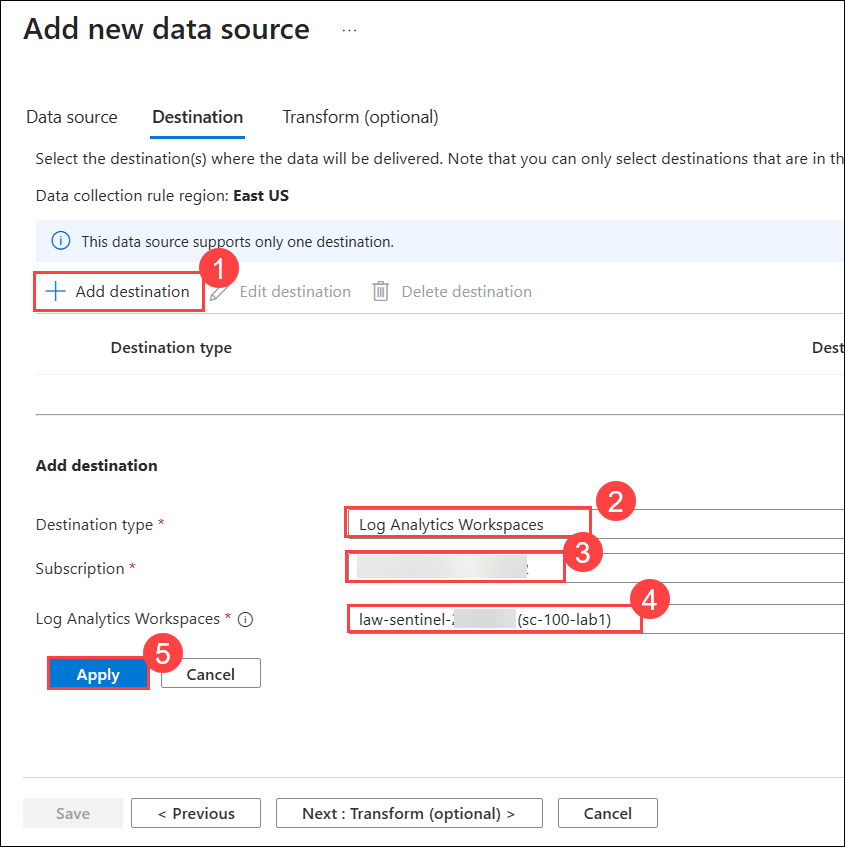

1. Select **Save**.

      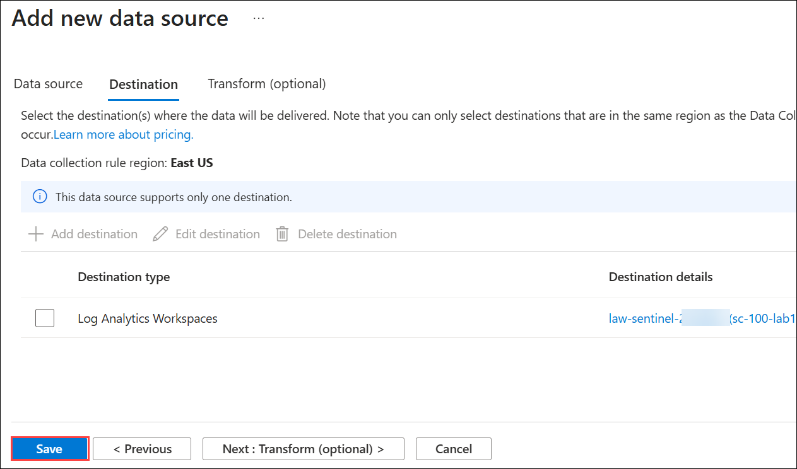

1. Select **Review & create**.

      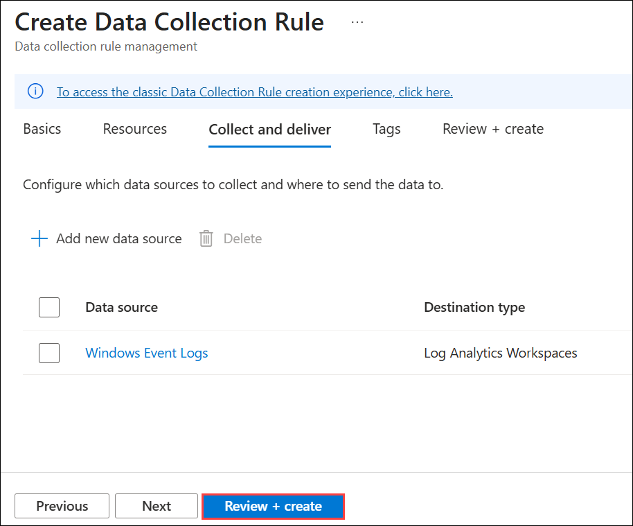

1. Select **Create**.

It may take a few hours till the resource is fully onboarded in Defender for Cloud. The next step is to look at the recommendation that Defender for Cloud generates for this resource.

> **Congratulations** on completing the task! Now, it's time to validate it. Here are the steps:
	
 - Hit the Validate button for the corresponding task. If you receive a success message, you can proceed to the next task.
 - If not, carefully read the error message and retry the step, following the instructions in the lab guide.
 - If you need any assistance, please contact us at cloudlabs-support@spektrasystems.com. We are available 24/7 to help you out.
    
<validation step="883a42a8-fd6a-4cf4-9b39-da3e203dc093" />

## Task 4: Add regulatory compliance standard

In this task, you will secure the resources based on recommendations and assign security policies, such as **NIST SP 800-53 Rev.5**, to ensure that **Tailwind Traders'** resources comply with regulatory requirements.

1. In the Azure portal, navigate to **Microsoft Defender for Cloud**.

1. In the left navigation pane, expand **Management (1)** and select **Environment settings (2)**.

1. Select **Expand all** and select your Subscription.

1. Select the ellipses **(...) (3)** next to the subscription and select **Edit settings (4)**.

     

1. Select **Security policies (1)** in the navigation menu on the left. The list might take a while to load.

1. Search for **`NIST SP 800-53 Rev. 5` (2)**. Change the status slider to **On (3)**.

     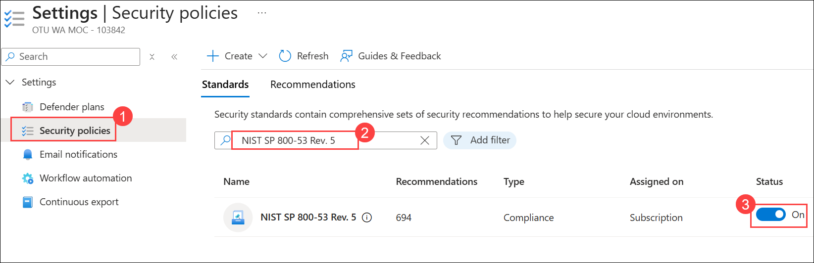

1. Go back to Defender for Cloud and select **Regulatory compliance** under Cloud Security.

     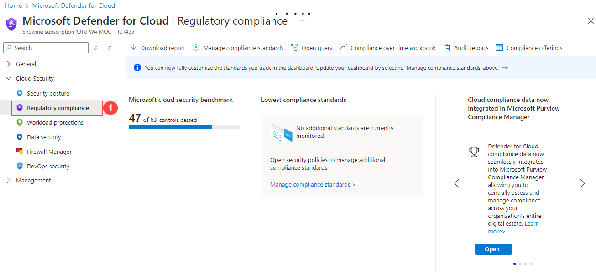

Due to limitation off the lab environment, you are not able to see the resources as well as the compliance recommendations. It takes a while until the deployed resources are visible in Defender for Cloud.

In the Regulatory compliance dashboard you can now review any failing assessments that appear in the dashboard to understand the details of the recommendations.

By continuously assessing resources against these controls, Defender for Cloud identifies issues that may hinder achieving specific compliance certifications. Maintaining regulatory compliance is crucial for safeguarding your organization’s data and ensuring a secure cloud environment.

### Review

In this exercise, you have completed the following:
- Enabled Defender for Cloud.
- Enabled Azure Arc on the test server.
- Added Server to Defender for Cloud and gather Logs.
- Added regulatory compliance standard.


### You have successfully completed the lab.
