# Secure Infrastructure

Contoso Ltd. recently acquired Tailwind Traders, which still uses local file servers for storage. As the cybersecurity architect of Contoso Ltd., you want to evaluate a solution to secure these file servers with your existing cloud environment. Tailwind Traders provided you with a test server (The Lab VM 2) that you can use for the implementation of your POC. In this exercise, you will set up the server and integrate it into your cloud infrastructure and security environment using Azure Arc and send server logs to Defender for Cloud.

## Part 1: Design a solution (required)

In this task you´ll design a concept to secure on premise environment inside your cloud infrastructure.

### Design approach

The initial step involves analyzing the requirements based on the described scenario, understanding the objectives and defining the requirements.

Based on the provided use-case, the following requirements can be outlined:

- Enable Defender for Cloud on your subscription
- On premises servers need to be secured
- Logs should be stored, that Contoso´s SIEM Solution can process them
- Assess the compliance state of deploy resources

In the second step examine Contoso Ltd.'s existing environment. Defender for Cloud provides recommendations to secure cloud and on-premises resources by identifying steps to improve configuration and deployment. By actively monitoring workloads, it enhances overall security posture and reduces exposure to threats.

### Proposed solution

|Requirement|Solution|Action plan|
|----|----|----|
|Enable Defender for Cloud on your subscription| Defender for Cloud | Activate Defender plans in Defender for Cloud |
|On premises servers need to be secured | Azure Arc | Onboard the on premise Server to the cloud enviroment |
|Logs need to be stored, that Contoso´s SIEM Solution can process them |Defender for Cloud, DataCollectionRules, AzureMonitoring Agent, Log Analytics workspace | Create a Data Collection Rule to gather logs from Contoso´s on premise Server |
|Assess the compliance state of deploy resources | Defender for Cloud Security policies| Enable the NIST SP 800-53 Rev.5 Compliance and assesses your compliance state.|

## Part 2: Implement the solution (optional)

<!-- ### Task 1: Create a Log Analytics Workspace

In this task, you´ll create a log analytics workspace which is required to house the data that is send from different resources.

1. Select **Create a resource** and search for **log analytics workspace**
1. Find the **Log Analytics Workspace tile**, select **Create**.
1. On Create Log Analytics workspace site, create a new **Resource Group** and name it **`ContosoRG`**.
1. In Instance details enter the name **`ContosoLA`**, select **East US** for region.
1. Select **Review & Create**
1. Select **Create** to start the deployment.

You successfully created the log analytics workspace. -->

### Task 1: Enable Defender for Cloud

Before Defender for Cloud can apply protections to your assets you have to enable the Defender plans for the resource types you want to secure.

1. Search for **Microsoft Defender for Cloud** (1) and open it (2).

   
1. In the left navigation pane, expand **Management** (1) and select **Environment settings** (2).
1. Select **Expand all** and select your Subscription.
1. If the Subscription is shown as **unregistered** reload the page.
1. Select the ellipses (...) (3) next to the subscription and select **Edit settings** (4).

   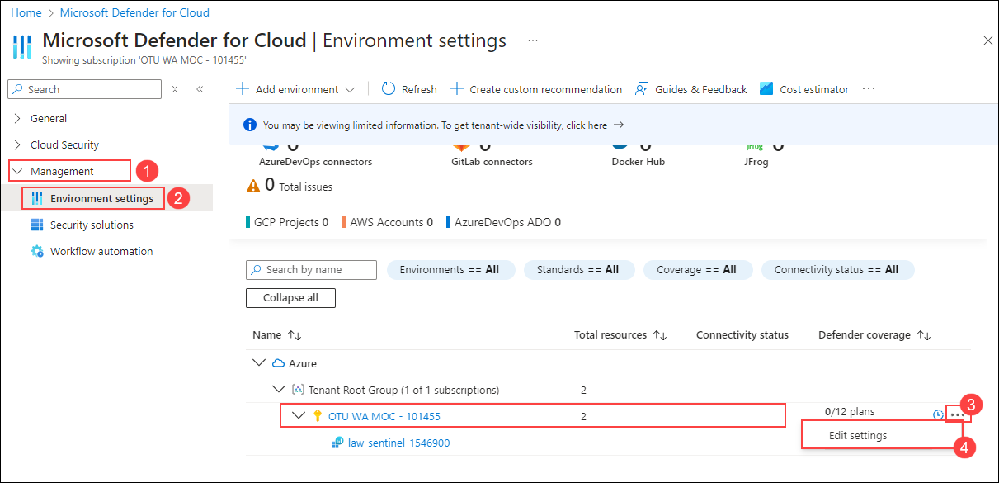
1. Under **Cloud Workload Protection** set the **Servers** plan stats to **On** (1).
1. Select **Save** (2) on top of the page.

   

When enabling the Plan for Servers you could see that Defender for Cloud supports many more resource types.

### Task 2: Enable the on premise Server in Azure Arc

Azure Arc is required so that it can be used to send data to the log analytics workspace that Defender for Cloud uses.

1. Swap to VM **Microsoft Azure: VM1**, use <inject key="VM1 Password"></inject> to sign in into the machine.

   
1. Open Edge and sign into the Azure portal **`https://portal.azure.com`** using the following credentials:
   - **Username**: <inject key="AzureAdUserEmail"></inject>
   - **Password**: <inject key="AzureAdUserPassword"></inject>
   >**Note**: If you are asked to **Stay Signed in**, Click on **Yes**.
1. Search for **`Azure Arc`** and open it.

   
1. In the left hand navigation pane, expand **Azure Arc resources (1)** and select **Machines (2)**.
1. Select **Add/Create (3)** > **Add a Machine (4)**.

   
1. Under Add a single server (1), select **Generate script** (2).

   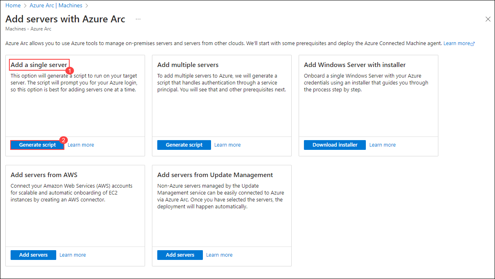
1. In the Resource group field, use the drop-down menu to select **sc-100-lab1** (1).
1. In the Region field, use the drop-down menu to select **<inject key="Resource group Region" enableCopy="false" ></inject>** (2).
1. Select **Download and run script** (3).

   
1. Select **Download** and run script on your second Lab Client **VM1** to onboard the on-premise Server to Azure.
   >**Note**: If there is a pop-up regarding **OnboardingScript.ps1 could harm your device. Do you want to keep it anyway?**, click on **Keep** (1).

      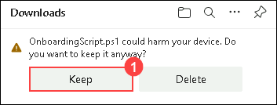
1. Run Windows PowerShell as an administrator. To do this, use the right mouse key to select the Windows icon on the bottom right corner of the window and select **Windows PowerShell(Admin)**
1. Set the Execution Policy to unrestricted.

    ```Powershell
    Set-ExecutionPolicy -ExecutionPolicy unrestricted
    ```

1. On the PowerShell windows, select Y
1. Run the onboarding script. To do this, select file explorer. It should take you to the downloads folder on the local C drive of the server VM. Use the right mouse key to select the file **OnboardingScript** and select **Run with PowerShell**.
1. Click on **Open**.
1. When the authentication popup appears, log in with the following following credentials:
   - **Username**: <inject key="AzureAdUserEmail"></inject>
   - **Password**: <inject key="AzureAdUserPassword"></inject>
1. Wait till the script is successfully completed.
1. Go back to Azure Portal and open Azure Arc.
1. Select **Machines**, select **Refresh** (1) on top of the page and validate your server is successfully deployed to Azure Arc.

   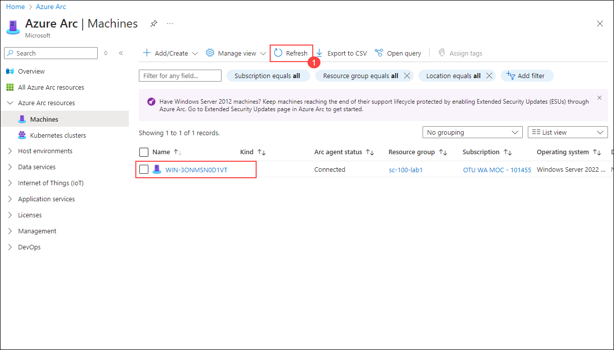

You have successfully enabled Azure Arc on the test server and data should start to flow into the log analytics workspace. This process might take some time until you can see anything in the dashboard.

> **Congratulations** on completing the task! Now, it's time to validate it. Here are the steps:
	
 - Hit the Validate button for the corresponding task. If you receive a success message, you can proceed to the next task.
 - If not, carefully read the error message and retry the step, following the instructions in the lab guide.
 - If you need any assistance, please contact us at cloudlabs-support@spektrasystems.com. We are available 24/7 to help you out.
    
<validation step="7905e87b-74c6-4ccc-92fc-21b2e51da913" />

### Task 3: Add Server to Defender for Cloud and gather Logs.

You´ll deploy a Data collection rule to get event logs from the on premise server. The rule will automatically deploy the monitoring agent on the server and forward logs to the previously created log analytics workspace.

1. Search for **Microsoft Defender for Cloud** and open it.

   
1. From the left navigation panel, select **Environment settings** (1) under management.
<!-- 1. From the top of the Getting started page, select the **Upgrade** tab. -->
1. Expand the **Tenant Root Group** and the **Subscrtiption**, now you will see the previously created log analytics workspace, **law-sentinel-<inject key="DeploymentID" enableCopy="false" /></inject>** listed. Select the ellipses (...) next to the **law-sentinel-<inject key="DeploymentID" enableCopy="false" /></inject>** and select **Edit settings** (2).  This will take you to the **Defender plan** page of law-sentinel-<inject key="DeploymentID" enableCopy="false" /></inject>.  

   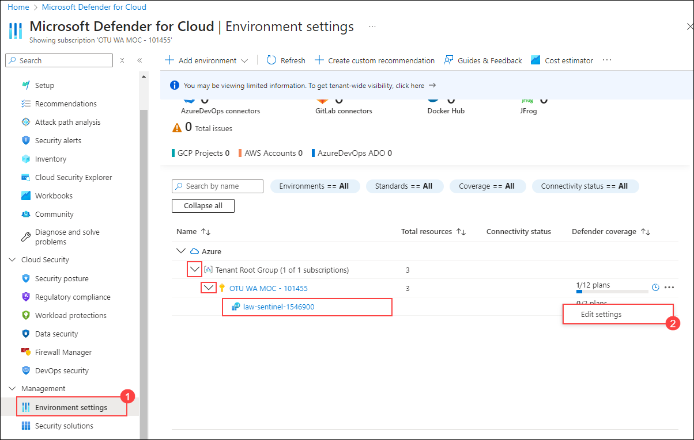
1. On the **Servers** plan, select **On** (1), then select **Save** (2), from the top of the page.

   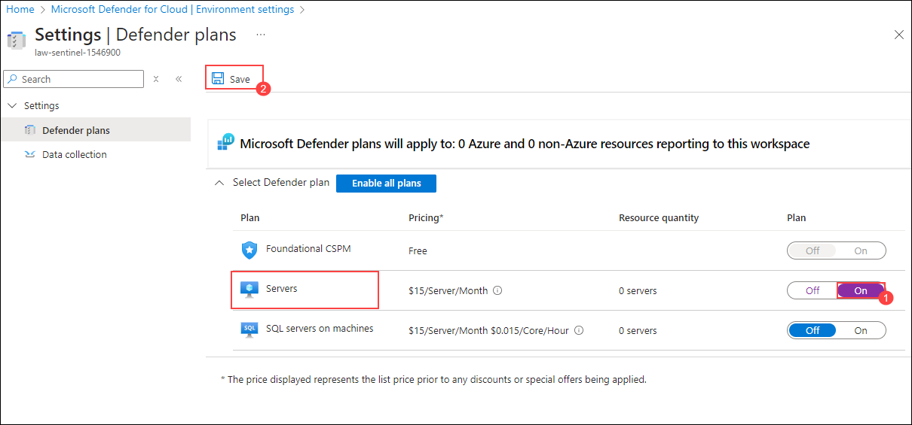
1. Use the search bar at the top to search for **Data collection rules**, then select it from the search results.

   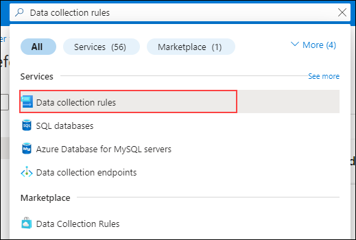
1. Select **Create**.
1. Add the following details, and select **Next: Resources** (4):
   - Rule Name: **`ContosoDCR`** (1)
   - Resource group: **sc-100-lab1** (2)
   - Region - **<inject key="Resource group Region" enableCopy="false" ></inject>** (3)

      
1. Select **Add resources** (1). Choose **Machines - Azure Arc** (2) under the droupdown for **Resource types** and Expand the scope of the resource group. Check the previously onboarded **Azure Arc machine** (3), select **Apply** (4).

   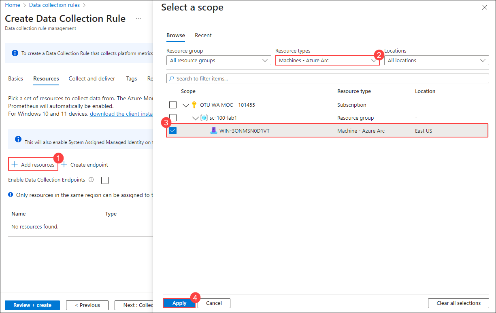
1. Select **Next: Collect and deliver**.
1. Select **Add data source** (1).
1. Choose Data Source type **Windows Event Logs** (2).
1. Select every option under **Configure the event logs and levels to collect:** (3).
1. Select **Next: Destination** (4).

   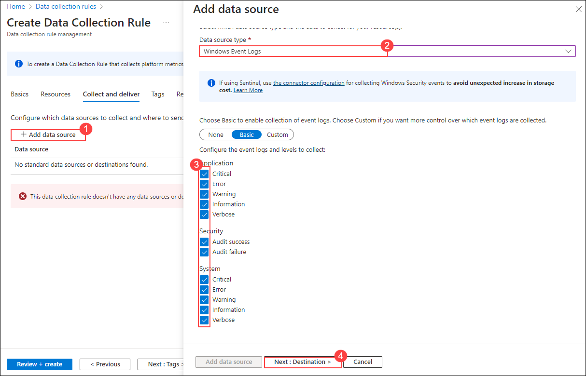
1. Select **Add Destination** (1).
   - Destination type: **Azure Monitor Logs** (2).
   - Destination Details: **law-sentinel-<inject key="DeploymentID" enableCopy="false" /></inject>** (3).
1. Select **Add data source** (4).

   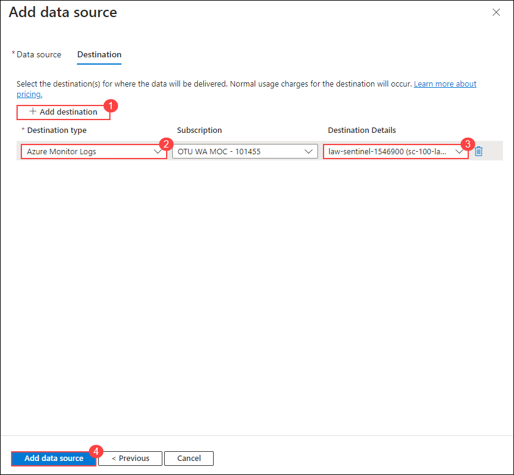
1. Select **Review & create**.
1. Select **Create**.

It may take a few hours till the resource is fully onboarded in Defender for Cloud. The next step is to look at the recommendation that Defender for Cloud generates for this resource.

> **Congratulations** on completing the task! Now, it's time to validate it. Here are the steps:
	
 - Hit the Validate button for the corresponding task. If you receive a success message, you can proceed to the next task.
 - If not, carefully read the error message and retry the step, following the instructions in the lab guide.
 - If you need any assistance, please contact us at cloudlabs-support@spektrasystems.com. We are available 24/7 to help you out.
    
<validation step="883a42a8-fd6a-4cf4-9b39-da3e203dc093" />

### Task 4: Add regulatory compliance standard

Based on the recommendation you can start to secure the resource and assign security policies e.g. NIST SP 800-53 Rev.5 to ensure that the resources of Tailwind traders comply with our compliance regulations.

1. Search for **Microsoft Defender for Cloud** and open it.
1. Expand **Management** and select **Environment settings** (1).
1. Select **Expand all**.
1. Select the ellipses (...) next to the subscription and select **Edit settings** (2).

   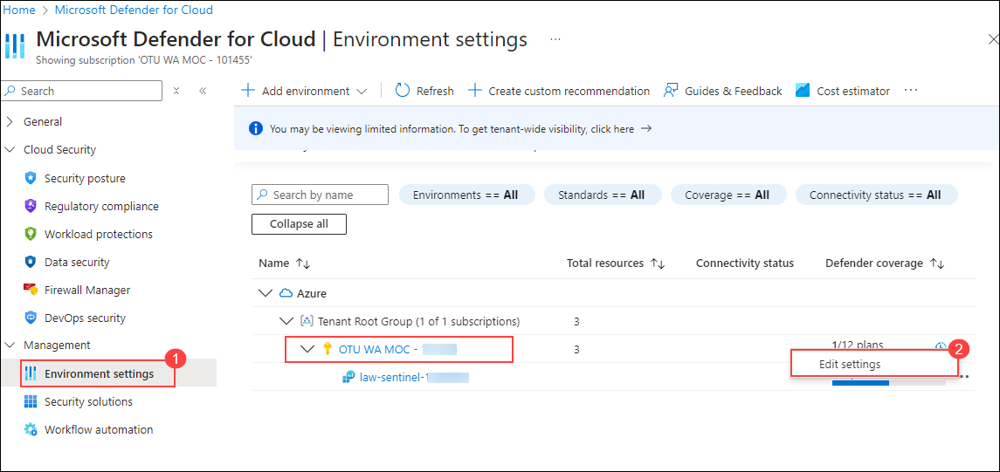
1. Select **Security policies** (1) in the navigation menu on the left. The list might take a while to load.
1. Search for **`NIST SP 800-53 Rev. 5`** (2). Change the status slider to **On** (3).

   
1. Go back to Defender for Cloud and select **Regulatory compliance** (1) under Cloud Security.

   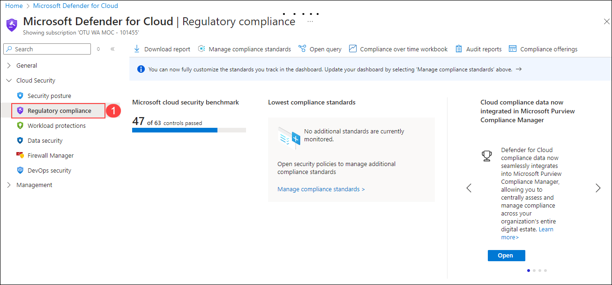


Due to limitation off the lab environment, you are not able to see the resources as well as the compliance recommendations. It takes a while until the deployed resources are visible in Defender for Cloud.

In the Regulatory compliance dashboard you can now review any failing assessments that appear in the dashboard to understand the details of the recommendations.

By continuously assessing resources against these controls, Defender for Cloud identifies issues that may hinder achieving specific compliance certifications. Maintaining regulatory compliance is crucial for safeguarding your organization’s data and ensuring a secure cloud environment.
