# Lab 01: Security Posture Management

## Estimated Duration: 60 Minutes

## Exercise Overview

Contoso's security team wants to improve its security posture using Microsoft Secure Score. The team needs to delegate recommended actions to security ambassadors while controlling access to security posture information and the specific data sources that feed it. Joni Sherman is a security ambassador who needs access to Exposure Management. Additionally, there have been reports that uninvited associates were being automatically admitted to Teams calls, which the security team wants to control.

## Exercise Objective

After completing this exercise, you'll be able to:

- Create a custom role to manage security posture for Exposure Management.
- Activate Defender XDR unified RBAC for specific workloads.
- Share recommended actions in a Teams channel for collaboration.
- Edit the status of recommended actions to track progress.

## Architecture Diagram

## Task 1 - Create a custom role to manage security posture for Exposure Management

In this task, you'll set up custom role focused on security posture and more specifically on Exposure Management. As part of the custom role, you'll grant Joni Shermann access to the data source for Exposure Management.

1. Open a new tab in **Microsoft Edge**, select the address bar, navigate to **`https://security.microsoft.com`** and log into the Entra ID Portal with the below credentials if prompted.

   - **Email/Username:** <inject key="AzureAdUserEmail"></inject>
   - **Password:** <inject key="AzureAdUserPassword"></inject>

1. On **Microsoft Defender** page, if the left navigation pane is collapsed, select **Show navigation** to expand it.

    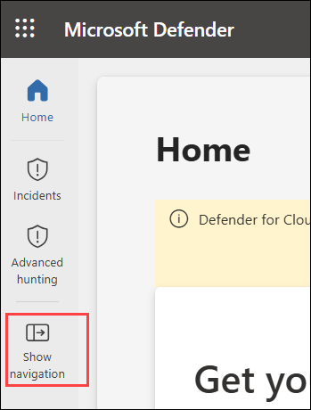

1. If the **Meet your improved security center** welcome page appears, select the **Close (X)** button.

    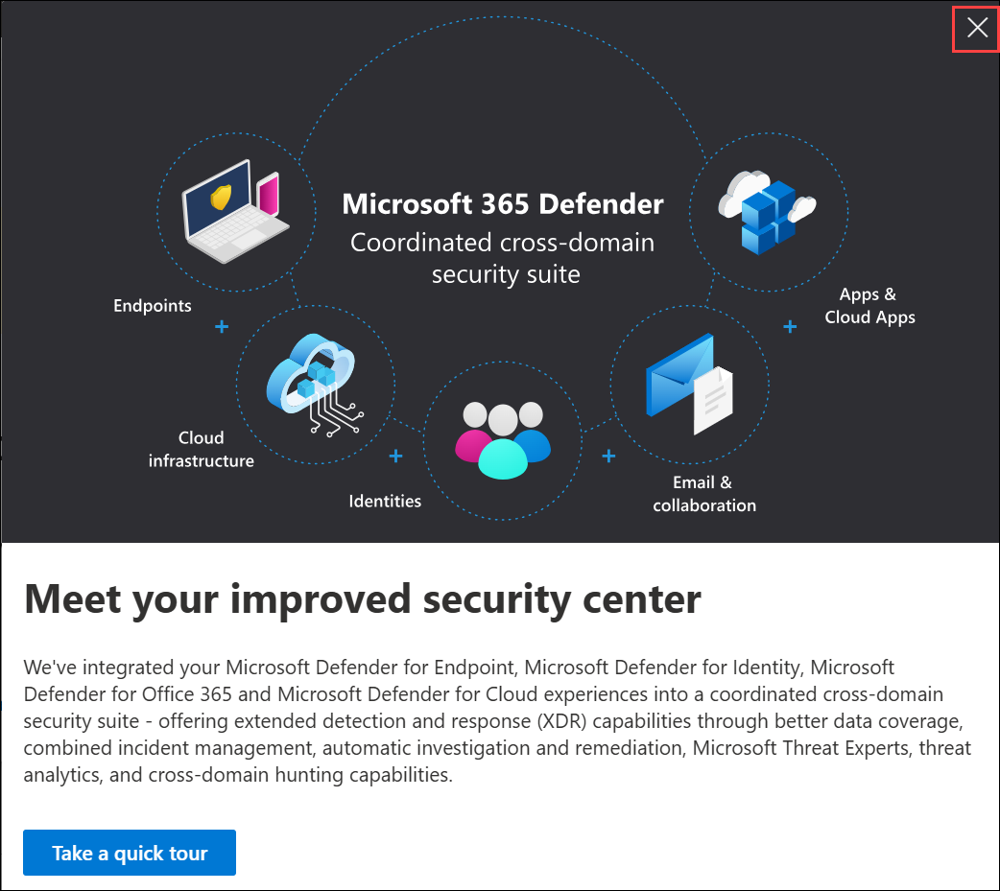

1. Scroll down from the left navigation panel  to **System** (1) and select **Permissions** (2) and under **Microsoft Defender XDR(1)**, select **Roles** (3).

   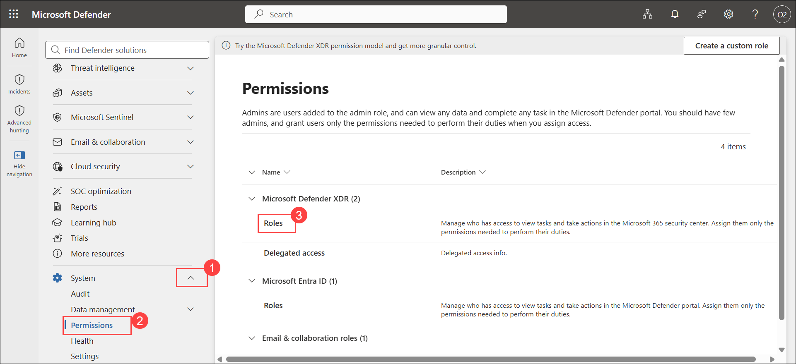   

    >**Note :** If this is the first time you are accessing Microsoft Defender settings, you will have to wait a few minutes while Defender prepares new spaces for your data and connects them. Once that completes, refresh the permissions page until you see a listing that includes Microsoft Defender XDR, Microsoft Entra ID, Endpoints roles & groups, Email & collaboration roles, and Cloud Apps. It may take some time for all of these to show up.

1. Select **Create custom role**.

   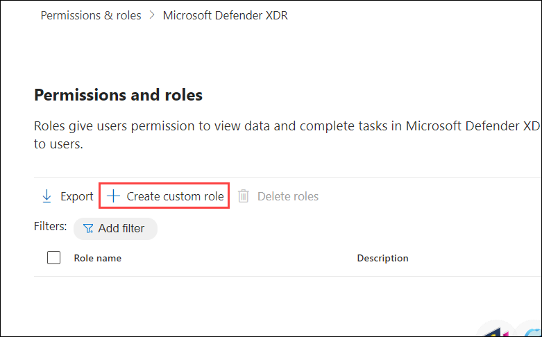

1. In the Role name field, enter **`SecureScore Manager` (1)** then select **Next (2)**.

    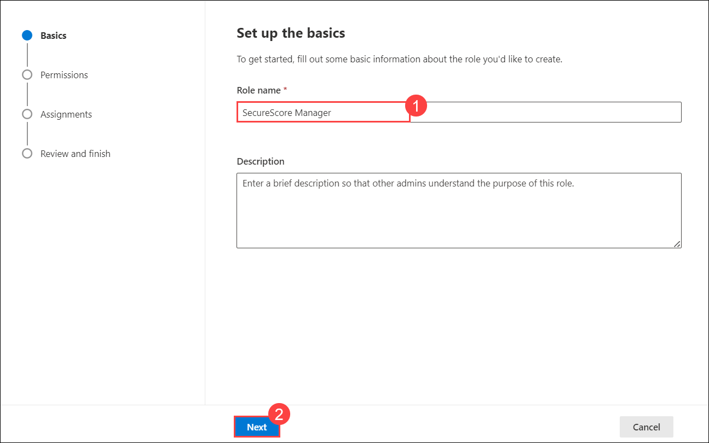

1. Select **Security posture** (1).

1. In the Security posture window:

    - Select **Select custom permissions** (2)
    - Under Posture management select **Select custom permissions** (3)
    - Choose **Exposure Management (manage)** (4)
    - Select **Apply** (5).
    - Select **Next** (6).
    
     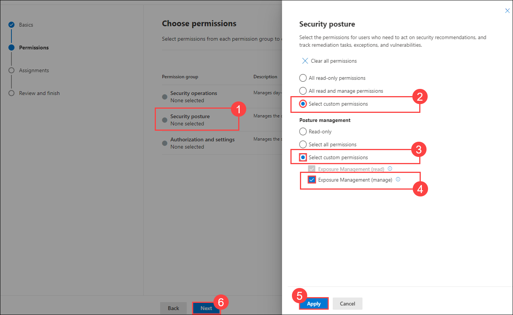

1. On the **Assign users and data sources** page, select **Add assignment** then populate the fields as follows then click on **Next**:

    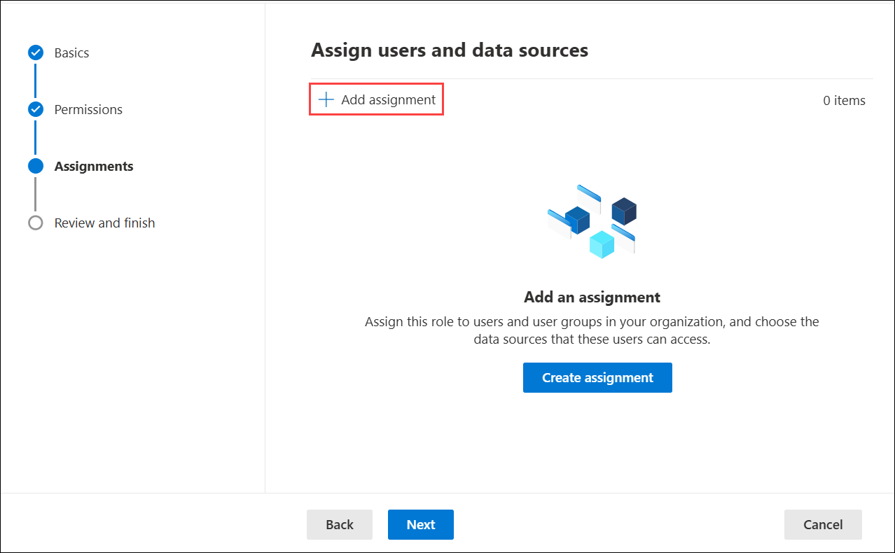

   - Assignment name: **`ExposureManagement` (1)**
   - Assign users and group: Enter **`Joni Sherman` (2)**, then select it.
   - Under **Data sources**, select the drop-down menu to see a list of the available data-sources. Select only **Microsoft Security Exposure Management (3)**. If other data sources are listed, unselect them.
   - Ensure **Include future data sources automatically (4)** is cleared.
   - Select, **Add (5)**.

     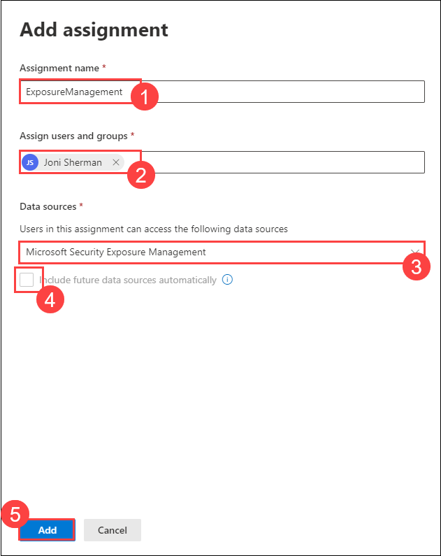

1. In the Review and finish page review your settings, select **Submit**, then select **Done**.

    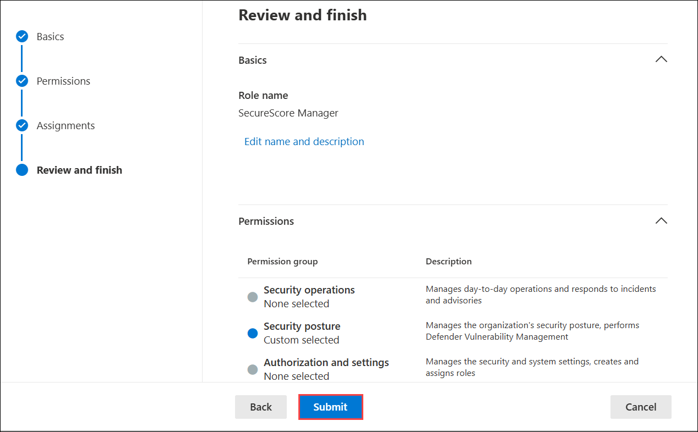

1. You should be on the **Permissions and roles** page and see the custom role you just created. Keep this tab open, you'll come back to it in the next task.

   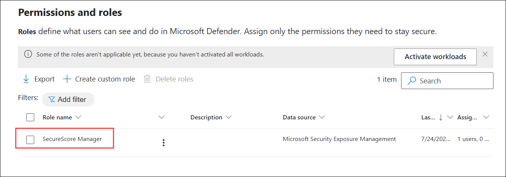

   >**Success!** You successfully set up a custom role for security posture that grants Joni Shermann access to the Exposure Management data source.

## Task 2 - Activate Defender XDR unified RBAC for specific workloads

For the Microsoft Defender XDR security portal to start enforcing the permissions and assignments configured in your new custom roles, you must activate the Microsoft Defender XDR Unified RBAC model for your workloads.

When you activate some or all of your workloads to use the new permission model, the roles and permissions for these workloads are fully controlled by the Microsoft Defender XDR Unified RBAC model in the Microsoft Defender portal.

In this task you´ll explore the page where workloads are activated.

1. You should still be logged into the Microsoft Defender portal and be in the **Permissions and roles** page. You should see the custom role you just created.

    

1. Note the information in the gray banner, Some of the roles aren't applicable yet, because you haven't activate all workloads. Select **Activate workloads**.

    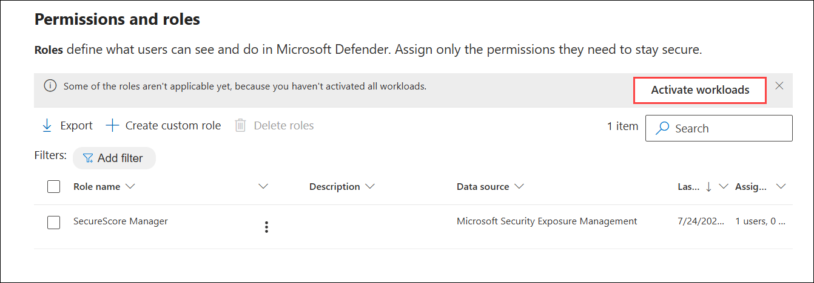

1. Note the description under **Activate unified role-based access control**. When you activate some or all of your workloads to use the new permission model, the roles and permissions for these workloads are fully controlled by the Microsoft Defender XDR Unified RBAC model in the Microsoft Defender portal.

    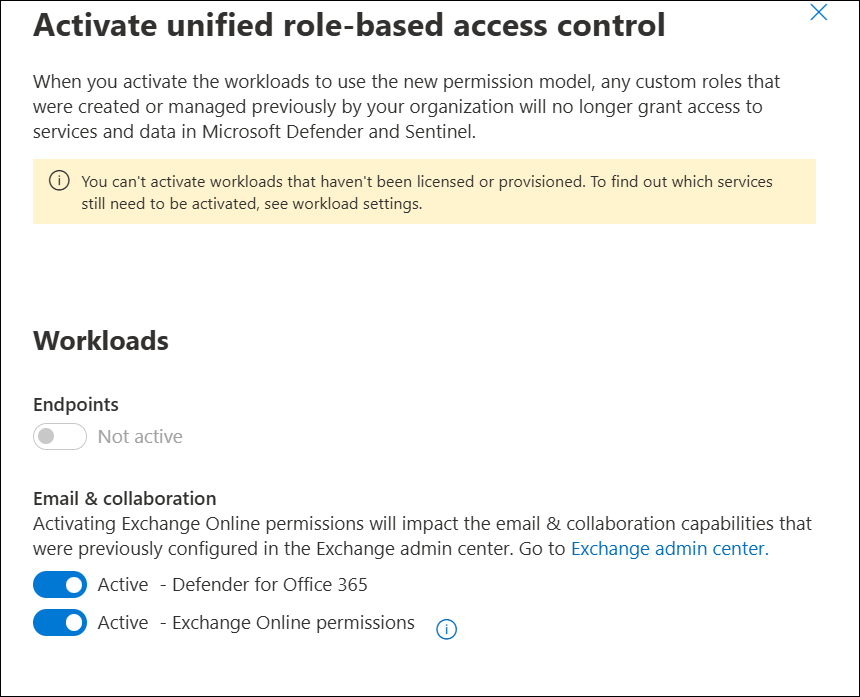

1. For this exercise, the data source for Exposure Management is enabled by default, which is why there is no setting to enable that workload. If you had created a custom role that included permissions for other workloads, such as Office 365 or Device and Vulnerability Management, as examples, then you would need to activate those specific workloads to activate the custom role, as part of unified RBAC.

   >**Success!** You learned where to activate the Microsoft Defender XDR Unified RBAC model for some or all of your workloads.

## Task 3 - Share a recommended action

In this task, you will share a **Microsoft Secure Score recommended action** by posting it on a **Teams channel**. Users in the channel will see the notice but won't be able to edit the status or manage the action. Only **Joni Shermann**, a member with the necessary role permissions, will have access to the recommended action.

1. On the left navigation pane, expand **Exposure management (1)** then select **Secure Score (2)**.

    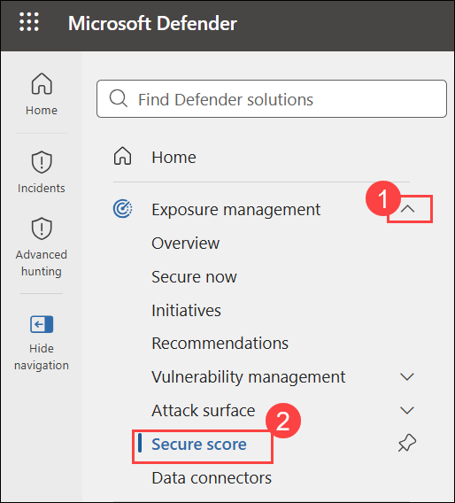

1. On the **Secure Scores** page, select **View Microsoft Secure Score**.

    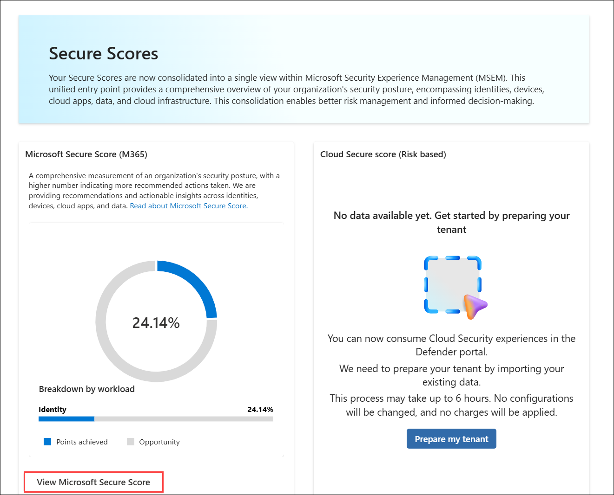

1. Select the **Recommended actions** tab.

    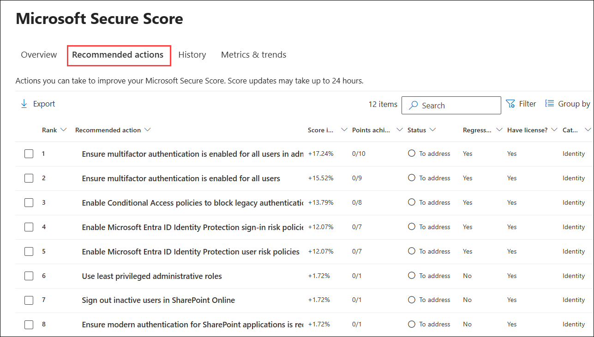

1. Select any **Recommended actions (1)** with a status of **To address**

1. Select **Share (2)**, and in the dropdown menu select **Microsoft Teams (3)**.

    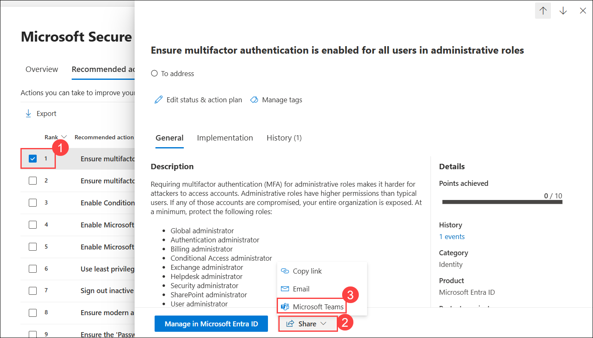

1. In field **Team** select **Mark 8 Project Team (1)** and in the **Channel** field select **Channel Research and Development (2)**.

1. Select **Post message to Teams (3)**.

    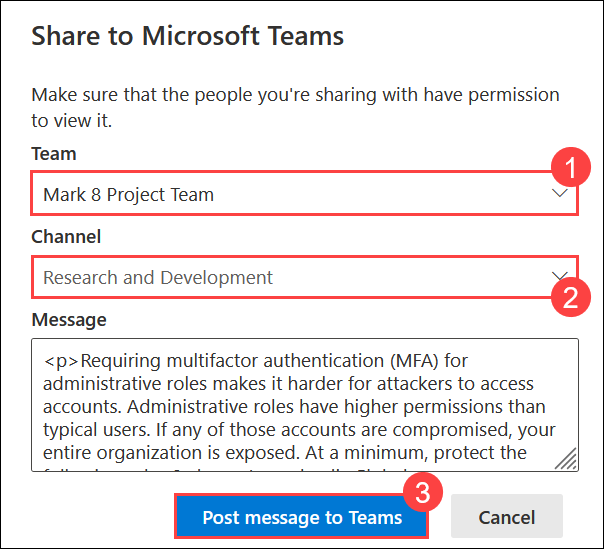

Joni Sherman and her Mark 8 Project Team will be notified about the recommended action in the Teams channel.

## Task 4 - Manage Recommendations

As Joni Sherman you received the teams notification that a specific action to increase the organization's security posture was recommended. As an extended member of the security team you have the role permissions to manage the recommended action and document the solution.

In this task, you´ll manage recommended action and document your solutions.

1. Open a Microsoft Edge InPrivate window, navigate to **`https://office.com`** and sign in as
   
1. Begin by signing in to **Office**. Open **[https://office.com](https://office.com)**, and in the **Sign in** window, enter **[joni.sherman@otuwamocZZZZZZ.onmicrosoft.com](mailto:joni.sherman@otuwamocZZZZZZ.onmicrosoft.com)** (where **ZZZZZZ** is the tenant prefix provided by your lab hosting provider).

    > **Note:** The **username** and **password** are available in the **Environment** tab of the lab guide. Scroll down to the **Environment Information** section to view the credentials required to sign in.

    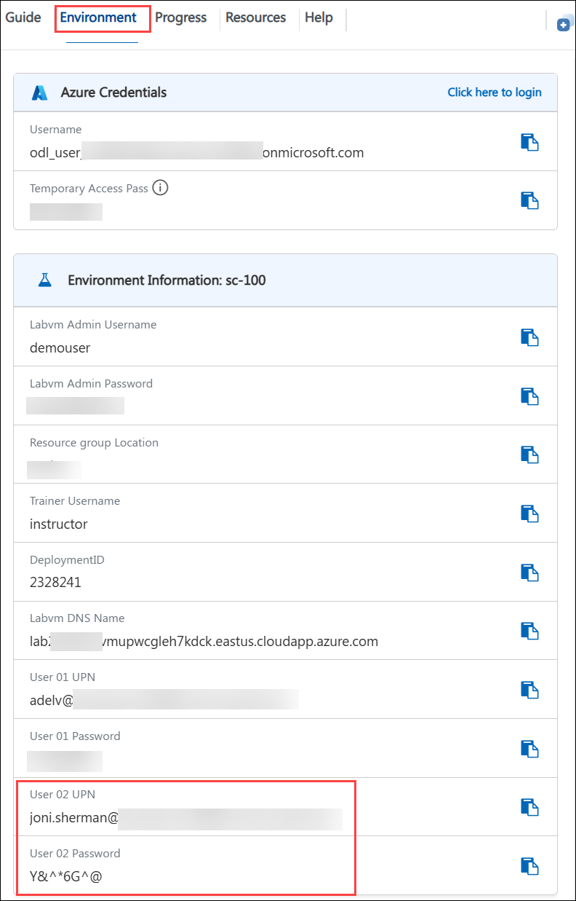

1. If the landing page appears blurred out, refresh the page.

1. In the Microsoft 365 portal, click on the **App launcher  (1)** button and select **Teams (2)**.

    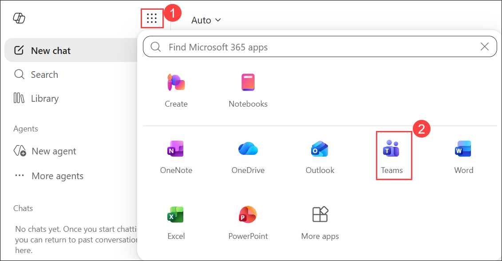

1. On the Welcome to Teams window, select **Get Started**. It may take a minute or two for Teams to set up. If a Teams for Mobile QR-code screen pops-up, close it.

1. Open Teams. For the **Mark 8 Project Team (1)** select **See all channels** then select **Research and Development (2)**.

1. Review the **message posted (3)** from the previous task.

1. From the posted message, select the link. Because you, Joni Shermann, have been granted permission through the custom role, you are able to access Secure Score. Other members of the Mark 8 project team can see teh post, but do not have access to Secure Score.

    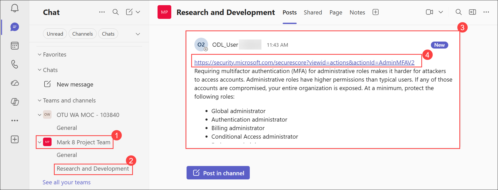

1. Select **Edit status & action plan (1)**.

1. Check **Resolved through third party (2)**.

1. Add a note **Currently secured (3)** to the **Action plan** field.

1. Select **Save and Close (4)**.

    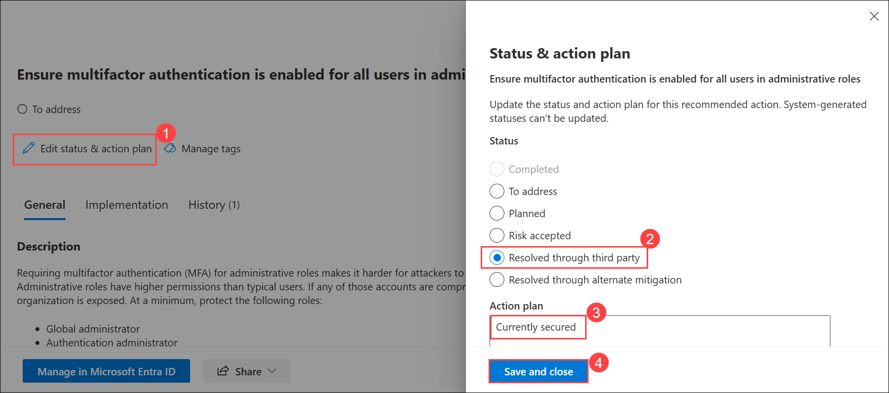

1. Close the inPrivate browser tabs.

As Joni Shermann, you successfully edited the status for the recommended action.

## Task 5 - Adele Vance accesses the Teams post

In this task, Adele Vance access the Mark 8 Project Team channel and selects the link in the posted message.

1. Open a Microsoft Edge InPrivate window, navigate to **`https://office.com`** and sign in as Adele Vance,

1. Begin by signing in to **Office**. Open **[https://office.com](https://office.com)**, and in the **Sign in** window, enter **[adelv@otuwamocZZZZZZ.onmicrosoft.com](mailto:adelv@otuwamocZZZZZZ.onmicrosoft.com)** (where **ZZZZZZ** is the tenant prefix provided by your lab hosting provider).

    > **Note:** The **username** and **password** are available in the **Environment** tab of the lab guide. Scroll down to the **Environment Information** section to view the credentials required to sign in.

    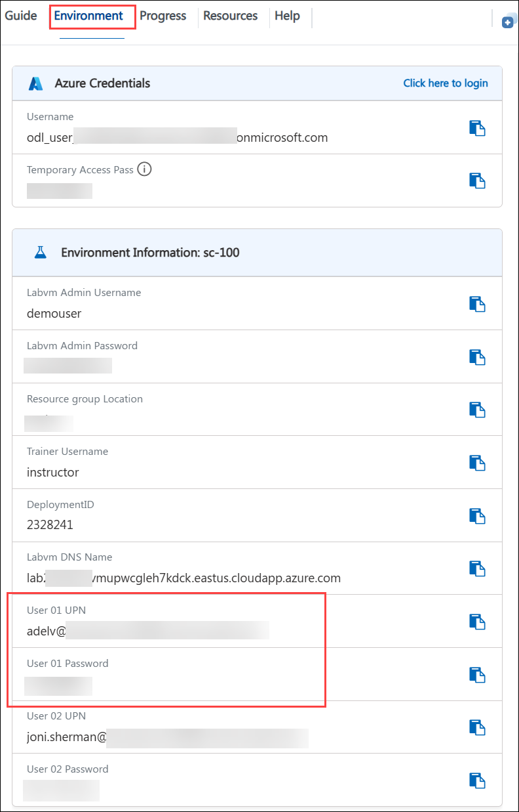

1. If the landing page appears blurred out, refresh the page.

1. In the Microsoft 365 portal, click on the **App launcher  (1)** button and select **Teams (2)**.

    

1. On the Welcome to Teams window, select **Get Started**.

1. Open Teams. For the **Mark 8 Project Team (1)** select **See all channels** then select **Research and Development (2)**.

1. Review the message posted from the previous task.

1. From the posted message, select the **link (3)**.

    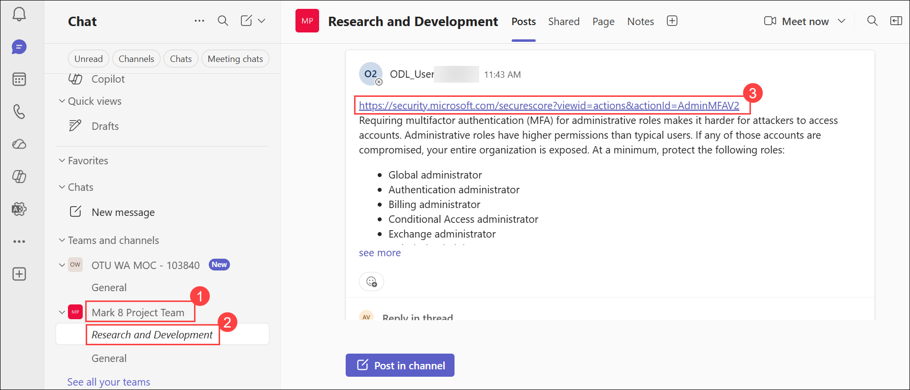

1. You are taken directly to Microsoft Secure Score, but you don't have permission to access this data, as Adele Vance was not added as a member to the custom role that you created.

    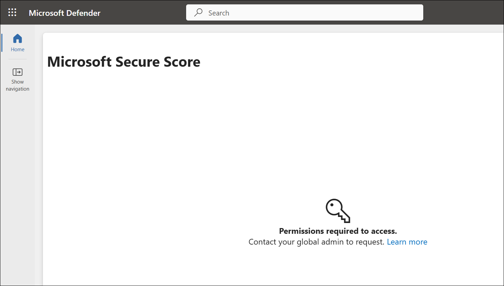

1. Close the InPrivate browser tabs.

In this task, you confirmed that members of the Mark 8 Project can see the message posted for the recommended action to help improve the organization's security posture, but only those associates that have been added to the custom role can access the Secure Score information.

### Summary

In this exercise, you have completed the following:

- Create a custom role to manage security posture for Exposure Management.
- Activate Defender XDR unified RBAC for specific workloads.
- Shared the recommended action in the Teams channel.
- Edited the status for the recommended action.

### You have successfully finished the exercise. Click on **Next** to move on to the next exercise.
