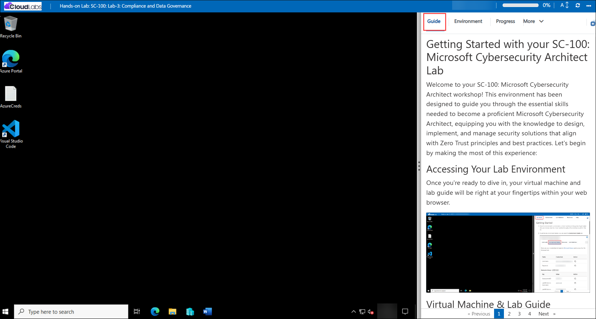
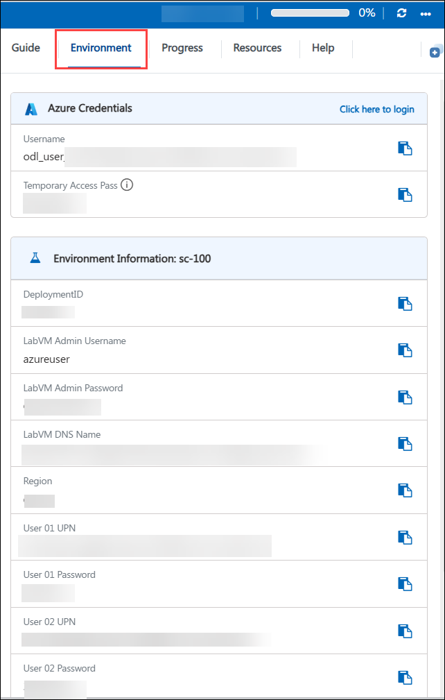
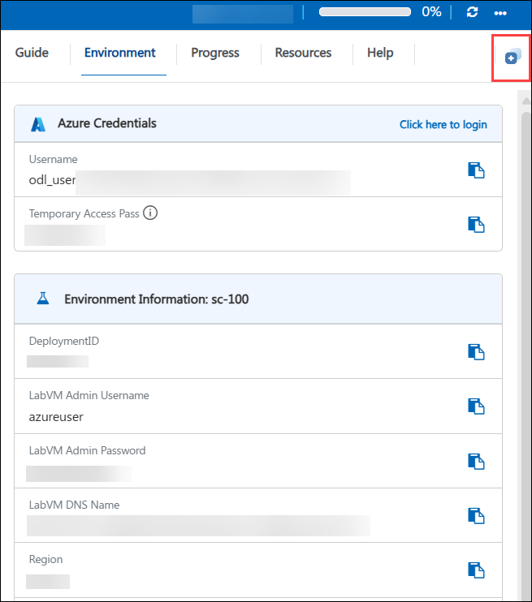
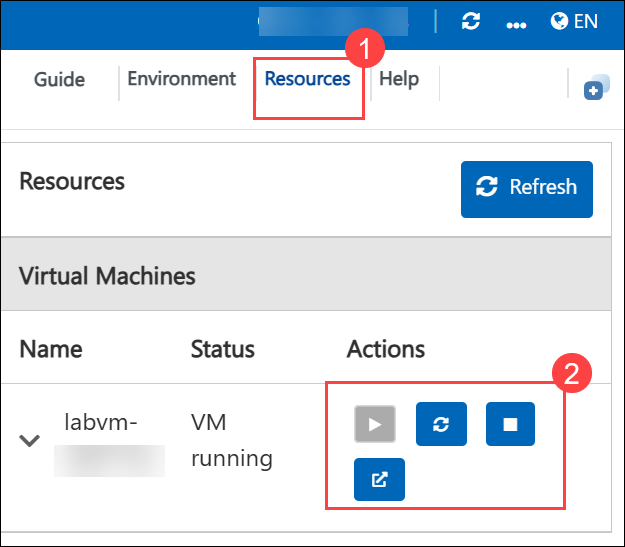
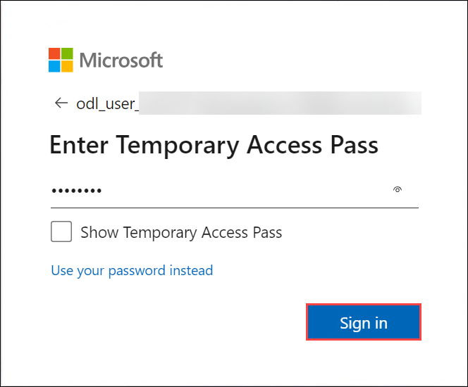

# Getting Started with your SC-100: Microsoft Cybersecurity Architect Lab

Welcome to your SC-100: Microsoft Cybersecurity Architect workshop! This environment has been designed to guide you through the essential skills needed to become a proficient Microsoft Cybersecurity Architect, equipping you with the knowledge to design, implement, and manage security solutions that align with Zero Trust principles and best practices. Let's begin by making the most of this experience:

## Overview

In these hands-on labs, you will step into the role of Contoso Ltd.'s Cybersecurity Architect and apply Zero Trust principles across a realistic, evolving business scenario, including Contoso's acquisition of Tailwind Traders. Across four lab modules, you will deploy and configure Microsoft Sentinel as a SIEM, discover your organization's external attack surface with Microsoft Defender EASM, and onboard on-premises servers to Microsoft Defender for Cloud using Azure Arc. You will then secure identities by hardening Microsoft Entra ID app consent and authentication strength policies, building Conditional Access policies with trusted locations and Continuous Access Evaluation, enabling cross-tenant synchronization and B2B collaboration, and using Microsoft Defender for Cloud Apps to uncover and block Shadow IT. On the data and compliance side, you will run an ISO-27001 assessment in Microsoft Purview Compliance Manager, design a custom sensitive information type for a data classification framework, and configure retention labels and policies to meet legal record-keeping requirements. Finally, you will manage security posture with Microsoft Secure Score and Exposure Management RBAC, deploy Intune endpoint security baselines for Windows and macOS, and implement Global Secure Access for secure remote access to on-premises resources. By completing these labs, you will gain the practical, end-to-end experience needed to design, implement, and govern security solutions across identity, data, infrastructure, and operations.

## Objectives

By the end of these labs, you will be able to:

1. **Deploy and operate Microsoft Sentinel as a SIEM:** Create a Log Analytics workspace, deploy Microsoft Sentinel, configure role-based access control for SOC roles, and build dashboards for incidents and alerts.

2. **Manage external attack surface:** Provision Microsoft Defender External Attack Surface Management (EASM), run discoveries against internet-facing assets, connect findings to Log Analytics, and triage and categorize discovered assets.

3. **Secure hybrid infrastructure:** Enable Microsoft Defender for Cloud, onboard on-premises servers using Azure Arc, collect server logs, and apply regulatory compliance standards.

4. **Harden Microsoft Entra ID identity controls:** Restrict third-party application consent to Microsoft-verified publishers and create custom authentication strength policies aligned to NIST guidance.

5. **Design and validate Conditional Access policies:** Build trusted network locations, create and test scoped Conditional Access policies, use Continuous Access Evaluation, and enforce authentication strength for sensitive applications.

6. **Enable secure cross-tenant collaboration:** Configure Entra ID cross-tenant synchronization and B2B external collaboration settings to synchronize users, restrict guest invitations, and identify external accounts.

7. **Detect and remediate Shadow IT:** Integrate Microsoft Defender for Endpoint with Defender for Cloud Apps, investigate unsanctioned applications, and block unsecure applications manually and automatically.

8. **Assess compliance and build a data classification framework:** Run an ISO-27001 assessment with Microsoft Purview Compliance Manager, assign remediation tasks, and create a custom sensitive information type to identify sensitive business data.

9. **Design and enforce data retention policies:** Analyze existing retention configurations and create retention labels and policies in Microsoft Purview Data Lifecycle Management to meet legal and regulatory requirements.

10. **Manage security posture and RBAC:** Create custom Defender XDR unified RBAC roles for Exposure Management, delegate Secure Score recommendations, and track remediation progress.

11. **Secure endpoints with Intune:** Deploy endpoint security baseline policies for Windows devices and configure antivirus and disk encryption (FileVault) for macOS devices.

12. **Implement Global Secure Access:** Activate Global Secure Access, configure the private network connector and Application Proxy, join devices to Entra ID, and validate secure remote connectivity to on-premises resources.

## Pre-requisites

- Familiarity with Zero Trust principles and the Microsoft Cybersecurity Reference Architecture.
- Working knowledge of Microsoft Entra ID, including identity, authentication, and access management concepts.
- Basic understanding of Microsoft 365 compliance and data governance concepts (Microsoft Purview).
- Familiarity with the Microsoft Defender family (Defender for Cloud, Defender for Cloud Apps, Defender for Endpoint, Defender XDR) and core Azure fundamentals.
- Comfort using the Azure portal, Entra admin center, Microsoft Purview and Defender portals, and basic PowerShell will help learners get the most from this course.

## Architecture

The lab architecture reflects how Contoso Ltd. secures its environment end-to-end using Microsoft's security, compliance, and identity platform. Throughout these labs, you will deploy security operations tooling, harden identity and access controls, govern sensitive data, and manage security posture and endpoints, all mapped to Zero Trust pillars.

1. **Security Operations and Infrastructure:** Microsoft Sentinel and Log Analytics provide centralized threat detection and SIEM capabilities, Microsoft Defender EASM discovers and monitors the external attack surface, and Microsoft Defender for Cloud with Azure Arc extends protection and compliance monitoring to on-premises servers.

2. **Identity and Access Security:** Microsoft Entra ID enforces least-privilege application consent and strong authentication, Conditional Access policies with trusted locations and Continuous Access Evaluation control sign-in risk, cross-tenant synchronization and external collaboration settings govern B2B access, and Microsoft Defender for Cloud Apps identifies and blocks Shadow IT.

3. **Data Security and Compliance:** Microsoft Purview Compliance Manager assesses environments against regulatory frameworks such as ISO-27001, Microsoft Purview Information Protection classifies sensitive data using custom sensitive information types, and Microsoft Purview Data Lifecycle Management enforces retention labels and policies.

4. **Security Posture and Endpoint Management:** Microsoft Defender XDR unified RBAC and Exposure Management drive Secure Score remediation and delegation, Microsoft Intune enforces endpoint security baselines across Windows and macOS devices, and Microsoft Entra Global Secure Access secures remote connectivity to on-premises resources.

## Explanation of Components

1. **Microsoft Sentinel & Log Analytics Workspace:** Centralizes collection, storage, and analysis of security logs, providing SIEM capabilities, role-based access control for SOC roles, and workbooks for incident and alert visualization.

2. **Microsoft Defender External Attack Surface Management:** Continuously discovers and monitors internet-facing assets to identify vulnerabilities and feeds findings into Log Analytics for centralized analysis.

3. **Microsoft Defender for Cloud & Azure Arc:** Extends unified security management and threat protection to on-premises and hybrid servers, collecting logs and assessing regulatory compliance.

4. **Microsoft Entra ID – Enterprise Apps & Authentication Strengths:** Restricts application consent to Microsoft-verified publishers and defines custom authentication strength policies to enforce stronger sign-in requirements.

5. **Conditional Access & Named Locations:** Uses trusted network locations, scoped and tested Conditional Access policies, and Continuous Access Evaluation to control access based on user, device, and location risk.

6. **Cross-Tenant Synchronization & External Collaboration Settings:** Synchronizes users between partner tenants, restricts guest invitation rights, and makes external identities identifiable to support secure B2B collaboration.

7. **Microsoft Defender for Cloud Apps:** Integrates with Defender for Endpoint to provide visibility into Shadow IT, assess application risk, and block unsanctioned applications manually or automatically.

8. **Microsoft Purview Compliance Manager:** Runs assessments against regulatory standards such as ISO-27001, highlights compliance gaps, and assigns remediation tasks to technical engineers.

9. **Microsoft Purview Information Protection:** Defines custom sensitive information types using pattern matching to identify organization-specific sensitive data, such as project IDs.

10. **Microsoft Purview Data Lifecycle Management:** Configures retention labels and policies, including auto-applied labels, to retain or dispose of content in line with legal and business requirements.

11. **Microsoft Defender XDR Unified RBAC & Exposure Management:** Provides custom roles for managing security posture data sources and delegating Secure Score recommended actions for remediation.

12. **Microsoft Intune Endpoint Security Baselines:** Deploys consolidated security baseline policies for Windows devices and configures antivirus protection and FileVault disk encryption for macOS devices.

13. **Microsoft Entra Global Secure Access:** Activates secure remote access through the private network connector and Application Proxy, enabling protected connectivity to on-premises file servers without legacy VPN infrastructure.

## Accessing Your Lab Environment
 
Once you're ready to dive in, your virtual machine and lab guide will be right at your fingertips within your web browser.

   

## Virtual Machine & Lab Guide
 
Your virtual machine is your workhorse throughout the workshop. The lab guide is your roadmap to success.
 
## Lab Guide Zoom In/Zoom Out

To adjust the zoom level for the environment page, click the **A↕ : 100%** icon located next to the timer in the lab environment.

 

## Exploring Your Lab Resources
 
To get a better understanding of your lab resources and credentials, navigate to the **Environment** tab.
 
   
 
## Utilizing the Split Window Feature
 
For convenience, you can open the lab guide in a separate window by selecting the **Split Window** button from the Top right corner.
 
 
 
## Managing Your Virtual Machine
 
Feel free to start, stop, or restart your virtual machine as needed from the **Resources** tab. Your experience is in your hands!
 

## Lab Duration Extension

1. To extend the duration of the lab, kindly click the **Hourglass** icon in the top right corner of the lab environment. 

    

    >**Note:** You will get the **Hourglass** icon when 10 minutes are remaining in the lab.

2. Click **OK** to extend your lab duration.
 
   

3. If you have not extended the duration prior to when the lab is about to end, a pop-up will appear, giving you the option to extend. Click **OK** to proceed.

## Let's Get Started with Azure Portal

1. On your virtual machine, click on the Azure Portal icon as shown below:

   .png)
   
1. You'll see the **Sign into Microsoft Azure** tab. Here, enter your credentials:
 
   - **Email/Username:** <inject key="AzureAdUserEmail"></inject>
 
      
 
1. Next, provide your password:
 
   - **Password:** <inject key="AzureAdUserPassword"></inject>
 
      

1. If prompted to stay signed in, click **Yes**.

   

1. If a **Welcome to Microsoft Azure** pop-up window appears, simply click **Maybe later** to skip the tour.

   

1. You can use the **Next** buttons to navigate through the lab guide.

   -1.png)

## Support Contact

The CloudLabs support team is available 24/7, 365 days a year, via email and live chat to ensure seamless assistance at any time. We offer dedicated support channels tailored specifically for both learners and instructors, ensuring that all your needs are promptly and efficiently addressed.

Learner Support Contacts:

- Email Support: cloudlabs-support@spektrasystems.com
- Live Chat Support: https://cloudlabs.ai/labs-support

## Happy Learning!!

